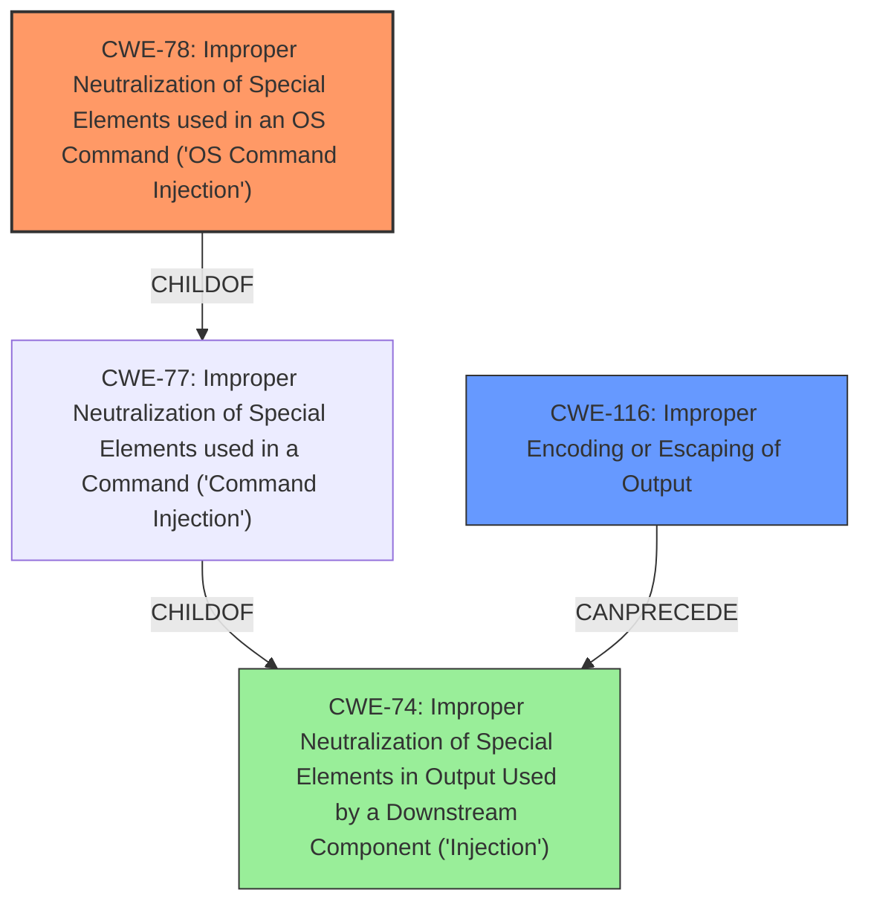

# Analysis for CVE-2022-22744

# Summary
| CWE ID | CWE Name | Confidence | CWE Abstraction Level | CWE Vulnerability Mapping Label | CWE-Vulnerability Mapping Notes |
|---|---|---|---|---|---|
| CWE-78 | Improper Neutralization of Special Elements used in an OS Command ('OS Command Injection') | 1.0 | Base | Primary | Allowed |
| CWE-116 | Improper Encoding or Escaping of Output | 0.7 | Class | Secondary | Allowed-with-Review |

## Evidence and Confidence

*   **Confidence Score:** 0.9
*   **Evidence Strength:** HIGH

## Relationship Analysis
The primary relationship influencing the decision is that CWE-78 is a child of CWE-77, representing a specific type of command injection related to OS commands. CWE-116 (Improper Encoding or Escaping of Output) can precede CWE-74 (Improper Neutralization of Special Elements in Output Used by a Downstream Component ('Injection')), indicating a potential vulnerability chain. The vulnerability description highlights the lack of proper escaping, directly linking to CWE-116. The choice of CWE-78 as the primary weakness is based on the vulnerability leading to OS command execution.

## Vulnerability Chain
The vulnerability chain starts with **improper escaping** (CWE-116), leading to **command injection** (CWE-78). The chain represents the sequence from the initial flaw (lack of proper escaping) to the final impact (arbitrary command execution).

## Summary of Analysis
The initial analysis focused on identifying the root cause of the vulnerability, which is the **improper escaping** of the curl command generated by DevTools. The vulnerability description clearly states that this **improper escaping** leads to **command injection** when the command is pasted into a PowerShell prompt.

The evidence from the vulnerability description includes:
- "The constructed curl command from the Copy as curl feature in DevTools was not properly escaped for PowerShell. This could have lead to **command injection** if pasted into a Powershell prompt."
- "The 'Copy as curl' feature in DevTools did not properly escape website-controlled data, specifically backticks (`), when generating curl commands for PowerShell."

The graph relationships support the selection of CWE-78 as the primary weakness because it is a specific type of command injection that occurs at the OS level. CWE-116 is chosen as a secondary weakness because it represents the **improper escaping** that leads to the **command injection**.

The selected CWEs are at the optimal level of specificity because they accurately represent the root cause and the resulting impact of the vulnerability. CWE-78 is a Base level CWE, which is preferred for mapping root causes, and it clearly describes the **OS command injection** vulnerability. CWE-116 is a Class level CWE that describes the **improper encoding or escaping** that enables the **command injection**.

Relevant CWE Information:

# Enhanced Context (25 CWEs)
The following CWEs were identified as potentially relevant to this vulnerability:

## CWE-653: Improper Isolation or Compartmentalization
**Why not selected:** This CWE is not applicable because the vulnerability does not involve improper isolation or compartmentalization of functionality, processes, or resources.

## CWE-668: Exposure of Resource to Wrong Sphere
**Why not selected:** Although the generated curl command could be considered a resource, CWE-668 is too high-level. The vulnerability is more specifically related to command injection due to **improper escaping**.

## CWE-267: Privilege Defined With Unsafe Actions
**Why not selected:** This CWE is not applicable because the vulnerability does not involve defining privileges with unsafe actions.

## CWE-59: Improper Link Resolution Before File Access ('Link Following')
**Why not selected:** This CWE is not applicable because the vulnerability does not involve improper link resolution.

## CWE-274: Improper Handling of Insufficient Privileges
**Why not selected:** This CWE is not applicable because the vulnerability does not involve handling insufficient privileges.

## CWE-73: External Control of File Name or Path
**Why not selected:** This CWE is not applicable because the vulnerability does not involve external control of file names or paths.

## CWE-41: Improper Resolution of Path Equivalence
**Why not selected:** This CWE is not applicable because the vulnerability does not involve improper resolution of path equivalence.

## CWE-266: Incorrect Privilege Assignment
**Why not selected:** This CWE is not applicable because the vulnerability does not involve incorrect privilege assignment.

## CWE-74: Improper Neutralization of Special Elements in Output Used by a Downstream Component ('Injection')
**Why not selected:** While related to injection, CWE-74 is a more general class. The specific issue is **OS command injection** (CWE-78) due to **improper escaping**, making CWE-78 a better fit.

## CWE-1289: Improper Validation of Unsafe Equivalence in Input
**Why not selected:** This CWE is not applicable because the vulnerability does not involve validation of unsafe equivalence in input.

## CWE-427: Uncontrolled Search Path Element
**Why not selected:** This CWE is not applicable because the vulnerability does not involve an uncontrolled search path element.

## CWE-88: Improper Neutralization of Argument Delimiters in a Command ('Argument Injection')
**Why not selected:** This CWE is not the primary issue, although it could be a secondary concern. The main problem is the **improper escaping** that leads to the ability to inject commands.

## CWE-116: Improper Encoding or Escaping of Output
**Why selected:** CWE-116 is chosen as a secondary weakness. It represents the **improper escaping** that leads to the **command injection**.

## CWE-22: Improper Limitation of a Pathname to a Restricted Directory ('Path Traversal')
**Why not selected:** This CWE is not applicable because the vulnerability does not involve path traversal.

## CWE-125: Out-of-bounds Read
**Why not selected:** This CWE is not applicable because the vulnerability does not involve an out-of-bounds read.

## CWE-88: Improper Neutralization of Argument Delimiters in a Command ('Argument Injection')
**Why not selected:** This CWE is not the primary issue, although it could be a secondary concern. The main problem is the **improper escaping** that leads to the ability to inject commands.

## CWE-78: Improper Neutralization of Special Elements used in an OS Command ('OS Command Injection')
**Why selected:** This CWE is chosen as the primary weakness. The vulnerability leads to **OS command injection** due to **improper escaping**.

## CWE-426: Untrusted Search Path
**Why not selected:** This CWE is not applicable because the vulnerability does not involve an untrusted search path.

## CWE-126: Buffer Over-read
**Why not selected:** This CWE is not applicable because the vulnerability does not involve a buffer over-read.

## CWE-787: Out-of-bounds Write
**Why not selected:** This CWE is not applicable because the vulnerability does not involve an out-of-bounds write.

## CWE-117: Improper Output Neutralization for Logs
**Why not selected:** This CWE is not applicable because the vulnerability does not involve improper output neutralization for logs.

## CWE-93: Improper Neutralization of CRLF Sequences ('CRLF Injection')
**Why not selected:** This CWE is not applicable because the vulnerability does not involve CRLF injection.

## CWE-190: Integer Overflow or Wraparound
**Why not selected:** This CWE is not applicable because the vulnerability does not involve integer overflow or wraparound.