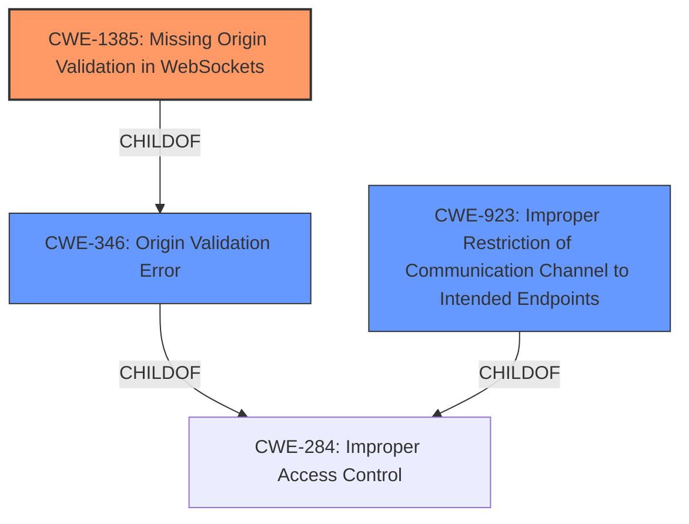

# Analysis for CVE-2022-22757

# Summary
| CWE ID | CWE Name | Confidence | CWE Abstraction Level | CWE Vulnerability Mapping Label | CWE-Vulnerability Mapping Notes |
|---|---|---|---|---|---|
| CWE-1385 | Missing Origin Validation in WebSockets | 0.9 | Variant | Allowed | Primary CWE |
| CWE-346 | Origin Validation Error | 0.7 | Class | Allowed-with-Review | Secondary Candidate |
| CWE-923 | Improper Restriction of Communication Channel to Intended Endpoints | 0.6 | Class | Allowed-with-Review | Secondary Candidate |

## Evidence and Confidence

*   **Confidence Score:** 0.9
*   **Evidence Strength:** HIGH

## Relationship Analysis
The primary CWE, CWE-1385 (Missing Origin Validation in WebSockets), is a Variant of CWE-346 (Origin Validation Error). CWE-346, in turn, is a child of CWE-284 (Improper Access Control). The relationship analysis influenced the decision to select CWE-1385 as the primary CWE because it is more specific and directly addresses the **missing origin validation** in WebSockets. While CWE-346 and CWE-923 are relevant, they are higher-level classes.

## Vulnerability Chain
The vulnerability chain starts with the **missing validation** of the `Host` and `Origin` headers. This leads to the ability for a malicious website to connect to and control the user's browser locally, potentially leading to information disclosure or other malicious activity.

**Chain:**
1.  **Root Cause:** **Missing origin validation** (CWE-1385)
2.  **Impact:** Remote control of browser, information disclosure

## Summary of Analysis
The initial analysis, supported by the provided evidence, points to **missing validation** of `Host` and `Origin` headers in the WebDriver component of Firefox as the root cause.

> *"Remote Agent, used in WebDriver, **did not validate the Host or Origin headers**. This could have allowed websites to connect back locally to the users browser to control it."*

The Retriever results also support this analysis, with CWE-1385 (Missing Origin Validation in WebSockets) being the top-ranked CWE. The relationship analysis confirms that CWE-1385 is a more specific variant of CWE-346 (Origin Validation Error), making it a more appropriate choice. The decision to select CWE-1385 is based on the evidence from the vulnerability description, the Retriever results, and the hierarchical relationship between CWEs.

The selected CWEs are at the optimal level of specificity because CWE-1385 directly describes the **missing origin validation** in WebSockets, which is the root cause of the vulnerability.
While other CWEs were considered, they were either too general (CWE-346, CWE-923) or not directly related to the vulnerability (CWE-668, CWE-125).

Relevant CWE Information:

# Enhanced Context (25 CWEs)
The following CWEs were identified as potentially relevant to this vulnerability:

## CWE-668: Exposure of Resource to Wrong Sphere
**Abstraction Level**: Class
**Similarity Score**: 0.78
**Source**: dense

**Description**:
The product exposes a resource to the wrong control sphere, providing unintended actors with inappropriate access to the resource.

**Mapping Guidance**:
- Usage: Discouraged
- Rationale: CWE-668 is high-level and is often misused as a catch-all when lower-level CWE IDs might be applicable. It is sometimes used for low-information vulnerability reports [REF-1287]. It is a level-1 Class (i.e., a child of a Pillar). It is not useful for trend analysis.

*Reason for not selecting*: CWE-668 is too high-level and doesn't specifically address the **missing origin validation**.

## CWE-1289: Improper Validation of Unsafe Equivalence in Input
**Abstraction Level**: Base
**Similarity Score**: 0.77
**Source**: dense

**Description**:
The product receives an input value that is used as a resource identifier or other type of reference, but it does not validate or incorrectly validates that the input is equivalent to a potentially-unsafe value.

**Mapping Guidance**:
- Usage: Allowed
- Rationale: This CWE entry is at the Base level of abstraction, which is a preferred level of abstraction for mapping to the root causes of vulnerabilities.

*Reason for not selecting*: While there is a **missing validation**, this CWE is too specific.

## CWE-41: Improper Resolution of Path Equivalence
**Abstraction Level**: Base
**Similarity Score**: 0.77
**Source**: dense

**Description**:
The product is vulnerable to file system contents disclosure through path equivalence. Path equivalence involves the use of special characters in file and directory names. The associated manipulations are intended to generate multiple names for the same object.

**Mapping Guidance**:
- Usage: Allowed
- Rationale: This CWE entry is at the Base level of abstraction, which is a preferred level of abstraction for mapping to the root causes of vulnerabilities.

*Reason for not selecting*: This CWE is not relevant to the vulnerability.

## CWE-807: Reliance on Untrusted Inputs in a Security Decision
**Abstraction Level**: Base
**Similarity Score**: 0.76
**Source**: dense

**Description**:
The product uses a protection mechanism that relies on the existence or values of an input, but the input can be modified by an untrusted actor in a way that bypasses the protection mechanism.

**Mapping Guidance**:
- Usage: Allowed
- Rationale: This CWE entry is at the Base level of abstraction, which is a preferred level of abstraction for mapping to the root causes of vulnerabilities.

*Reason for not selecting*: While the system relies on untrusted inputs, the root cause is the **missing validation**, not the reliance itself.

## CWE-267: Privilege Defined With Unsafe Actions
**Abstraction Level**: Base
**Similarity Score**: 0.76
**Source**: dense

**Description**:
A particular privilege, role, capability, or right can be used to perform unsafe actions that were not intended, even when it is assigned to the correct entity.

**Mapping Guidance**:
- Usage: Allowed
- Rationale: This CWE entry is at the Base level of abstraction, which is a preferred level of abstraction for mapping to the root causes of vulnerabilities.

*Reason for not selecting*: This CWE is not relevant to the vulnerability.

## CWE-653: Improper Isolation or Compartmentalization
**Abstraction Level**: Class
**Similarity Score**: 0.76
**Source**: dense

**Description**:
The product does not properly compartmentalize or isolate functionality, processes, or resources that require different privilege levels, rights, or permissions.

**Mapping Guidance**:
- Usage: Allowed
- Rationale: This CWE entry is at the Base level of abstraction, which is a preferred level of abstraction for mapping to the root causes of vulnerabilities.

*Reason for not selecting*: This CWE is not directly related to the **missing origin validation**.

## CWE-274: Improper Handling of Insufficient Privileges
**Abstraction Level**: Base
**Similarity Score**: 0.76
**Source**: dense

**Description**:
The product does not handle or incorrectly handles when it has insufficient privileges to perform an operation, leading to resultant weaknesses.

**Mapping Guidance**:
- Usage: Discouraged
- Rationale: This CWE entry could be deprecated in a future version of CWE.

*Reason for not selecting*: This CWE is not relevant to the vulnerability.

## CWE-610: Externally Controlled Reference to a Resource in Another Sphere
**Abstraction Level**: Class
**Similarity Score**: 0.76
**Source**: dense

**Description**:
The product uses an externally controlled name or reference that resolves to a resource that is outside of the intended control sphere.

**Mapping Guidance**:
- Usage: Discouraged
- Rationale: This CWE entry is a level-1 Class (i.e., a child of a Pillar). It might have lower-level children that would be more appropriate

*Reason for not selecting*: This CWE is related, but not as specific as the selected ones.

## CWE-451: User Interface (UI) Misrepresentation of Critical Information
**Abstraction Level**: Class
**Similarity Score