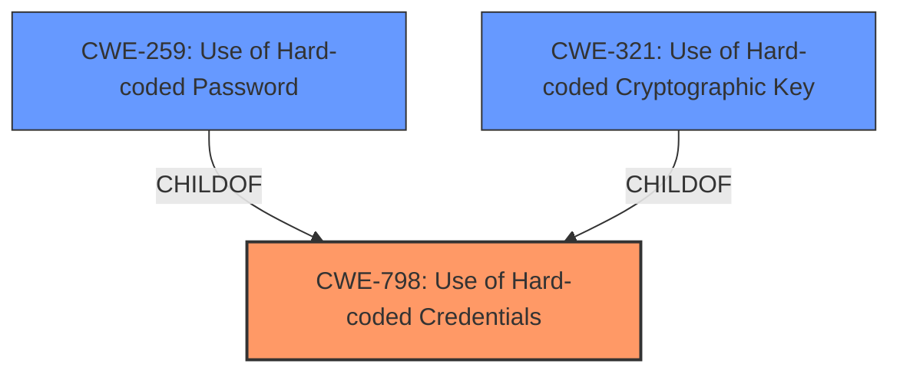

# Analysis for CVE-2022-22765

# Summary
| CWE ID | CWE Name | Confidence | CWE Abstraction Level | CWE Vulnerability Mapping Label | CWE-Vulnerability Mapping Notes |
|---|---|---|---|---|---|
| CWE-798 | Use of Hard-coded Credentials | 1 | Base | Allowed | Primary CWE. The vulnerability stems from the system containing **hardcoded credentials**. |
| CWE-259 | Use of Hard-coded Password | 0.7 | Variant | Allowed | Secondary CWE. A more specific variant of CWE-798, focusing on **hardcoded passwords** being the specific type of credential. |
| CWE-321 | Use of Hard-coded Cryptographic Key | 0.7 | Variant | Allowed | Secondary CWE. A more specific variant of CWE-798, focusing on **hardcoded cryptographic keys** being the specific type of credential. |

## Evidence and Confidence

*   **Confidence Score:** 0.9
*   **Evidence Strength:** HIGH

## Relationship Analysis
The primary weakness, CWE-798, is a Base level CWE. The vulnerability description clearly states the presence of **hardcoded credentials**. The child CWEs, CWE-259 and CWE-321, are more specific variants that describe the type of **hardcoded credentials** used. The decision to include these child CWEs is based on their relationship to CWE-798 and the need for a more granular representation of the vulnerability.

## Vulnerability Chain
The chain of events for this vulnerability is straightforward:
1.  **Root Cause:** The system contains **hardcoded credentials** (CWE-798).
2.  **Impact:** Threat actors can access, modify, or delete sensitive information, including ePHI, PHI, and PII.

## Summary of Analysis
The initial analysis identified CWE-798 as the primary weakness due to the presence of **hardcoded credentials**. The retriever results and vulnerability description support this classification. The relationship analysis further refined this by considering the child CWEs, CWE-259 and CWE-321, which provide more specific details about the type of **hardcoded credentials** used.

The evidence from the "CVE Reference Links Content Summary" section explicitly states: "The vulnerability stems from the use of hard-coded credentials within the BD Viper LT system... **CWE-798: Use of Hard-coded Credentials** - The system contains credentials (likely usernames and passwords) that are embedded directly in the software code or configuration files."

The selection of CWE-798, CWE-259 and CWE-321 is based on the provided evidence and the hierarchical relationships between these CWEs. The chosen CWEs provide an optimal level of specificity, accurately representing the **root cause** of the vulnerability and its potential impact.