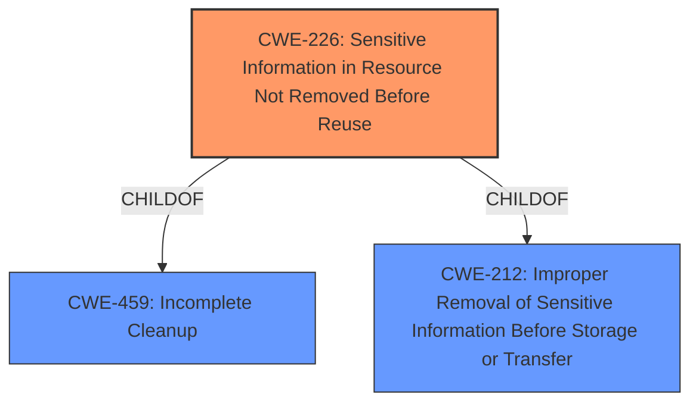

# Analysis Report for CVE-2022-22779

# Vulnerability Analysis Report: CVE-2022-22779

## Description


## Analysis (with Relationship Data)

# Summary
| CWE ID | CWE Name | Confidence | CWE Abstraction Level | CWE Vulnerability Mapping Label | CWE-Vulnerability Mapping Notes |
|---|---|---|---|---|---|
| CWE-226 | Sensitive Information in Resource Not Removed Before Reuse | 0.9 | Base | Allowed | Primary CWE. The **improper message removal** resulted in the disclosure of sensitive information. |
| CWE-459 | Incomplete Cleanup | 0.7 | Base | Allowed | Secondary CWE. Relates to the aspect of the application **failing to properly clean up** temporary resources after they have been used, leading to sensitive information being exposed. |

## Evidence and Confidence

*   **Confidence Score:** 0.8
*   **Evidence Strength:** MEDIUM

## Relationship Analysis
The primary CWE is CWE-226, which focuses on the failure to remove sensitive information from a resource before reuse. This has a ChildOf relationship with CWE-459 (Incomplete Cleanup) and CWE-212 (Improper Removal of Sensitive Information Before Storage or Transfer). The secondary CWE, CWE-459, is related because it describes the broader issue of failing to clean up temporary resources. CWE-212 is similar to CWE-226, but focuses on the transfer or storage of sensitive information to unauthorized actors, while CWE-226 is geared towards the final stage of resource lifecycle. The selection of CWE-226 as the primary CWE is due to its direct relevance to the vulnerability description, focusing on the reuse of a resource (file system) without proper sanitization.



## Vulnerability Chain
The chain of events is as follows:
1.  A user initiates exploded messages.
2.  The receiving user switches to a non-chat feature and puts the host in sleep mode.
3.  The sending user explodes the messages.
4.  The Keybase client **fails to properly remove** the messages from the receiving user's filesystem (**CWE-226**).
5.  Sensitive information is disclosed.

In this chain, CWE-226 represents the root cause, as it describes the specific **failure to remove sensitive information** from the filesystem before it can be accessed by an unauthorized actor or process.

## Summary of Analysis
The initial analysis focused on identifying the root cause of the vulnerability: the **improper message removal** leading to sensitive information disclosure. The retriever results suggested several potential CWEs, with CWE-226 (Sensitive Information in Resource Not Removed Before Reuse) being the top candidate. After reviewing the details of the vulnerability description and comparing it with the CWE specifications, CWE-226 was chosen as the primary CWE because it directly addresses the issue of failing to clear sensitive information from a resource (the user's filesystem) before it is made available for reuse. CWE-459 (Incomplete Cleanup) was selected as a secondary CWE because it addresses the broader aspect of failing to properly clean up temporary resources after use.

The evidence supporting this decision comes from the "Vulnerability Description Key Phrases" section, which identifies the **rootcause** as **improper message removal** and the impact as "disclosure of sensitive information." The vulnerability description also specifies that the Keybase client **fails to properly remove exploded messages**, further supporting the selection of CWE-226.

The relationships between the CWEs influenced the final selection by providing a broader context for understanding the vulnerability. CWE-226's relationship with CWE-459 and CWE-212 helped to refine the focus on the specific issue of failing to clear sensitive information from a resource before reuse, as opposed to simply failing to clean up temporary resources in general.

The selected CWEs are at the optimal level of specificity because they directly address the root cause of the vulnerability, which is the **failure to remove sensitive information** from the user's filesystem. While other CWEs may be related to the vulnerability, they do not capture the specific nature of the weakness as accurately as CWE-226 and CWE-459.


## CWE Relationship Analysis

Current CWEs represent these abstraction levels: .


### Vulnerability Chain Analysis

**Chain starting from CWE-212:**
- 212 (Improper Removal of Sensitive Information Before Storage or Transfer) - ROOT


**Chain starting from CWE-226:**
- 226 (Sensitive Information in Resource Not Removed Before Reuse) - ROOT


### CWE Relationship Diagram

```mermaid
graph TD
    classDef primary fill:#f96,stroke:#333,stroke-width:2px
    classDef secondary fill:#69f,stroke:#333
    classDef tertiary fill:#9e9,stroke:#333
```


*Report generated on 2025-03-30 23:23:27*
