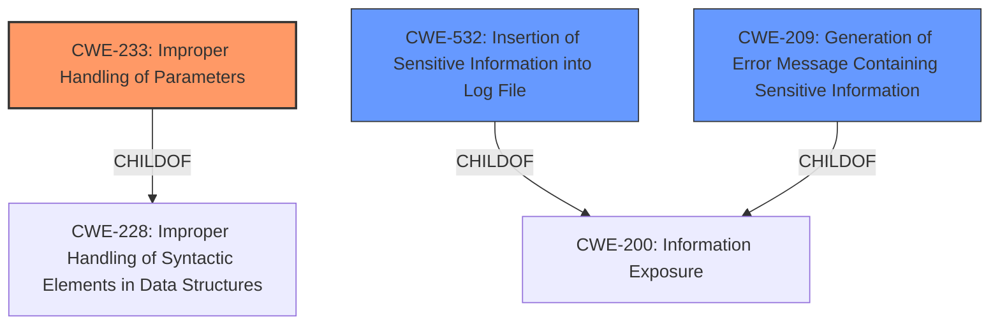

# Analysis Report for CVE-2022-22792

# Vulnerability Analysis Report: CVE-2022-22792

## Description


## Analysis (with Relationship Data)

# Summary
| CWE ID | CWE Name | Confidence | CWE Abstraction Level | CWE Vulnerability Mapping Label | CWE-Vulnerability Mapping Notes |
|---|---|---|---|---|---|
| CWE-233 | Improper Handling of Parameters | 0.9 | Base | Allowed | Primary CWE |
| CWE-532 | Insertion of Sensitive Information into Log File | 0.7 | Base | Allowed | Secondary Candidate |
| CWE-209 | Generation of Error Message Containing Sensitive Information | 0.6 | Base | Allowed | Secondary Candidate |

## Evidence and Confidence

*   **Confidence Score:** 0.8
*   **Evidence Strength:** MEDIUM

## Relationship Analysis
The primary CWE is CWE-233, which has a parent CWE of CWE-228.
CWE-532 and CWE-209 are related to information exposure. CWE-209 is a child of CWE-200 (Information Exposure). These relationships show potential chains of weaknesses leading to information exposure due to **improper handling of parameters**.



## Vulnerability Chain
The vulnerability chain starts with **improper handling of URL parameters** (CWE-233), which leads to the exposure of user data and passwords in clear text. The exposed data might be logged (CWE-532) or presented in an error message (CWE-209).

## Summary of Analysis
The initial assessment, based on the vulnerability description, points to **improper handling of URL parameters** as the root cause. The description states "MobiSoft - MobiPlus User Take Over and **Improper Handling of url Parameters** Attacker can navigate to specific url which will expose all the users and password in clear text. http//IP/MobiPlusWeb/Handlers/MainHandler.ashx?MethodName=GridData&ampGridName=Users".

This aligns with CWE-233 (Improper Handling of Parameters), which describes situations where a product "does not properly handle when the expected number of parameters, fields, or arguments is not provided in input, or if those parameters are undefined." The attacker's ability to expose user data by simply navigating to a specific URL with certain parameters indicates that the application is not properly validating or handling these parameters.

The exposure of user data and passwords suggests that sensitive information is being revealed, which could potentially lead to CWE-532 (Insertion of Sensitive Information into Log File) if this information is being logged, or CWE-209 (Generation of Error Message Containing Sensitive Information) if the information is displayed in an error message.

The retriever results also support CWE-233 as the primary candidate, with a high score.

The chosen CWEs are at the Base level of abstraction, which is the preferred level for root cause analysis, providing sufficient specificity for this vulnerability.

CWE-74 was considered because it can involve downstream components, however it focuses more on neutralization of special elements, which isn't the primary issue here. CWE-639 (Authorization Bypass Through User-Controlled Key) and CWE-88 (Improper Neutralization of Argument Delimiters in a Command ('Argument Injection')) were also considered but deemed less relevant as the primary issue is not about argument injection or authorization bypass via manipulated keys, but rather a general failure to handle URL parameters correctly.


## CWE Relationship Analysis

Current CWEs represent these abstraction levels: .


### Vulnerability Chain Analysis

**Chain starting from CWE-200:**
- 200 (Exposure of Sensitive Information to an Unauthorized Actor) - ROOT


**Chain starting from CWE-209:**
- 209 (Generation of Error Message Containing Sensitive Information) - ROOT


### CWE Relationship Diagram

```mermaid
graph TD
    classDef primary fill:#f96,stroke:#333,stroke-width:2px
    classDef secondary fill:#69f,stroke:#333
    classDef tertiary fill:#9e9,stroke:#333
```


*Report generated on 2025-03-30 11:39:51*
