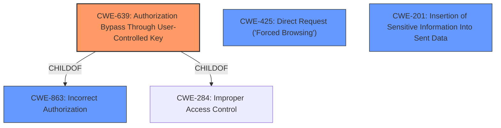

# Analysis Report for CVE-2022-22832

# Vulnerability Analysis Report: CVE-2022-22832

## Description


## Analysis (with Relationship Data)

# Summary
| CWE ID | CWE Name | Confidence | CWE Abstraction Level | CWE Vulnerability Mapping Label | CWE-Vulnerability Mapping Notes |
|---|---|---|---|---|---|
| CWE-639 | Authorization Bypass Through User-Controlled Key | 0.9 | Base | Allowed | Primary CWE |
| CWE-201 | Insertion of Sensitive Information Into Sent Data | 0.7 | Base | Allowed | Secondary Candidate |
| CWE-425 | Direct Request ('Forced Browsing') | 0.6 | Base | Allowed | Secondary Candidate |
| CWE-863 | Incorrect Authorization | 0.5 | Class | Allowed-with-Review | Secondary Candidate |

## Evidence and Confidence

*   **Confidence Score:** 0.8
*   **Evidence Strength:** HIGH

## Relationship Analysis
The primary CWE is CWE-639, which is a base-level weakness describing authorization bypass via user-controlled keys. It is a child of CWE-863 (Incorrect Authorization) and CWE-284 (Improper Access Control). CWE-425 (Direct Request) is also related, as it involves bypassing authorization by directly accessing resources. The choice of CWE-639 is preferred due to its specificity and base-level abstraction. The other CWE relationships did not strongly influence the decision.



## Vulnerability Chain
The vulnerability chain begins with **insecure authorization** and **lack of access controls**, leading to **information disclosure** of sensitive user data (usernames, session IDs). This then enables **privilege escalation** by allowing an attacker to generate valid tokens for other users, including administrators, ultimately leading to **complete system compromise**.
  - The root cause is **CWE-639 Authorization Bypass Through User-Controlled Key**
  - This leads to impact **CWE-201 Insertion of Sensitive Information Into Sent Data**

## Summary of Analysis
The primary assessment is based on the vulnerability description and CVE reference summary, which clearly indicate that an **unauthenticated attacker** can access user data due to **improper authorization**. The key piece of evidence is the ability to generate authorization tokens using disclosed usernames and session IDs.

> The vulnerability stems from insecure API design in Servisnet Tessa. Specifically, the API endpoint `/data-service/users/[userid]` allows any authenticated user, regardless of their privilege level, to retrieve information about other users, including administrator accounts.

This evidence supports the selection of CWE-639, which addresses authorization bypass through user-controlled keys. The retriever results also support this decision, with CWE-639 being the top match.

CWE-201 is a secondary issue because sensitive information is disclosed as a result of the authorization bypass. An attacker is able to retrieve the user information that is sent back from the API.

CWE-425 is also a candidate because the vulnerability allows direct access to user data via the `/data-service/users/[userid]` endpoint without proper authorization checks. However, CWE-639 is a more precise fit because it captures the root cause of the authorization bypass.

CWE-863 is considered but downgraded because it is a class-level CWE, while CWE-639 is a more specific base-level CWE.

The selected CWEs are at the optimal level of specificity because they directly address the root cause (CWE-639) and a major consequence (CWE-201) of the vulnerability. Other CWEs considered were either too general (CWE-863) or less directly related to the core weakness (CWE-425).

Relevant CWE Information:

# Enhanced Context (25 CWEs)

## CWE-639: Authorization Bypass Through User-Controlled Key
**Abstraction Level**: Base
**Similarity Score**: 0.77
**Source**: dense

**Description**:
The system's authorization functionality does not prevent one user from gaining access to another user's data or record by modifying the key value identifying the data.

**Mapping Guidance**:
- Usage: Allowed
- Rationale: This CWE entry is at the Base level of abstraction, which is a preferred level of abstraction for mapping to the root causes of vulnerabilities.

## CWE-201: Insertion of Sensitive Information Into Sent Data
**Abstraction Level**: Base
**Similarity Score**: 3.32
**Source**: graph

**Description**:
The code transmits data to another actor, but a portion of the data includes sensitive information that should not be accessible to that actor.

**Mapping Guidance**:
- Usage: Allowed
- Rationale: This CWE entry is at the Base level of abstraction, which is a preferred level of abstraction for mapping to the root causes of vulnerabilities.

## CWE-425: Direct Request ('Forced Browsing')
**Abstraction Level**: Base
**Similarity Score**: 5334.92
**Source**: sparse

**Description**:
The web application does not adequately enforce appropriate authorization on all restricted URLs, scripts, or files.

**Mapping Guidance**:
- Usage: Allowed
- Rationale: This CWE entry is at the Base level of abstraction, which is a preferred level of abstraction for mapping to the root causes of vulnerabilities.

## CWE-863: Incorrect Authorization
**Abstraction Level**: Class
**Similarity Score**: 5467.58
**Source**: sparse

**Description**:
The product performs an authorization check when an actor attempts to access a resource or perform an action, but it does not correctly perform the check.

**Mapping Guidance**:
- Usage: Allowed-with-Review
- Rationale: This CWE entry is a Class and might have Base-level children that would be more appropriate


## CWE Relationship Analysis

Current CWEs represent these abstraction levels: .


### Vulnerability Chain Analysis

**Chain starting from CWE-201:**
- 201 (Insertion of Sensitive Information Into Sent Data) - ROOT


**Chain starting from CWE-425:**
- 425 (Direct Request ('Forced Browsing')) - ROOT


### CWE Relationship Diagram

```mermaid
graph TD
    classDef primary fill:#f96,stroke:#333,stroke-width:2px
    classDef secondary fill:#69f,stroke:#333
    classDef tertiary fill:#9e9,stroke:#333
```


*Report generated on 2025-03-31 03:21:58*
