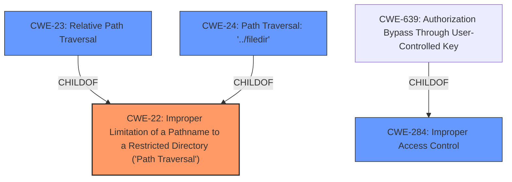

# Raw Analyzer Response for CVE-2022-22914

# Summary
| CWE ID  | CWE Name                                                                     | Confidence | CWE Abstraction Level | CWE Vulnerability Mapping Label | CWE-Vulnerability Mapping Notes |
| :-------- | :--------------------------------------------------------------------------- | :--------- | :---------------------- | :------------------------------ | :-------------------------------- |
| CWE-22    | Improper Limitation of a Pathname to a Restricted Directory ('Path Traversal') | 1.0        | Base                    | Primary                         | Allowed                           |
| CWE-284   | Improper Access Control                                                      | 0.5        | Pillar                  | Secondary                       | Discouraged                        |

## Evidence and Confidence

*   **Confidence Score:** 0.75
*   **Evidence Strength:** HIGH

## Relationship Analysis
The primary CWE is CWE-22, which is a Base level CWE that accurately describes the path traversal vulnerability. CWE-284 is a Pillar level CWE, and while the vulnerability description mentions "incorrect access control," it leads to path traversal, making CWE-22 the more specific and appropriate choice. CWE-22 has child CWEs like CWE-23, CWE-24, CWE-25, CWE-26, CWE-29, CWE-36 and CWE-37 which represent specific types of path traversal.

## Vulnerability Chain
The vulnerability chain starts with **incorrect access control** which leads to **path traversal**, ultimately resulting in the ability to view and download content in the upload directory.

## Summary of Analysis
The initial assessment identified that the vulnerability is primarily due to **path traversal** enabled by **incorrect access control**. The evidence from the "Vulnerability Description Key Phrases" section confirms this with the entries: "**rootcause:** **incorrect access control**" and "**weakness:** **path traversal**". Further, the "CVE Reference Links Content Summary" section states: "This vulnerability involves **incorrect access control** in the FileManager, which allows unauthenticated remote users to view and download content from the upload directory. This is achieved via **path traversal**."

The retriever results also support this, with CWE-22 having the highest score.

CWE-284 was considered because **incorrect access control** is listed as the root cause, but it's too high-level. The vulnerability description and the retriever results suggest that the primary issue is path traversal (CWE-22). While **incorrect access control** contributes to the vulnerability, the more specific weakness is the **path traversal** itself.

The selection of CWE-22 is at the optimal level of specificity because it directly describes the **path traversal** vulnerability, which is the mechanism by which the attacker can access unauthorized files. The other CWEs considered were either too general (CWE-284) or too specific (variants of path traversal).

Relevant CWE Information:

# Enhanced Context (25 CWEs)
The following CWEs were identified as potentially relevant to this vulnerability:

## CWE-23: Relative Path Traversal
**Abstraction Level**: Base
**Similarity Score**: 0.79
**Source**: dense

**Description**:
The product uses external input to construct a pathname that should be within a restricted directory, but it does not properly neutralize sequences such as ".." that can resolve to a location that is outside of that directory.

**Mapping Guidance**:
- Usage: Allowed
- Rationale: This CWE entry is at the Base level of abstraction, which is a preferred level of abstraction for mapping to the root causes of vulnerabilities.

## CWE-22: Improper Limitation of a Pathname to a Restricted Directory ('Path Traversal')
**Technical Explanation:** The vulnerability description explicitly mentions **path traversal**, which aligns directly with the description of CWE-22. The **incorrect access control** allows attackers to bypass intended restrictions and access files outside the designated upload directory.
**Security Implications:** Attackers can potentially access sensitive files, system configurations, or other critical resources, leading to information disclosure, privilege escalation, or even remote code execution.
**Relationships:** CWE-22 is a base CWE, and more specific variants like CWE-23 (Relative Path Traversal) and CWE-24 (Path Traversal: '../filedir') could be considered if more specific information about the type of path traversal was available.
**Mapping Guidance Influence:** The MITRE mapping guidance recommends using the Base level of abstraction when it accurately represents the weakness, which is the case here.
**Confidence:** 1.0

## CWE-284: Improper Access Control
**Technical Explanation:** The vulnerability description mentions **incorrect access control** as the root cause. However, CWE-284 is a high-level Pillar that covers a broad range of access control issues. While the vulnerability does involve **incorrect access control**, the more specific weakness is path traversal (CWE-22), which is the mechanism by which the attacker bypasses the intended access restrictions.
**Security Implications:** Attackers can bypass intended access restrictions, leading to unauthorized access to resources or functionality.
**Relationships:** CWE-284 is a Pillar, and more specific CWEs like CWE-639 (Authorization Bypass Through User-Controlled Key) or CWE-862 (Missing Authorization) could be considered if more details about the access control issue were available. However, the resulting impact is path traversal.
**Mapping Guidance Influence:** The MITRE mapping guidance discourages using CWE-284 due to its high-level nature and recommends using more specific descendants.
**Confidence:** 0.5

## Other CWEs Considered:
- CWE-23, CWE-24, CWE-29, CWE-36, CWE-37: These are specific variants of Path Traversal (ChildOf CWE-22). They were not selected because the vulnerability description does not provide enough detail to determine the specific type of path traversal being used.
- CWE-73: External Control of File Name or Path: Considered, but the core issue isn't the external control of the filename directly, but the **improper limitation of the pathname**, which makes CWE-22 a better fit.
- CWE-425: Direct Request ('Forced Browsing'): While the attacker directly requests the file, the primary issue is the **path traversal** that allows them to access it. This is a secondary issue and not the root cause.
- CWE-639: Authorization Bypass Through User-Controlled Key: This CWE is related to bypassing authorization through a user-controlled key, but it is not directly applicable since the primary weakness is the **path traversal** itself.