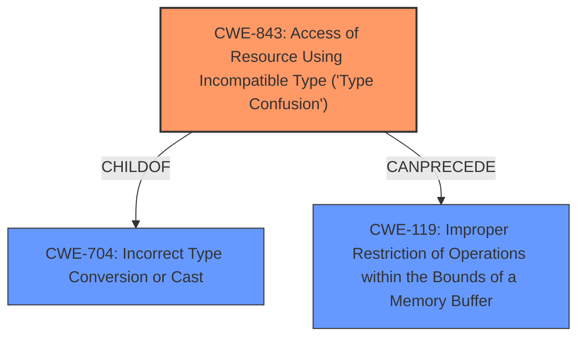

# Analysis for CVE-2022-2295

# Summary
| CWE ID  | CWE Name                                                                    | Confidence | CWE Abstraction Level | CWE Vulnerability Mapping Label | CWE-Vulnerability Mapping Notes |
| :-------- | :-------------------------------------------------------------------------- | :---------- | :---------------------- | :------------------------------ | :-------------------------------- |
| CWE-843 | Access of Resource Using Incompatible Type ('Type Confusion') | 1.0        | Base                    | Primary CWE                     | Allowed                           |

## Evidence and Confidence

*   **Confidence Score:** 1.0
*   **Evidence Strength:** HIGH

## Relationship Analysis
The primary CWE, CWE-843, is a base-level weakness, making it a good fit for direct mapping. It has child relationships with CWE-704, indicating it is a specific type of improper data access. Additionally, it has a CANPRECEDE relationship with CWE-119, which means type confusion can lead to buffer overflows. The relationship analysis supports the selection of CWE-843 because it is a base-level CWE, and the description aligns well with the provided information.

## Vulnerability Chain
The vulnerability chain starts with **type confusion in the V8** engine, which leads to heap corruption.
  - The root cause is **type confusion**, represented by CWE-843.
  - The impact is heap corruption.

## Summary of Analysis
The initial analysis strongly suggests CWE-843 as the primary weakness due to the explicit mention of "**confusion in V8**" in the vulnerability description, which maps directly to the "Type Confusion" weakness. The CVE Reference Links Content Summary also confirms "**Type Confusion in V8**" as the root cause. The retriever results also support CWE-843 as the top candidate with a similarity score of 0.369. The description matches, the **rootcause** aligns, and the mapping guidance allows for this base-level mapping. Therefore, the selected CWE is at the optimal level of specificity based on the evidence.

Relevant CWE Information:

# Enhanced Context (25 CWEs)

## CWE-843: Access of Resource Using Incompatible Type ('Type Confusion')

**Technical Explanation:**
The vulnerability description explicitly mentions "**confusion in V8**". This directly aligns with the definition of CWE-843, which describes a situation where a resource is accessed using an incompatible type. The security implication is heap corruption, which can lead to remote code execution. The relationship analysis shows that CWE-843 can precede CWE-119 (Improper Restriction of Operations within the Bounds of a Memory Buffer), suggesting that type confusion can lead to buffer overflows. The mapping guidance allows for this base-level mapping, and the rationale supports the direct match between the description and the CWE definition.