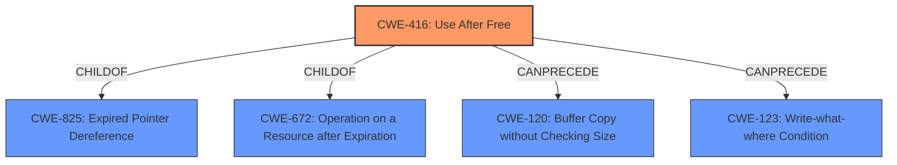

# Raw Analyzer Response for CVE-2022-2296

# Summary
| CWE ID | CWE Name | Confidence | CWE Abstraction Level | CWE Vulnerability Mapping Label | CWE-Vulnerability Mapping Notes |
|---|---|---|---|---|---|
| CWE-416 | Use After Free | 1.0 | Variant | Allowed | Primary CWE |

## Evidence and Confidence

*   **Confidence Score:** 1.0
*   **Evidence Strength:** HIGH

## Relationship Analysis
The primary relationship that influenced the decision was the hierarchical relationship with `CWE-825` (Expired Pointer Dereference), `CWE-672` (Operation on a Resource after Expiration). `CWE-416` is a Variant of these, providing a more specific classification than the parent classes. There are also chain relationships such as `CanPrecede -> CWE-120`, `CanPrecede -> CWE-123`.

## Vulnerability Chain
The vulnerability chain starts with the **use after free** condition, which leads to heap corruption, and ultimately allows for remote code execution. The chain is as follows:
1.  **Use After Free (CWE-416)**: The core weakness.
2.  Heap Corruption: The direct result of the **use after free**.
3.  Remote Code Execution: The final impact of the vulnerability.

## Summary of Analysis
The primary weakness is a **use after free** vulnerability. The description explicitly states "**rootcause:** **use after free**", which aligns directly with `CWE-416` (Use After Free). The CVE Reference Links Content Summary also confirms this with entries for both "root\_cause" and "weaknesses" being "**Use after free**". `CWE-416` is a Variant-level CWE, providing a specific classification, and the mapping guidance allows for its use. The retriever results also list `CWE-416` as the top candidate.

Other CWEs Considered and Rejected:
*   `CWE-366` (Race Condition within a Thread): While race conditions can sometimes lead to use-after-free vulnerabilities, there is no explicit mention of a race condition in the description or CVE details provided.
*   `CWE-122` (Heap-based Buffer Overflow): The description mentions heap corruption as an impact, but the root cause is the **use after free**, not a buffer overflow directly.
*   `CWE-362` (Concurrent Execution using Shared Resource with Improper Synchronization ('Race Condition')): Similar to `CWE-366`, there is no direct evidence of a race condition.
*    `CWE-415` (Double Free): There is no direct evidence of a double free.