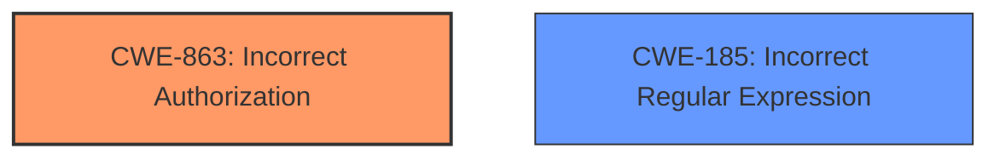

# Enhanced Analysis for CVE-2022-22978

# Summary
| CWE ID    | CWE Name                                                                                                         | Confidence | CWE Abstraction Level | CWE Vulnerability Mapping Label | CWE-Vulnerability Mapping Notes |
| --------- | ---------------------------------------------------------------------------------------------------------------- | ---------- | ----------------------- | ------------------------------- | ------------------------------- |
| CWE-863 | Incorrect Authorization | 0.85      | Class                  | Primary                  | Allowed-with-Review               |
| CWE-185 | Incorrect Regular Expression | 0.75      | Class                  | Secondary                  | Allowed-with-Review              |

## Evidence and Confidence

*   **Confidence Score:** 0.80
*   **Evidence Strength:** HIGH

## Relationship Analysis
The primary relationship that influenced my decision was the parent-child relationship. CWE-863 is a class-level CWE, and while it's generally better to choose a base-level CWE, in this case, the description aligns well with the class definition of incorrect authorization. CWE-185 which is a Class level CWE is related to incorrect Regular Expression.



## Vulnerability Chain
The vulnerability chain starts with the **misconfigured RegexRequestMatcher** (CWE-185). This leads to an **incorrect authorization** (CWE-863), ultimately resulting in an authorization bypass.

## Summary of Analysis
The analysis is primarily based on the provided evidence. The vulnerability description clearly states that the **misconfigured RegexRequestMatcher** leads to an authorization bypass. The CVE Reference Links Content Summary further reinforces this by stating that the root cause is the **misconfiguration** with `.` in the regular expression, which leads to an authorization bypass.

The retriever results also support this, with CWE-863 (Incorrect Authorization) being the top-ranked CWE. The mapping guidance for CWE-863 suggests examining its children for a better fit, but none of the children are as directly applicable as CWE-863 itself. CWE-185 (Incorrect Regular Expression) is also a relevant CWE, as the **misconfiguration** of the `RegexRequestMatcher` involves an incorrect regular expression.

The selected CWEs are at an appropriate level of specificity. While it would be ideal to have a base-level CWE, the class-level CWEs (CWE-863 and CWE-185) accurately represent the nature of the vulnerability.

Relevant CWE Information:

# Enhanced Context (25 CWEs)
The following CWEs were identified as potentially relevant to this vulnerability:

## CWE-807: Reliance on Untrusted Inputs in a Security Decision
**Abstraction Level**: Base
**Similarity Score**: 0.78
**Source**: dense

**Description**:
The product uses a protection mechanism that relies on the existence or values of an input, but the input can be modified by an untrusted actor in a way that bypasses the protection mechanism.

**Mapping Guidance**:
- Usage: Allowed
- Rationale: This CWE entry is at the Base level of abstraction, which is a preferred level of abstraction for mapping to the root causes of vulnerabilities.

## CWE-863: Incorrect Authorization
**Abstraction:** Class
**Status:** Incomplete

### Description
The product performs an authorization check when an actor attempts to access a resource or perform an action, but it does not correctly perform the check.

### Extended Description
Not provided

### Alternative Terms
AuthZ: "AuthZ" is typically used as an abbreviation of "authorization" within the web application security community. It is distinct from "AuthN" (or, sometimes, "AuthC") which is an abbreviation of "authentication." The use of "Auth" as an abbreviation is discouraged, since it could be used for either authentication or authorization.

### Relationships
ChildOf -> CWE-285
ChildOf -> CWE-284

### Mapping Guidance
**Usage:** Allowed-with-Review
**Rationale:** This CWE entry is a Class and might have Base-level children that would be more appropriate
**Comments:** Examine children of this entry to see if there is a better fit
**Reasons:**
- Abstraction

### Additional Notes
**[Terminology]**

Assuming a user with a given identity, authorization is the process of determining whether that user can access a given resource, based on the user's privileges and any permissions or other access-control specifications that apply to the resource.

### Observed Examples
- **CVE-2021-39155:** Chain: A microservice integration and management platform compares the hostname in the HTTP Host header in a case-sensitive way (CWE-178, CWE-1289), allowing bypass of the authorization policy (CWE-863) using a hostname with mixed case or other variations.
- **CVE-2019-15900:** Chain: sscanf() call is used to check if a username and group exists, but the return value of sscanf() call is not checked (CWE-252), causing an uninitialized variable to be checked (CWE-457), returning success to allow authorization bypass for executing a privileged (CWE-863).
- **CVE-2009-2213:** Gateway uses default "Allow" configuration for its authorization settings.

**Justification:** The vulnerability description clearly states that the **misconfigured RegexRequestMatcher** leads to an authorization bypass. This aligns directly with the description of CWE-863, which states that the product performs an authorization check, but it does not correctly perform the check.

## CWE-185: Incorrect Regular Expression
**Abstraction:** Class
**Status:** Draft

### Description
The product specifies a regular expression in a way that causes data to be improperly matched or compared.

### Extended Description
When the regular expression is used in protection mechanisms such as filtering or validation, this may allow an attacker to bypass the intended restrictions on the incoming data.

### Alternative Terms
None

### Relationships
ChildOf -> CWE-697
CanPrecede -> CWE-187
CanPrecede -> CWE-182

### Mapping Guidance
**Usage:** Allowed-with-Review
**Rationale:** This CWE entry is a Class and might have Base-level children that would be more appropriate
**Comments:** Examine children of this entry to see if there is a better fit
**Reasons:**
- Abstraction

### Additional Notes
**[Relationship]** While there is some overlap with allowlist/denylist problems, this entry is intended to deal with incorrectly written regular expressions, regardless of their intended use. Not every regular expression is intended for use as an allowlist or denylist. In addition, allowlists and denylists can be implemented using other mechanisms besides regular expressions.

**[Research Gap]** Regexp errors are likely a primary factor in many MFVs, especially those that require multiple manipulations to exploit. However, they are rarely diagnosed at this level of detail.

### Observed Examples
- **CVE-2002-2109:** Regexp isn't "anchored" to the beginning or end, which allows spoofed values that have trusted values as substrings.
- **CVE-2005-1949:** Regexp for IP address isn't anchored at the end, allowing appending of shell metacharacters.
- **CVE-2001-1072:** Bypass access restrictions via multiple leading slash, which causes a regular expression to fail.

**Justification:** The vulnerability description mentions that the **misconfigured RegexRequestMatcher** with `.` in the regular expression can lead to an authorization bypass. This indicates that the regular expression is not correctly specified, leading to improper matching or comparison of data. This aligns with the description of CWE-185.

**CWEs Considered but Not Used:**

*   **CWE-668: Exposure of Resource to Wrong Sphere:** This CWE was considered, but it's too high-level and doesn't directly address the root cause of the vulnerability, which is the incorrect authorization due to the **misconfigured** regular expression.
*   **CWE-1333: Inefficient Regular Expression Complexity:** While the `.` character in the regular expression could potentially lead to inefficiency, the primary issue is the incorrect authorization, not the performance of the regular expression.
*   **CWE-917: Improper Neutralization of Special Elements used in an Expression Language Statement ('Expression Language Injection'):** This CWE is not applicable as the vulnerability doesn't involve expression language injection.
*   **CWE-94: Improper Control of Generation of Code ('Code Injection'):** This CWE is not applicable as the vulnerability doesn't involve code injection.
*   **CWE-306: Missing Authentication for Critical Function:** This CWE is not applicable as the vulnerability is about incorrect authorization, not missing authentication.
*   **CWE-552: Files or Directories Accessible to External Parties:** This CWE is not relevant as the vulnerability does not involve exposing files or directories to external parties.
*   **CWE-287: Improper Authentication:** This CWE is not applicable as the vulnerability is about


## CWE Relationship Analysis

Current CWEs represent these abstraction levels: .


### Vulnerability Chain Analysis

**Chain starting from CWE-807:**
- 807 (Reliance on Untrusted Inputs in a Security Decision) - ROOT


**Chain starting from CWE-668:**
- 668 (Exposure of Resource to Wrong Sphere) - ROOT


### CWE Relationship Diagram

```mermaid
graph TD
    classDef primary fill:#f96,stroke:#333,stroke-width:2px
    classDef secondary fill:#69f,stroke:#333
    classDef tertiary fill:#9e9,stroke:#333
```