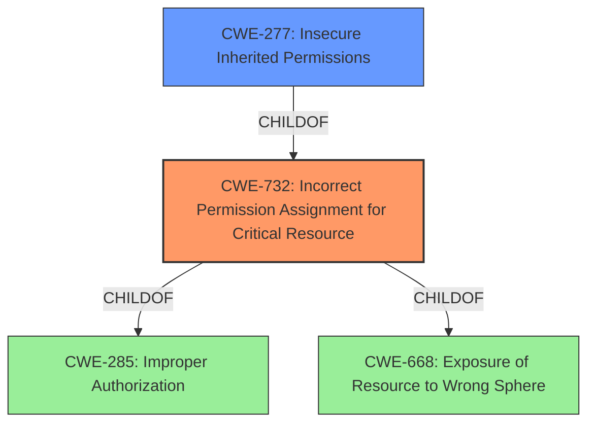

# Analysis for CVE-2022-22988

# Summary
| CWE ID | CWE Name | Confidence | CWE Abstraction Level | CWE Vulnerability Mapping Label | CWE-Vulnerability Mapping Notes |
|---|---|---|---|---|---|
| CWE-732 | Incorrect Permission Assignment for Critical Resource | 1.0 | Class | Allowed-with-Review | Primary CWE |
| CWE-277 | Insecure Inherited Permissions | 0.7 | Variant | Allowed | Secondary Candidate |

## Evidence and Confidence

*   **Confidence Score:** 0.9
*   **Evidence Strength:** HIGH

## Relationship Analysis
The primary CWE, CWE-732 (Incorrect Permission Assignment for Critical Resource), is a Class-level CWE and has child relationships to CWE-285 (Improper Authorization) and CWE-668 (Exposure of Resource to Wrong Sphere). The secondary CWE, CWE-277 (Insecure Inherited Permissions), is a Variant of CWE-732. This means CWE-277 is a more specific case of the general permission assignment issue described by CWE-732. Because the report indicates "File and directory permissions have been corrected," the base issue is one of incorrect permission assignment which leads to exposure of resources, not necessarily an authorization bypass.

## Vulnerability Chain
The vulnerability chain starts with **insecure file and directory permissions** (**ROOT CAUSE**), which allows **unintended users** to **access and modify files and directories** (**IMPACT**). The attacker can **traverse through the files and directories** (**VECTOR**) due to the **improper permissions**.

## Summary of Analysis
The analysis is based on the provided evidence, especially the "CVE Reference Links Content Summary" section and the "Vulnerability Description Key Phrases".

The primary CWE is CWE-732 Incorrect Permission Assignment for Critical Resource. The description states: "The product specifies permissions for a security-critical resource in a way that allows that resource to be read or modified by unintended actors." This aligns directly with the vulnerability description, which mentions "File and directory permissions have been corrected to prevent unintended users from modifying or accessing resources." The **root cause** is the **incorrect permission assignment**, and the impact is the ability of **unintended users** to **access and modify files**. The "CVE Reference Links Content Summary" also supports this, stating that the **root cause** is "**insecure file and directory permissions** within the EdgeRover Desktop App."

CWE-277 Insecure Inherited Permissions was also considered as a secondary candidate. The description is: "A product defines a set of insecure permissions that are inherited by objects that are created by the program." This could be the case, if the application was creating files and directories, and the inherited permission mask was insecure, but without further evidence this cannot be confirmed.

The retriever identified other CWEs such as CWE-22 (Improper Limitation of a Pathname to a Restricted Directory ('Path Traversal')), CWE-668 (Exposure of Resource to Wrong Sphere), CWE-863 (Incorrect Authorization), CWE-59 (Improper Link Resolution Before File Access ('Link Following')), and CWE-639 (Authorization Bypass Through User-Controlled Key). However, these are not the primary issues. CWE-22 is more about path traversal, while the vulnerability is about incorrect permissions. CWE-668 is too broad. CWE-863 and CWE-639 are about authorization bypass, but the vulnerability is about permissions, not authorization. CWE-59 is about link following, which is not relevant to the vulnerability description.

The selection of CWE-732 is at the optimal level of specificity, as it directly addresses the root cause of the vulnerability: incorrect permission assignment. It's more specific than its parents (CWE-285 and CWE-668) and more general than its child (CWE-277).