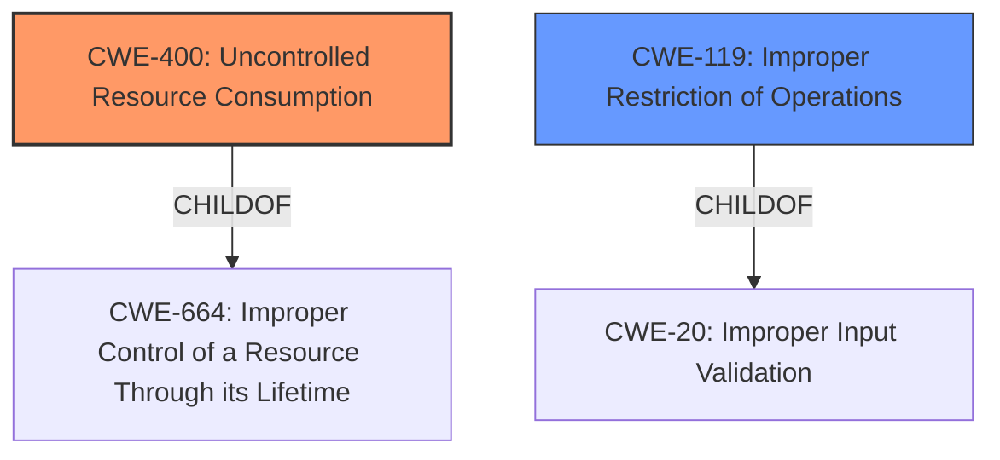

# Analysis for CVE-2022-23024

# Summary
| CWE ID | CWE Name | Confidence | CWE Abstraction Level | CWE Vulnerability Mapping Label | CWE-Vulnerability Mapping Notes |
|---|---|---|---|---|---|
| CWE-400 | Uncontrolled Resource Consumption | 0.8 | Class | Primary | Discouraged |
| CWE-119 | Improper Restriction of Operations within the Bounds of a Memory Buffer | 0.6 | Class | Secondary | Discouraged |

## Evidence and Confidence

*   **Confidence Score:** 0.7
*   **Evidence Strength:** MEDIUM

## Relationship Analysis
The primary relationship influencing my decision is the parent-child relationship between CWE-400 and its potential children, such as CWE-770 and CWE-789. While CWE-400 is a class-level CWE and thus discouraged, the provided information does not offer enough specificity to pinpoint the exact resource being exhausted or the mechanism behind it. CWE-119 is also a class level CWE and thus discouraged.



## Vulnerability Chain
The vulnerability chain starts with undisclosed IPsec traffic causing the Traffic Management Microkernel (TMM) to terminate, which can be mapped to uncontrolled resource consumption leading to denial of service.
  - The root cause is the **improper** handling of IPsec traffic with the IPsec ALG logging profile configured.
  - The weakness is the **uncontrolled** consumption of resources.
  - The impact is the termination of TMM, leading to a denial-of-service condition.

## Summary of Analysis
The initial analysis pointed to CWE-400 (Uncontrolled Resource Consumption) as the primary candidate due to the termination of the Traffic Management Microkernel (TMM) caused by undisclosed IPsec traffic. This aligns with the description of CWE-400, which involves the **improper** control of resource allocation leading to resource exhaustion.

The retriever results also include CWE-119 (Improper Restriction of Operations within the Bounds of a Memory Buffer). While a memory buffer issue could potentially contribute to the TMM termination, the description does not provide enough evidence to support this. Therefore, CWE-119 is a secondary candidate.

The selection of CWE-400 is based on the provided evidence that "undisclosed IPsec traffic can cause the Traffic Management Microkernel (TMM) to terminate." This suggests that the system is not properly managing resources when processing certain IPsec traffic patterns, leading to a denial-of-service condition.

```
Vulnerability Description Key Phrases
- impact: terminate
- vector: undisclosed IPsec traffic
- product: BIG-IP AFM
- version: 16.x before 16.1.0, 15.1.x before 15.1.4.1, 14.1.x before 14.1.4.2, and all versions of 13.1.x
- component: IPsec application layer gateway (ALG) logging profile
```

While CWE-400 is a Class-level CWE and the mapping guidance discourages its use, the limited information prevents a more specific mapping to a Base or Variant level CWE.

Relevant CWE Information:

# Enhanced Context (25 CWEs)

## CWE-400: Uncontrolled Resource Consumption
**Abstraction:** Class
**Status:** Draft

### Description
The product does not properly control the allocation and maintenance of a limited resource, thereby enabling an actor to influence the amount of resources consumed, eventually leading to the exhaustion of available resources.

### Extended Description

Limited resources include memory, file system storage, database connection pool entries, and CPU. If an attacker can trigger the allocation of these limited resources, but the number or size of the resources is not controlled, then the attacker could cause a denial of service that consumes all available resources. This would prevent valid users from accessing the product, and it could potentially have an impact on the surrounding environment. For example, a memory exhaustion attack against an application could slow down the application as well as its host operating system.