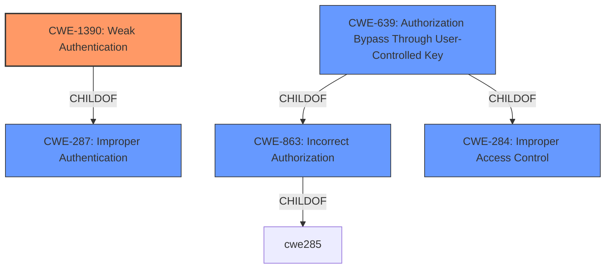

# Enhanced Analysis for CVE-2022-2303

# Summary
| CWE ID | CWE Name | Confidence | CWE Abstraction Level | CWE Vulnerability Mapping Label | CWE-Vulnerability Mapping Notes |
|---|---|---|---|---|---|
| CWE-1390 | Weak Authentication | 0.9 | Class | Primary | Allowed-with-Review |
| CWE-639 | Authorization Bypass Through User-Controlled Key | 0.7 | Base | Secondary | Allowed |
| CWE-863 | Incorrect Authorization | 0.6 | Class | Secondary | Allowed-with-Review |

## Evidence and Confidence

*   **Confidence Score:** 0.8
*   **Evidence Strength:** HIGH

## Relationship Analysis
The primary CWE, CWE-1390 (Weak Authentication), is a class-level CWE that covers situations where the authentication mechanism is insufficient. It is related to CWE-287 (Improper Authentication), which is a parent class. The secondary CWEs, CWE-639 (Authorization Bypass Through User-Controlled Key) and CWE-863 (Incorrect Authorization), represent authorization issues that arise from the weak authentication. CWE-639 is a base-level CWE and a child of both CWE-863 and CWE-284, providing a more specific characterization of the authorization bypass. The selection of CWE-1390 as primary is influenced by its direct relevance to the vulnerability's impact (bypass of 2FA enforcement), while CWE-639 and CWE-863 provide additional context regarding the authorization weaknesses present.



## Vulnerability Chain
The vulnerability chain starts with a **weakness** in the authentication mechanism, specifically the **failure** to properly enforce 2FA at the group level when using Resource Owner Password Credentials grant. This leads to the bypass of 2FA enforcement, resulting in unauthorized access to group resources.

## Summary of Analysis
The initial analysis focused on the bypass of 2FA enforcement, which strongly suggested authentication and authorization issues. The evidence, especially the "CVE Reference Links Content Summary," explicitly states that group members can bypass 2FA enforcement using Resource Owner Password Credentials grant to obtain an access token without using 2FA.

The graph relationships influenced the selection by clarifying the hierarchical structure of the CWEs. CWE-1390 (Weak Authentication) was chosen as the primary CWE because it directly addresses the vulnerability's core issue: the **inability** of the authentication mechanism to sufficiently prove the user's identity in the context of enforced 2FA.

CWE-639 (Authorization Bypass Through User-Controlled Key) and CWE-863 (Incorrect Authorization) provide additional context, highlighting that the **weakness** in authentication leads to authorization bypass and incorrect authorization checks. These are included as secondary CWEs to provide a more complete picture of the vulnerability.

The selected CWEs are at the optimal level of specificity, with CWE-1390 being a class-level CWE that accurately describes the overall **weakness** and CWE-639 being a base-level CWE that details the specific authorization bypass mechanism.

Relevant CWE Information:

# Enhanced Context (25 CWEs)
The following CWEs were identified as potentially relevant to this vulnerability:

## CWE-668: Exposure of Resource to Wrong Sphere
**Abstraction Level**: Class
**Similarity Score**: 0.74
**Source**: dense

**Description**:
The product exposes a resource to the wrong control sphere, providing unintended actors with inappropriate access to the resource.

**Mapping Guidance**:
- Usage: Discouraged
- Rationale: CWE-668 is high-level and is often misused as a catch-all when lower-level CWE IDs might be applicable. It is sometimes used for low-information vulnerability reports [REF-1287]. It is a level-1 Class (i.e., a child of a Pillar). It is not useful for trend analysis.

*Rejected*: This is too general

## CWE-639: Authorization Bypass Through User-Controlled Key
**Abstraction Level**: Base
**Similarity Score**: 0.74
**Source**: dense

**Description**:
The system's authorization functionality does not prevent one user from gaining access to another user's data or record by modifying the key value identifying the data.

**Mapping Guidance**:
- Usage: Allowed
- Rationale: This CWE entry is at the Base level of abstraction, which is a preferred level of abstraction for mapping to the root causes of vulnerabilities.

*Accepted*: This describes the bypass that occurs

## CWE-664: Improper Control of a Resource Through its Lifetime
**Abstraction Level**: Pillar
**Similarity Score**: 0.74
**Source**: dense

**Description**:
The product does not maintain or incorrectly maintains control over a resource throughout its lifetime of creation, use, and release.

**Mapping Guidance**:
- Usage: Discouraged
- Rationale: This CWE entry is high-level when lower-level children are available.

*Rejected*: This is too general

## CWE-212: Improper Removal of Sensitive Information Before Storage or Transfer
**Abstraction Level**: Base
**Similarity Score**: 0.73
**Source**: dense

**Description**:
The product stores, transfers, or shares a resource that contains sensitive information, but it does not properly remove that information before the product makes the resource available to unauthorized actors.

**Mapping Guidance**:
- Usage: Allowed
- Rationale: This CWE entry is at the Base level of abstraction, which is a preferred level of abstraction for mapping to the root causes of vulnerabilities.

*Rejected*: This is not about removing sensitive information

## CWE-538: Insertion of Sensitive Information into Externally-Accessible File or Directory
**Abstraction Level**: Base
**Similarity Score**: 0.73
**Source**: dense

**Description**:
The product places sensitive information into files or directories that are accessible to actors who are allowed to have access to the files, but not to the sensitive information.

**Mapping Guidance**:
- Usage: Allowed
- Rationale: This CWE entry is at the Base level of abstraction, which is a preferred level of abstraction for mapping to the root causes of vulnerabilities.

*Rejected*: This is not about insertion of sensitive information

## CWE-552: Files or Directories Accessible to External Parties
**Abstraction Level**: Base
**Similarity Score**: 0.73
**Source**: dense

**Description**:
The product makes files or directories accessible to unauthorized actors, even though they should not be.

**Mapping Guidance**:
- Usage: Allowed
- Rationale: This CWE entry is at the Base level of abstraction, which is a preferred level of abstraction for mapping to the root causes of vulnerabilities.

*Rejected*: This is not about file or directory access.

## CWE-1390: Weak Authentication
**Abstraction Level**: Class
**Similarity Score**: 0.72
**Source**: dense

**Description**:
The product uses an authentication mechanism to restrict access to specific users or identities, but the mechanism does not sufficiently prove that the claimed identity is correct.

**Mapping Guidance**:
- Usage: Allowed-with-Review
- Rationale: This CWE entry is a Class and might have Base-level children that would be more appropriate

*Accepted*: This directly describes the root cause

## CWE-404: Improper Resource Shutdown or Release
**Abstraction Level**: Class
**Similarity Score**: 0.72
**Source**: dense

**Description**:
The product does not release or incorrectly releases a resource before it is made available for re-use.

**Mapping Guidance**:
- Usage: Allowed-with-Review
- Rationale: This CWE entry is a Class and might have Base-level children that would be more appropriate

*Rejected*: This is not about resource shutdown or release

## CWE-274: Improper Handling of Insufficient Privileges
**Abstraction Level**: Base
**Similarity Score**: 0.72
**Source**: dense

**Description**:
The product does not handle or incorrectly handles when it has insufficient privileges to perform an operation, leading to resultant weaknesses.

**Mapping Guidance**:
- Usage: Discouraged
- Rationale: This CWE entry could be deprecated in a future version of CWE.

*Rejected*: This is not about handling insufficient privileges.

## CWE-280:


## CWE Relationship Analysis

Current CWEs represent these abstraction levels: .


### Vulnerability Chain Analysis

**Chain starting from CWE-552:**
- 552 (Files or Directories Accessible to External Parties) - ROOT


**Chain starting from CWE-538:**
- 538 (Insertion of Sensitive Information into Externally-Accessible File or Directory) - ROOT


### CWE Relationship Diagram

```mermaid
graph TD
    classDef primary fill:#f96,stroke:#333,stroke-width:2px
    classDef secondary fill:#69f,stroke:#333
    classDef tertiary fill:#9e9,stroke:#333
```