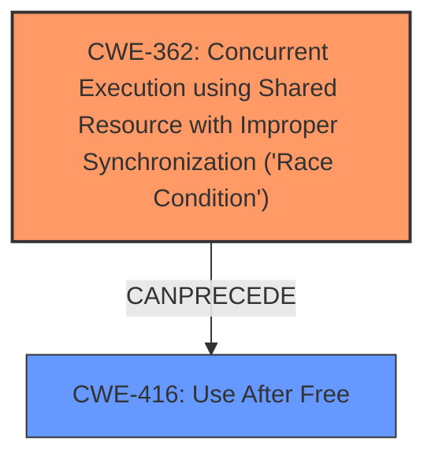

# Analysis Report for CVE-2022-23036

# Vulnerability Analysis Report: CVE-2022-23036

## Description


## Analysis (with Relationship Data)

# Summary
| CWE ID  | CWE Name                                                                             | Confidence | CWE Abstraction Level | CWE Vulnerability Mapping Label | CWE-Vulnerability Mapping Notes |
| :-------- | :----------------------------------------------------------------------------------- | :---------- | :---------------------- | :------------------------------ | :------------------------------ |
| CWE-362   | Concurrent Execution using Shared Resource with Improper Synchronization ('**Race Condition**') | 1         | Class                    | Primary CWE                     | Allowed-with-Review           |
| CWE-416   | Use After Free                                                                       | 0.6         | Variant                 | Secondary Candidate             | Allowed                       |

## Evidence and Confidence

*   **Confidence Score:** 0.8
*   **Evidence Strength:** HIGH

## Relationship Analysis
The primary CWE identified is CWE-362, which is a Class-level CWE describing a **race condition**. A potential secondary CWE is CWE-416, a Variant-level CWE that can result from a race condition. The relationship CANPRECEDE from CWE-362 to CWE-416 supports the potential for a chain of events where a race condition leads to a use-after-free vulnerability.



## Vulnerability Chain
The vulnerability chain starts with a **race condition** (CWE-362) when the Linux PV device frontends are removing access rights of the backends. This can then lead to the backend retaining access to memory pages after they have been freed and reused, potentially resulting in a use-after-free condition (CWE-416). The final impact includes data leaks, data corruption, and denial of service.

## Summary of Analysis
Initially, the description highlights the **race condition** as the primary weakness, which aligns directly with CWE-362. The analysis of the CVE reference links further reinforces this, emphasizing the improper handling of race conditions in grant table access removal. The retriever results also list CWE-362 as the top candidate with a high score. Given this evidence, CWE-362 is selected as the primary CWE.

The possibility of a use-after-free (CWE-416) condition arises from the unsynchronized memory deallocation. The backend can access memory that has been freed and reused. While this is a plausible consequence, the primary driver for this is the initial **race condition**. Therefore, CWE-416 is considered as a secondary CWE with lower confidence because it is not explicitly stated but inferred.

The decision to classify CWE-362 as the primary CWE is based on the following:
*   The vulnerability description explicitly mentions the **race condition**. "Several Linux PV device frontends are using the grant table interfaces for removing access rights of the backends in ways being subject to **race condition**s..."
*   The CVE reference links confirm that the root cause is related to the improper handling of race conditions.
*   CWE-362 is at the class level, allowing for the identification of multiple variants, as noted in the MITRE mapping guidance.

The decision to tentatively include CWE-416 is influenced by the description of unsynchronized memory deallocation, which could lead to a use-after-free. However, it is not explicitly stated in the provided text.

Relevant CWE Information:

# Enhanced Context (25 CWEs)
The following CWEs were identified as potentially relevant to this vulnerability:

## CWE-667: Improper Locking
**Abstraction Level**: Class
**Similarity Score**: 0.81
**Source**: dense

**Description**:
The product does not properly acquire or release a lock on a resource, leading to unexpected resource state changes and behaviors.

**Mapping Guidance**:
- Usage: Allowed-with-Review
- Rationale: This CWE entry is a Class and might have Base-level children that would be more appropriate

*Rationale for not selecting CWE-667*: The vulnerability description focuses on the **race condition** itself, not specifically on the improper use of locks. While improper locking could contribute to a race condition, the description doesn't provide enough evidence to support this.

## CWE-404: Improper Resource Shutdown or Release
**Abstraction Level**: Class
**Similarity Score**: 0.79
**Source**: dense

**Description**:
The product does not release or incorrectly releases a resource before it is made available for re-use.

**Mapping Guidance**:
- Usage: Allowed-with-Review
- Rationale: This CWE entry is a Class and might have Base-level children that would be more appropriate

*Rationale for not selecting CWE-404*: This CWE is too general. The problem is more specific than just failing to release a resource. It is failing to properly synchronize the release.

## CWE-362: Concurrent Execution using Shared Resource with Improper Synchronization ('Race Condition')
**Abstraction Level**: Class
**Similarity Score**: 0.79
**Source**: dense

**Description**:
The product contains a concurrent code sequence that requires temporary, exclusive access to a shared resource, but a timing window exists in which the shared resource can be modified by another code sequence operating concurrently.

**Mapping Guidance**:
- Usage: Allowed-with-Review
- Rationale: This CWE entry is a Class and might have Base-level children that would be more appropriate

*Rationale for selecting CWE-362 as the primary CWE*: The vulnerability description explicitly mentions a **race condition**, which aligns perfectly with CWE-362. The CVE reference links further reinforce this, emphasizing the improper handling of race conditions in grant table access removal.

## CWE-226: Sensitive Information in Resource Not Removed Before Reuse
**Abstraction Level**: Base
**Similarity Score**: 0.78
**Source**: dense

**Description**:
The product releases a resource such as memory or a file so that it can be made available for reuse, but it does not clear or "zeroize" the information contained in the resource before the product performs a critical state transition or makes the resource available for reuse by other entities.

**Mapping Guidance**:
- Usage: Allowed
- Rationale: This CWE entry is at the Base level of abstraction, which is a preferred level of abstraction for mapping to the root causes of vulnerabilities.

*Rationale for not selecting CWE-226*: The core issue isn't about sensitive information not being removed, but rather the timing issue in accessing and releasing the resource that leads to a race condition.

## CWE-125: Out-of-bounds Read
**Abstraction Level**: Base
**Similarity Score**: 0.77
**Source**: dense

**Description**:
The product reads data past the end, or before the beginning, of the intended buffer.

**Mapping Guidance**:
- Usage: Allowed
- Rationale: This CWE entry is at the Base level of abstraction, which is a preferred level of abstraction for mapping to the root causes of vulnerabilities.

*Rationale for not selecting CWE-125*: There is no evidence of out-of-bounds read.

## CWE-131: Incorrect Calculation of Buffer Size
**Abstraction Level**: Base
**Similarity Score**: 0.77
**Source**: dense

**Description**:
The product does not correctly calculate the size to be used when allocating a buffer, which could lead to a buffer overflow.

**Mapping Guidance**:
- Usage: Allowed
- Rationale: This CWE entry is at the Base level of abstraction, which is a preferred level of abstraction for mapping to the root causes of vulnerabilities.

*Rationale for not selecting CWE-131*: There is no evidence of incorrect calculation of buffer size.

## CWE-909: Missing Initialization of Resource
**Abstraction Level**: Class
**Similarity Score**: 0.77
**Source**: dense

**Description**:
The product does not initialize a critical resource.

**Mapping Guidance**:
- Usage: Allowed-with-Review
- Rationale: This CWE entry is a Class and might have Base-level children that would be more appropriate

*Rationale for not selecting CWE-909*: There is no evidence of missing initialization of resource.

## CWE-908: Use of Uninitialized Resource
**Abstraction Level**: Base
**Similarity Score**: 0.77
**Source**: dense

**Description**:
The product uses or accesses a resource that has not been initialized.

**Mapping Guidance**:
- Usage: Allowed
- Rationale: This CWE entry is at the Base level of abstraction, which is a preferred level of abstraction for mapping to the root causes of vulnerabilities.

*Rationale for not selecting CWE-908*: There is no evidence of use of uninitialized resource.

## CWE-367: Time-of-check Time-of-use (TOCTOU) Race Condition
**Abstraction Level**: Base
**Similarity Score**: 0.77
**Source**: dense

**Description**:
The product checks the state of a resource before using that resource, but the resource's state can change between the check and the use in a way that


## CWE Relationship Analysis

Current CWEs represent these abstraction levels: .


### Vulnerability Chain Analysis

**Chain starting from CWE-131:**
- 131 (Incorrect Calculation of Buffer Size) - ROOT


**Chain starting from CWE-908:**
- 908 (Use of Uninitialized Resource) - ROOT


### CWE Relationship Diagram

```mermaid
graph TD
    classDef primary fill:#f96,stroke:#333,stroke-width:2px
    classDef secondary fill:#69f,stroke:#333
    classDef tertiary fill:#9e9,stroke:#333
```


*Report generated on 2025-03-30 22:56:30*
