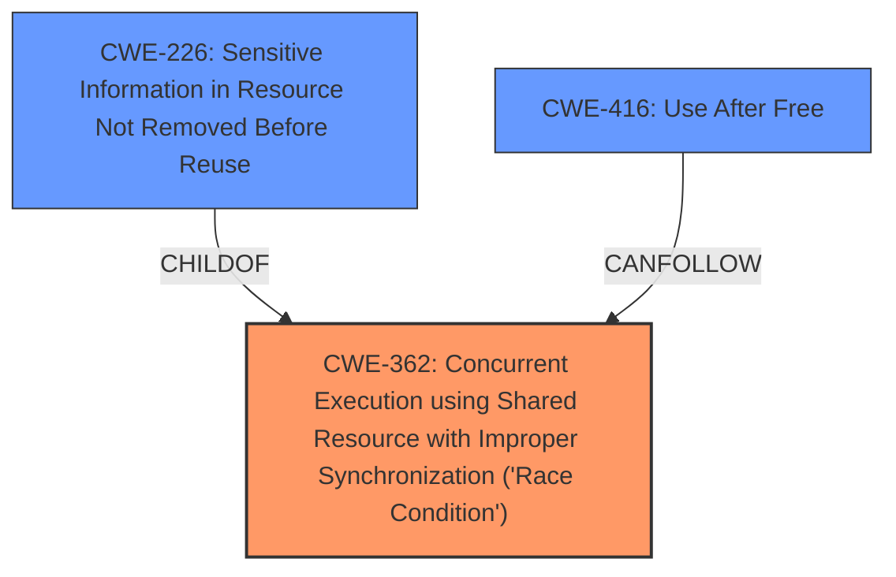

# Analysis Report for CVE-2022-23040

# Vulnerability Analysis Report: CVE-2022-23040

## Description


## Analysis (with Relationship Data)

# Summary
| CWE ID | CWE Name | Confidence | CWE Abstraction Level | CWE Vulnerability Mapping Label | CWE-Vulnerability Mapping Notes |
|---|---|---|---|---|---|
| CWE-362 | Concurrent Execution using Shared Resource with Improper Synchronization ('Race Condition') | 1.0 | Class | Allowed-with-Review | Primary CWE. The vulnerability is due to a **race condition** when multiple device frontends access shared resources without proper synchronization. |
| CWE-226 | Sensitive Information in Resource Not Removed Before Reuse | 0.7 | Base | Allowed | Secondary CWE. The vulnerability description mentions a **race condition** that results in backends potentially accessing freed memory pages even after reuse. This relates to sensitive data not being cleared before reuse. |
| CWE-416 | Use After Free | 0.6 | Variant | Allowed | Secondary CWE. Since the backend can keep access to the memory page even after it has been freed and then re-used for a different purpose, this could lead to **use-after-free** conditions. |

## Evidence and Confidence

*   **Confidence Score:** 0.8
*   **Evidence Strength:** HIGH

## Relationship Analysis
The primary CWE is CWE-362 (Race Condition), which is a Class-level CWE. It has child CWEs that represent specific types of race conditions. In this case, CWE-226 is chosen because it describes a condition in which sensitive information remains in a resource after it has been freed. Furthermore, the possibility of the backend accessing freed memory pages suggests a potential Use-After-Free vulnerability (CWE-416), where the backend attempts to access or manipulate memory that has already been deallocated.



## Vulnerability Chain
The vulnerability chain starts with a **race condition** (CWE-362) due to **improper synchronization** when multiple PV device frontends access shared resources. This leads to a scenario where sensitive information might not be properly removed from memory pages before they are reused (CWE-226), and the backend could potentially access these freed memory pages leading to use-after-free conditions (CWE-416).

## Summary of Analysis
The initial analysis correctly identified CWE-362 as the primary weakness due to the presence of a **race condition**. The "Vulnerability Description Key Phrases" section explicitly mentions "rootcause: **race condition**." Additionally, the "CVE Reference Links Content Summary" confirms the root cause as a lack of error checking and a **race condition**.

However, further analysis suggests that CWE-226 and CWE-416 are also relevant. The description states that "the backend can keep access to the memory page even after it has been freed and then re-used for a different purpose," directly supporting CWE-226 because the memory is being reused without proper clearing. It also directly supports CWE-416 because of the freed memory that the backend still has access to.

The selected CWEs are at an appropriate level of specificity. CWE-362 captures the general **race condition**, while CWE-226 highlights the sensitive information exposure, and CWE-416 highlights the potential **use-after-free** scenario.

Relevant CWE Information:
*   **CWE-362**: The product contains a concurrent code sequence that requires temporary, exclusive access to a shared resource, but a **timing window** exists in which the shared resource can be modified by another code sequence operating concurrently.
*   **CWE-226**: The product releases a resource such as memory or a file so that it can be made available for reuse, but it does not clear or "zeroize" the information contained in the resource before the product performs a critical state transition or makes the resource available for reuse by other entities.
*   **CWE-416**: The product uses a resource after it has been freed.

CWEs Considered but Not Used:
*   CWE-789: Memory Allocation with Excessive Size Value - While memory issues are present, the core issue isn't about excessive size allocation, but rather about synchronization and reuse.
*   CWE-367: Time-of-check Time-of-use (TOCTOU) Race Condition - While TOCTOU is a type of race condition, the provided information does not specifically highlight the "check-then-use" pattern.
*   CWE-667: Improper Locking - While locking might be a potential solution to the race condition, the description doesn't indicate that the improper locking is the root cause itself.
*   CWE-125: Out-of-bounds Read - While data corruption is possible, the core weakness is the **race condition** and reuse of memory, not necessarily an out-of-bounds read.


## CWE Relationship Analysis

Current CWEs represent these abstraction levels: .


### Vulnerability Chain Analysis

**Chain starting from CWE-125:**
- 125 (Out-of-bounds Read) - ROOT


**Chain starting from CWE-416:**
- 416 (Use After Free) - ROOT


### CWE Relationship Diagram

```mermaid
graph TD
    classDef primary fill:#f96,stroke:#333,stroke-width:2px
    classDef secondary fill:#69f,stroke:#333
    classDef tertiary fill:#9e9,stroke:#333
```


*Report generated on 2025-03-30 13:11:00*
