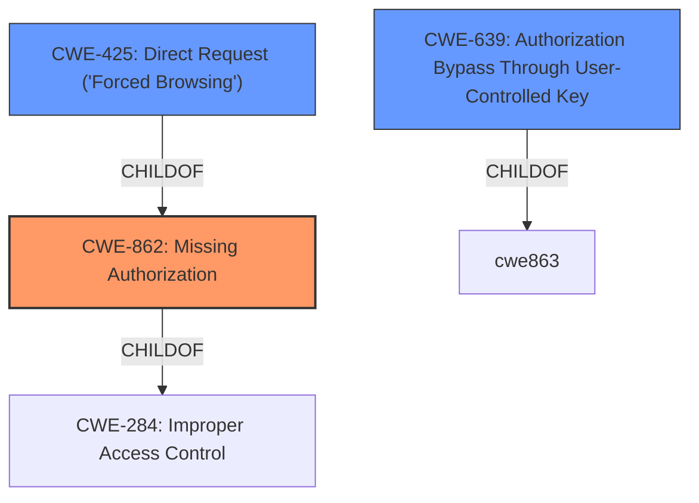

# Raw Analyzer Response for CVE-2022-23055

# Summary
| CWE ID | CWE Name | Confidence | CWE Abstraction Level | CWE Vulnerability Mapping Label | CWE-Vulnerability Mapping Notes |
|---|---|---|---|---|---|
| CWE-862 | Missing Authorization | 1.0 | Class | Primary | Allowed-with-Review |
| CWE-639 | Authorization Bypass Through User-Controlled Key | 0.7 | Base | Secondary | Allowed |
| CWE-425 | Direct Request ('Forced Browsing') | 0.6 | Base | Secondary | Allowed |

## Evidence and Confidence

*   **Confidence Score:** 0.9
*   **Evidence Strength:** HIGH

## Relationship Analysis
The primary CWE selected is CWE-862 **Missing Authorization**, a Class-level CWE, which is a child of the Pillar CWE-284 **Improper Access Control**. CWE-639 **Authorization Bypass Through User-Controlled Key** and CWE-425 **Direct Request ('Forced Browsing')** are related Base-level CWEs that describe potential mechanisms for exploiting missing authorization checks.

## Vulnerability Chain
The vulnerability chain begins with a **Missing Authorization** check (CWE-862). This **missing authorization** can lead to an **Authorization Bypass Through User-Controlled Key** (CWE-639), where an attacker modifies a key to access unauthorized data. Alternatively, the **missing authorization** can lead to a **Direct Request ('Forced Browsing')** (CWE-425) scenario, where an attacker directly requests unauthorized resources.

## Summary of Analysis
Initially, the analysis focused on identifying the root cause of the vulnerability. The vulnerability description clearly states "**missing authorization**" as the root cause within the chat rooms functionality. The CVE Reference Links Content Summary further reinforces this by stating: "The vulnerability stems from a **Missing Authorization** issue within the chat room functionality... The application does not properly validate user permissions when sending or retrieving chat messages." This directly points to CWE-862 **Missing Authorization**.

The Retriever Results also highlight CWE-862 **Missing Authorization** as a potential candidate. However, since CWE-862 is a Class-level CWE, the analysis explored more specific Base-level CWEs that could represent the underlying weakness.

CWE-639 **Authorization Bypass Through User-Controlled Key** was considered because the attacker can modify parameters to impersonate other users and access unauthorized chat content. The "CVE Reference Links Content Summary" mentions "By modifying the `user` parameter in the `send` request, an attacker can send messages appearing to come from a different user. By modifying the `room` parameter in the `history` request, an attacker can retrieve messages from any chat room, regardless of their membership." This suggests that the attacker is using a user-controlled key to bypass authorization.

CWE-425 **Direct Request ('Forced Browsing')** was also considered since the attacker can directly request unauthorized resources by modifying the `room` parameter.

Ultimately, CWE-862 **Missing Authorization** was selected as the primary CWE because it represents the fundamental flaw: the absence of authorization checks. CWE-639 and CWE-425 are secondary CWEs that describe potential mechanisms for exploiting the **missing authorization**. These provide more specific insights into how the vulnerability can be exploited.

The MITRE mapping guidance for CWE-862 suggests examining its children for a better fit. However, no child CWEs directly address the specific vulnerability, so CWE-862 was selected as the most appropriate Class-level CWE.

Relevant CWE Information:

# Enhanced Context (25 CWEs)
The following CWEs were identified as potentially relevant to this vulnerability:

## CWE-472: External Control of Assumed-Immutable Web Parameter
**Abstraction Level**: Base
**Similarity Score**: 0.76
**Source**: dense

**Description**:
The web application does not sufficiently verify inputs that are assumed to be immutable but are actually externally controllable, such as hidden form fields.

**Mapping Guidance**:
- Usage: Allowed
- Rationale: This CWE entry is at the Base level of abstraction, which is a preferred level of abstraction for mapping to the root causes of vulnerabilities.

## CWE-639: Authorization Bypass Through User-Controlled Key
**Abstraction Level**: Base
**Similarity Score**: 0.76
**Source**: dense

**Description**:
The system's authorization functionality does not prevent one user from gaining access to another user's data or record by modifying the key value identifying the data.

**Mapping Guidance**:
- Usage: Allowed
- Rationale: This CWE entry is at the Base level of abstraction, which is a preferred level of abstraction for mapping to the root causes of vulnerabilities.

## CWE-807: Reliance on Untrusted Inputs in a Security Decision
**Abstraction Level**: Base
**Similarity Score**: 0.75
**Source**: dense

**Description**:
The product uses a protection mechanism that relies on the existence or values of an input, but the input can be modified by an untrusted actor in a way that bypasses the protection mechanism.

**Mapping Guidance**:
- Usage: Allowed
- Rationale: This CWE entry is at the Base level of abstraction, which is a preferred level of abstraction for mapping to the root causes of vulnerabilities.

## CWE-1390: Weak Authentication
**Abstraction Level**: Class
**Similarity Score**: 0.75
**Source**: dense

**Description**:
The product uses an authentication mechanism to restrict access to specific users or identities, but the mechanism does not sufficiently prove that the claimed identity is correct.

**Mapping Guidance**:
- Usage: Allowed-with-Review
- Rationale: This CWE entry is a Class and might have Base-level children that would be more appropriate

## CWE-302: Authentication Bypass by Assumed-Immutable Data
**Abstraction Level**: Base
**Similarity Score**: 0.74
**Source**: dense

**Description**:
The authentication scheme or implementation uses key data elements that are assumed to be immutable, but can be controlled or modified by the attacker.

**Mapping Guidance**:
- Usage: Allowed
- Rationale: This CWE entry is at the Base level of abstraction, which is a preferred level of abstraction for mapping to the root causes of vulnerabilities.

## CWE-1220: Insufficient Granularity of Access Control
**Abstraction Level**: Base
**Similarity Score**: 0.74
**Source**: dense

**Description**:
The product implements access controls via a policy or other feature with the intention to disable or restrict accesses (reads and/or writes) to assets in a system from untrusted agents. However, implemented access controls lack required granularity, which renders the control policy too broad because it allows accesses from unauthorized agents to the security-sensitive assets.

**Mapping Guidance**:
- Usage: Allowed
- Rationale: This CWE entry is at the Base level of abstraction, which is a preferred level of abstraction for mapping to the root causes of vulnerabilities.

## CWE-274: Improper Handling of Insufficient Privileges
**Abstraction Level**: Base
**Similarity Score**: 0.74
**Source**: dense

**Description**:
The product does not handle or incorrectly handles when it has insufficient privileges to perform an operation, leading to resultant weaknesses.

**Mapping Guidance**:
- Usage: Discouraged
- Rationale: This CWE entry could be deprecated in a future version of CWE.

## CWE-303: Incorrect Implementation of Authentication Algorithm
**Abstraction Level**: Base
**Similarity Score**: 0.73
**Source**: dense

**Description**:
The requirements for the product dictate the use of an established authentication algorithm, but the implementation of the algorithm is incorrect.

**Mapping Guidance**:
- Usage: Allowed
- Rationale: This CWE entry is at the Base level of abstraction, which is a preferred level of abstraction for mapping to the root causes of vulnerabilities.

## CWE-799: Improper Control of Interaction Frequency
**Abstraction Level**: Class
**Similarity Score**: 0.73
**Source**: dense

**Description**:
The product does not properly limit the number or frequency of interactions that it has with an actor, such as the number of incoming requests.

**Mapping Guidance**:
- Usage: Allowed-with-Review
- Rationale: This CWE entry is a Class and might have Base-level children that would be more appropriate

## CWE-307: Improper Restriction of Excessive Authentication Attempts
**Abstraction Level**: Base
**Similarity Score**: 0.73
**Source