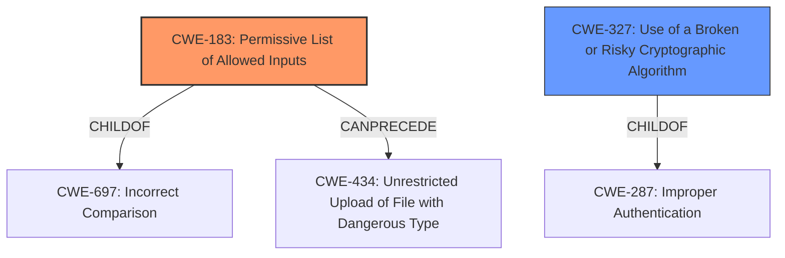

# Analysis for CVE-2022-2310

# Summary
| CWE ID  | CWE Name                                                              | Confidence | CWE Abstraction Level | CWE Vulnerability Mapping Label | CWE-Vulnerability Mapping Notes |
| :-------- | :-------------------------------------------------------------------- | :--------- | :---------------------- | :------------------------------ | :------------------------------ |
| CWE-183 | Permissive List of Allowed Inputs                                     | 0.9        | Base                    | Primary CWE                     | Allowed                         |
| CWE-327 | Use of a Broken or Risky Cryptographic Algorithm                      | 0.8        | Class                   | Secondary Candidate             | Allowed-with-Review             |

## Evidence and Confidence

*   **Confidence Score:** 0.85
*   **Evidence Strength:** HIGH

## Relationship Analysis
The primary CWE is CWE-183, which describes the **incorrect whitelisting** of authentication bypass methods. CWE-327 is the secondary CWE due to the use of a **weak crypto password**. CWE-183 has a CanPrecede relationship with CWE-434 (Unrestricted Upload of File with Dangerous Type), but that relationship is not relevant to the vulnerability. CWE-183 is a child of CWE-697 (Incorrect Comparison), which could be relevant, but CWE-183 is a better fit. CWE-327 is a class-level CWE that could have more specific children.

## Vulnerability Chain
The vulnerability chain starts with **incorrect whitelisting of authentication bypass methods and weak crypto password**. This leads to an **authentication bypass**, which results in an attacker gaining **complete control over the SWG**.

## Summary of Analysis
The vulnerability description clearly states that the root cause is "**incorrect whitelisting of authentication bypass methods and weak crypto password**."

*   CWE-183 (Permissive List of Allowed Inputs) directly addresses the "**incorrect whitelisting**" aspect. The description of CWE-183 states: "The product implements a protection mechanism that relies on a list of inputs (or properties of inputs) that are explicitly allowed by policy because the inputs are assumed to be safe, but the list is too permissive - that is, it allows an input that is unsafe, leading to resultant weaknesses." This aligns perfectly with the vulnerability.
*   CWE-327 (Use of a Broken or Risky Cryptographic Algorithm) addresses the "**weak crypto password**" aspect. The description of CWE-327 states: "The product uses a broken or risky cryptographic algorithm or protocol."
*   The retriever results show CWE-183 with a high score of 0.800 and CWE-327 with a score of 0.556, further supporting these choices.
*   Other CWEs considered:
    *   CWE-290 (Authentication Bypass by Spoofing): This is not as accurate as CWE-183 because the vulnerability is not about spoofing but rather about incorrectly allowing bypass methods.
    *   CWE-306 (Missing Authentication for Critical Function) and CWE-287 (Improper Authentication): These are too general. The vulnerability is not about missing authentication entirely but about **incorrectly whitelisting** bypass methods and a **weak crypto password**.
    *   CWE-288 (Authentication Bypass Using an Alternate Path or Channel): While this could be related, the root cause is the **incorrect whitelisting**, making CWE-183 a better fit.
    *   CWE-1390 (Weak Authentication) and CWE-522 (Insufficiently Protected Credentials): these are too general for the vulnerability description which has a **weak crypto password** rootcause and **incorrect whitelisting** rootcause.

The selected CWEs are at the optimal level of specificity because they directly address the root causes described in the vulnerability description. CWE-183 is a Base level CWE, which is preferred, and CWE-327 is a Class level CWE that is appropriate given the available information.