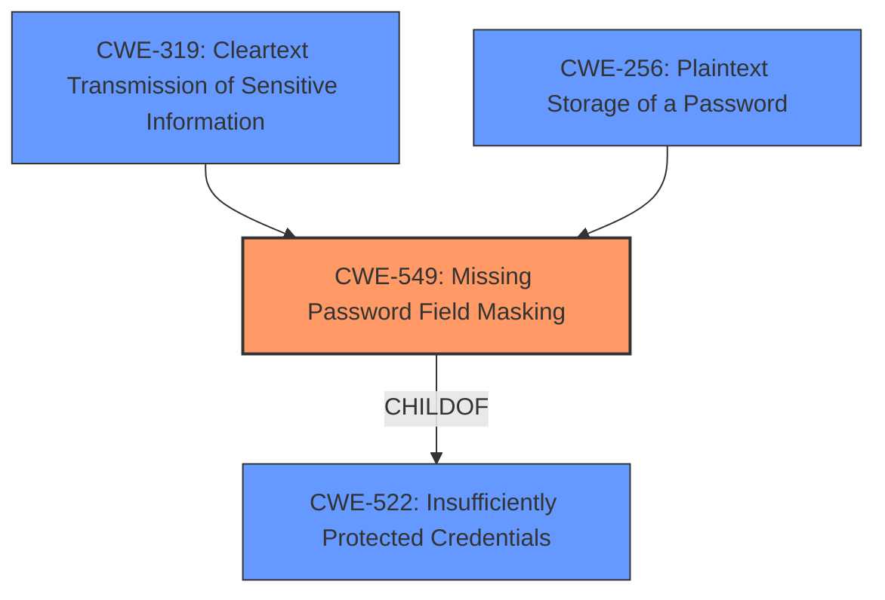

# Analysis Report for CVE-2022-23109

# Vulnerability Analysis Report: CVE-2022-23109

## Description


## Analysis (with Relationship Data)

# Summary
| CWE ID | CWE Name | Confidence | CWE Abstraction Level | CWE Vulnerability Mapping Label | CWE-Vulnerability Mapping Notes |
|---|---|---|---|---|---|
| CWE-549 | Missing Password Field Masking | 0.9 | Base | Allowed | Primary CWE. The Jenkins plugin failed to mask Vault credentials, leading to their exposure. |
| CWE-319 | Cleartext Transmission of Sensitive Information | 0.7 | Base | Allowed | Secondary CWE. The Vault credentials were transmitted in cleartext within the build logs and step descriptions. |
| CWE-256 | Plaintext Storage of a Password | 0.6 | Base | Allowed | Secondary CWE. Because the credentials were not masked, they are effectively stored as plaintext in the build logs. |

## Evidence and Confidence

*   **Confidence Score:** 0.8
*   **Evidence Strength:** HIGH

## Relationship Analysis
The primary CWE, CWE-549 (Missing Password Field Masking), is directly related to the vulnerability where sensitive credentials are not properly masked, leading to exposure. CWE-549 is a child of CWE-522 (Insufficiently Protected Credentials). CWE-319 (Cleartext Transmission of Sensitive Information) and CWE-256 (Plaintext Storage of a Password) are also related, as the unmasked credentials are both transmitted and effectively stored in cleartext.



## Vulnerability Chain
The chain of events is as follows:
1.  The HashiCorp Vault Plugin **failed to explicitly declare Vault credentials as sensitive** (CWE-549).
2.  As a result, the credentials were **not masked in Pipeline build logs and step descriptions**.
3.  This led to the **exposure of Vault credentials in cleartext**, effectively leading to cleartext transmission and storage (CWE-319, CWE-256).

## Summary of Analysis
The initial analysis identified that the core issue was the **failure to mask the Vault credentials** in the Jenkins plugin. This is supported by the vulnerability description, which states that the plugin "does not mask Vault credentials". The CVE Reference Links Content Summary confirms this, stating the plugin "did not explicitly declare Vault credentials as sensitive".

Based on this evidence, CWE-549 (Missing Password Field Masking) is the most accurate and specific CWE. It represents the root cause of the vulnerability which is the **missing** masking functionality for credentials.

CWE-319 (Cleartext Transmission of Sensitive Information) and CWE-256 (Plaintext Storage of a Password) are secondary concerns, stemming from the initial failure to mask the credentials. Because of the **impact** of the unmasked credentials, those are added.

Other CWEs like CWE-862 (Missing Authorization) and CWE-863 (Incorrect Authorization) were considered but deemed less relevant. The core issue is not related to authorization, but to the lack of proper handling of sensitive information. Similarly, CWE-1336 (Improper Neutralization of Special Elements Used in a Template Engine) is not relevant as there is no template engine involved in this vulnerability.

The selected CWEs are at the optimal level of specificity. CWE-549 is a Base-level CWE, representing the specific weakness. The evidence supports this choice as it directly points to the **missing** masking functionality.

Relevant CWE Information:

# Enhanced Context (25 CWEs)
The following CWEs were identified as potentially relevant to this vulnerability:

## CWE-312: Cleartext Storage of Sensitive Information
**Abstraction Level**: Base
**Similarity Score**: 0.79
**Source**: dense

**Description**:
The product stores sensitive information in cleartext within a resource that might be accessible to another control sphere.

**Mapping Guidance**:
- Usage: Allowed
- Rationale: This CWE entry is at the Base level of abstraction, which is a preferred level of abstraction for mapping to the root causes of vulnerabilities.


## CWE-319: Cleartext Transmission of Sensitive Information
**Abstraction Level**: Base
**Similarity Score**: 0.79
**Source**: dense

**Description**:
The product transmits sensitive or security-critical data in cleartext in a communication channel that can be sniffed by unauthorized actors.

**Mapping Guidance**:
- Usage: Allowed
- Rationale: This CWE entry is at the Base level of abstraction, which is a preferred level of abstraction for mapping to the root causes of vulnerabilities.


## CWE-522: Insufficiently Protected Credentials
**Abstraction Level**: Class
**Similarity Score**: 0.77
**Source**: dense

**Description**:
The product transmits or stores authentication credentials, but it uses an insecure method that is susceptible to unauthorized interception and/or retrieval.

**Mapping Guidance**:
- Usage: Allowed-with-Review
- Rationale: This CWE entry is a Class and might have Base-level children that would be more appropriate


## CWE-538: Insertion of Sensitive Information into Externally-Accessible File or Directory
**Abstraction Level**: Base
**Similarity Score**: 0.77
**Source**: dense

**Description**:
The product places sensitive information into files or directories that are accessible to actors who are allowed to have access to the files, but not to the sensitive information.

**Mapping Guidance**:
- Usage: Allowed
- Rationale: This CWE entry is at the Base level of abstraction, which is a preferred level of abstraction for mapping to the root causes of vulnerabilities.


## CWE-311: Missing Encryption of Sensitive Data
**Abstraction Level**: Class
**Similarity Score**: 0.77
**Source**: dense

**Description**:
The product does not encrypt sensitive or critical information before storage or transmission.

**Mapping Guidance**:
- Usage: Discouraged
- Rationale: CWE-311 is high-level with more precise children available. It is a level-1 Class (i.e., a child of a Pillar).


## CWE-212: Improper Removal of Sensitive Information Before Storage or Transfer
**Abstraction Level**: Base
**Similarity Score**: 0.77
**Source**: dense

**Description**:
The product stores, transfers, or shares a resource that contains sensitive information, but it does not properly remove that information before the product makes the resource available to unauthorized actors.

**Mapping Guidance**:
- Usage: Allowed
- Rationale: This CWE entry is at the Base level of abstraction, which is a preferred level of abstraction for mapping to the root causes of vulnerabilities.


## CWE-256: Plaintext Storage of a Password
**Abstraction Level**: Base
**Similarity Score**: 0.76
**Source**: dense

**Description**:
Storing a password in plaintext may result in a system compromise.

**Mapping Guidance**:
- Usage: Allowed
- Rationale: This CWE entry is at the Base level of abstraction, which is a preferred level of abstraction for mapping to the root causes of vulnerabilities.


## CWE-1391: Use of Weak Credentials
**Abstraction Level**: Class
**Similarity Score**: 0.75
**Source**: dense

**Description**:
The product uses weak credentials (such as a default key or hard-coded password) that can be calculated, derived, reused, or guessed by an attacker.

**Mapping Guidance**:
- Usage: Allowed-with-Review
- Rationale: This CWE entry is a Class and might have Base-level children that would be more appropriate


## CWE-497: Exposure of Sensitive System Information to an Unauthorized Control Sphere
**Abstraction Level**: Base
**Similarity Score**: 0.75
**Source**: dense

**Description**:
The product does not properly prevent sensitive system-level information from being accessed by unauthorized actors who do not have the same level of access to the underlying system as the product does.

**Mapping Guidance**:
- Usage: Allowed
- Rationale: This CWE entry is at the Base level of abstraction, which is a preferred level of abstraction for mapping to the root causes of vulnerabilities.


## CWE-74: Improper Neutralization of Special Elements in Output Used by a Downstream Component ('Injection')
**Abstraction Level**: Class
**Similarity Score**: 0.75
**Source**: dense

**Description**:
The product constructs all or part of a command, data structure, or record using externally-influenced input from an upstream component, but it does not neutralize or incorrectly neutralizes special elements that could modify how it is parsed or interpreted when it is sent to a downstream component.

**Mapping Guidance**:
- Usage: Discouraged
- Rationale: CWE-7


## CWE Relationship Analysis

Current CWEs represent these abstraction levels: .


### Vulnerability Chain Analysis

**Chain starting from CWE-862:**
- 862 (Missing Authorization) - ROOT


**Chain starting from CWE-549:**
- 549 (Missing Password Field Masking) - ROOT


### CWE Relationship Diagram

```mermaid
graph TD
    classDef primary fill:#f96,stroke:#333,stroke-width:2px
    classDef secondary fill:#69f,stroke:#333
    classDef tertiary fill:#9e9,stroke:#333
```


*Report generated on 2025-03-31 05:27:37*
