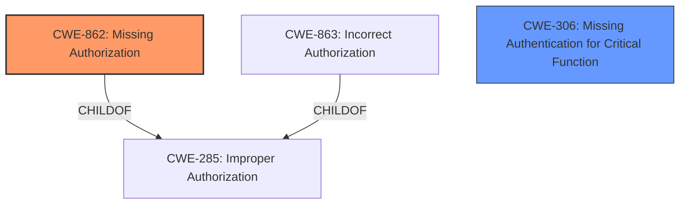

# Raw Analyzer Response for CVE-2022-23112

# Summary
| CWE ID | CWE Name | Confidence | CWE Abstraction Level | CWE Vulnerability Mapping Label | CWE-Vulnerability Mapping Notes |
|---|---|---|---|---|---|
| CWE-862 | Missing Authorization | 1.0 | Class | Primary | Allowed-with-Review |
| CWE-306 | Missing Authentication for Critical Function | 0.7 | Base | Secondary | Allowed |

## Evidence and Confidence

*   **Confidence Score:** 0.85
*   **Evidence Strength:** HIGH

## Relationship Analysis
The primary relationship that influenced the decision was the parent-child relationship between CWE-285 (Improper Authorization) and its children CWE-862 (Missing Authorization) and CWE-863 (Incorrect Authorization). Given the vulnerability description explicitly mentions a **missing permission check**, CWE-862 was chosen over CWE-863 as it more accurately reflects the nature of the flaw. CWE-306 (Missing Authentication for Critical Function) was considered as a related weakness, as authorization and authentication are closely linked, however since the description specified that the users already had overall/read access it was deemed to be secondary.

## Vulnerability Chain
The vulnerability chain starts with the **missing permission check** (CWE-862), leading to the ability for attackers with Overall/Read access to connect to an attacker-specified SSH server using attacker-specified credentials.

## Summary of Analysis
The initial assessment focused on identifying the root cause of the vulnerability, which is the **missing permission check**. The description clearly states that the Jenkins Publish Over SSH Plugin lacks proper authorization checks. This aligns directly with the definition of CWE-862 (Missing Authorization), which describes a scenario where a product does not perform an authorization check when an actor attempts to access a resource or perform an action.

The Retriever Results also indicated CWE-862 as the top candidate, further supporting this classification. The MITRE mapping guidance for CWE-862 suggests that it is a Class and might have Base-level children that would be more appropriate, prompting a review of its children. However, no child CWE provided a more specific fit than CWE-862 itself.

CWE-306 was considered because the plugin is missing authentication, but the users already have overall/read access, so they are authenticated.

The decision to classify the vulnerability as CWE-862 is based on the direct evidence from the vulnerability description, the Retriever Results, and the MITRE mapping guidance. The selection of CWE-862 as the primary CWE provides an accurate and specific representation of the vulnerability's root cause.

Relevant CWE Information:
- **Vulnerability Description Key Phrases**:
  - **rootcause:** **missing permission check**
- **CVE Reference Links Content Summary**:
  - **Missing permission check:** The plugin lacks proper authorization checks when performing connection tests.