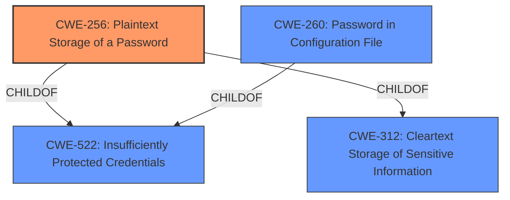

# Analysis Report for CVE-2022-23114

# Vulnerability Analysis Report: CVE-2022-23114

## Description


## Analysis (with Relationship Data)

# Summary

| CWE ID | CWE Name | Confidence | CWE Abstraction Level | CWE Vulnerability Mapping Label | CWE-Vulnerability Mapping Notes |
|---|---|---|---|---|---|
| CWE-256 | Plaintext Storage of a Password | 1.0 | Base | Allowed | Primary CWE |
| CWE-260 | Password in Configuration File | 0.8 | Base | Allowed | Secondary Candidate |
| CWE-312 | Cleartext Storage of Sensitive Information | 0.7 | Base | Allowed | Secondary Candidate |
| CWE-522 | Insufficiently Protected Credentials | 0.6 | Class | Allowed-with-Review | Secondary Candidate |

## Evidence and Confidence

*   **Confidence Score:** 0.9
*   **Evidence Strength:** HIGH

## Relationship Analysis
The primary relationship influencing the selection is the hierarchical structure with CWE-256 and CWE-260 as children of CWE-522. The vulnerability description clearly indicates that the password is stored in plaintext (CWE-256) and specifically within a configuration file (CWE-260). CWE-522 is a class-level CWE, so choosing the more specific base-level CWEs (CWE-256 and CWE-260) is preferred. CWE-312 is also a parent of CWE-256 and is a less precise choice as it encompasses more general sensitive information storage.



## Vulnerability Chain
The vulnerability chain involves the following:
1.  **Root Cause:** The Jenkins plugin **stores passwords unencrypted** in a configuration file.
2.  **Weakness:** **Plaintext storage of password**.
3.  **Impact:** Users with access to the Jenkins controller file system can view the password.

## Summary of Analysis
The initial analysis focused on identifying the root cause of the vulnerability, which is the **storage of passwords unencrypted**. The evidence from the vulnerability description clearly states: "Jenkins Publish Over SSH Plugin 1.22 and earlier **stores password unencrypted** in its global configuration file on the Jenkins controller where it can be viewed by users with access to the Jenkins controller file system." The CVE Reference Links Content Summary confirms this, stating: "The Publish Over SSH Plugin **stores passwords unencrypted** in its global configuration file (`jenkins.plugins.publish_over_ssh.BapSshPublisherPlugin.xml`) on the Jenkins controller" and "The plugin **stores passwords in plain text** instead of using encryption or a secure credential storage mechanism."

The retriever results listed CWE-256 (Plaintext Storage of a Password) as the top candidate, which aligns well with the vulnerability description. The relationship analysis and the MITRE mapping guidance both suggest selecting the most specific base-level CWE, making CWE-256 the primary choice. CWE-260 (Password in Configuration File) is also a strong candidate because the password is in a configuration file.

CWE-312 (Cleartext Storage of Sensitive Information) was considered but deemed less specific than CWE-256, as it covers a broader range of sensitive information, not just passwords. CWE-522 (Insufficiently Protected Credentials) is a class-level CWE and is therefore less specific than its base-level children like CWE-256 and CWE-260.

The selection of CWE-256 as the primary CWE is based on the direct evidence of **plaintext password storage**, its base-level abstraction, and the MITRE mapping guidance favoring specific CWEs. The confidence in this mapping is high (1.0) due to the clear and consistent evidence.


## CWE Relationship Analysis

Current CWEs represent these abstraction levels: .


### Vulnerability Chain Analysis

**Chain starting from CWE-260:**
- 260 (Password in Configuration File) - ROOT


**Chain starting from CWE-312:**
- 312 (Cleartext Storage of Sensitive Information) - ROOT


### CWE Relationship Diagram

```mermaid
graph TD
    classDef primary fill:#f96,stroke:#333,stroke-width:2px
    classDef secondary fill:#69f,stroke:#333
    classDef tertiary fill:#9e9,stroke:#333
```


*Report generated on 2025-03-31 09:21:34*
