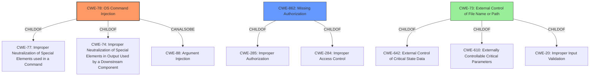

# Raw Analyzer Response for CVE-2022-23118

# Summary
| CWE ID | CWE Name | Confidence | CWE Abstraction Level | CWE Vulnerability Mapping Label | CWE-Vulnerability Mapping Notes |
|---|---|---|---|---|---|
| CWE-78 | Improper Neutralization of Special Elements used in an OS Command ('OS Command Injection') | 1.0 | Base | Primary | Allowed |
| CWE-862 | Missing Authorization | 0.7 | Class | Secondary | Allowed-with-Review |
| CWE-73 | External Control of File Name or Path | 0.6 | Base | Secondary | Allowed |

## Evidence and Confidence

*   **Confidence Score:** 0.8
*   **Evidence Strength:** HIGH

## Relationship Analysis
The primary CWE is CWE-78, which is a base-level CWE and a child of CWE-77 (Improper Neutralization of Special Elements used in a Command) and CWE-74 (Improper Neutralization of Special Elements in Output Used by a Downstream Component ('Injection')). CWE-78 can also be related to CWE-88 (Improper Neutralization of Argument Delimiters in a Command ('Argument Injection')). CWE-862 is a class-level CWE and a child of CWE-285 (Improper Authorization) and CWE-284 (Improper Access Control). CWE-73 is a base-level CWE and a child of CWE-642 (External Control of Critical State Data), CWE-610 (Externally Controllable Critical Parameters), and CWE-20 (Improper Input Validation). CWE-73 can precede CWE-59 (Improper Link Resolution Before File Access ('Link Following')), CWE-434 (Unrestricted Upload of File with Dangerous Type)), CWE-98 (Improper Control of Filename for Include/Require Statement in PHP Program ('PHP Remote File Inclusion')), and CWE-41 (Improper Resolution of Path Equivalence).

## Vulnerability Chain
The vulnerability chain starts with the **improper access control**, allowing an attacker to specify the path for the `git` command. This leads to **arbitrary OS command execution** on the controller.

## Summary of Analysis
The initial assessment identified CWE-78 as the primary weakness due to the ability to execute arbitrary OS commands. The **improper access control** allows attackers to specify the path for the `git` command, resulting in OS command injection. The provided evidence in "CVE Reference Links Content Summary" states: "The plugin implements functionality that allows agent processes to invoke command-line `git` at an attacker-specified path on the controller," directly supporting CWE-78.

CWE-862 is considered a secondary weakness because the **improper access control** could be seen as a **missing authorization** check that would prevent the attacker from specifying the path. However, the primary issue is the ability to inject commands, making CWE-78 more relevant.

CWE-73 is a weaker secondary candidate. While the attacker does control the file path, the real issue is that they can inject commands. This makes CWE-78 the primary concern and CWE-73 less specific.

The relationships in the graph influenced the final selection by highlighting the connection between CWE-78 and CWE-88, and by showing that CWE-73 can precede CWE-59, CWE-434, CWE-98, and CWE-41.

The selected CWEs are at the optimal level of specificity because CWE-78 directly addresses the **OS command injection** vulnerability, and CWE-862 highlights the **improper access control**.

Relevant CWE Information:

# Enhanced Context (25 CWEs)

## CWE-73: External Control of File Name or Path
**Abstraction Level**: Base
**Similarity Score**: 0.82
**Source**: dense

**Description**:
The product allows user input to control or influence paths or file names that are used in filesystem operations.

**Mapping Guidance**:
- Usage: Allowed
- Rationale: This CWE entry is at the Base level of abstraction, which is a preferred level of abstraction for mapping to the root causes of vulnerabilities.

## CWE-522: Insufficiently Protected Credentials
**Abstraction Level**: Class
**Similarity Score**: 0.254
**Source**: sparse

**Description**:
The product transmits or stores authentication credentials, but it uses an insecure method that is susceptible to unauthorized interception and/or retrieval.

## CWE-306: Missing Authentication for Critical Function
**Abstraction Level**: Base
**Similarity Score**: 0.252
**Source**: sparse

**Description**:
The product does not perform any authentication for functionality that requires a provable user identity or consumes a significant amount of resources.

## CWE-862: Missing Authorization
**Abstraction Level**: Class
**Similarity Score**: 0.252
**Source**: sparse

**Description**:
The product does not perform an authorization check when an actor attempts to access a resource or perform an action.

## CWE-78: Improper Neutralization of Special Elements used in an OS Command ('OS Command Injection')
**Abstraction Level**: Base
**Similarity Score**: 0.243
**Source**: sparse

**Description**:
The product constructs all or part of an OS command using externally-influenced input from an upstream component, but it does not neutralize or incorrectly neutralizes special elements that could modify the intended OS command when it is sent to a downstream component.