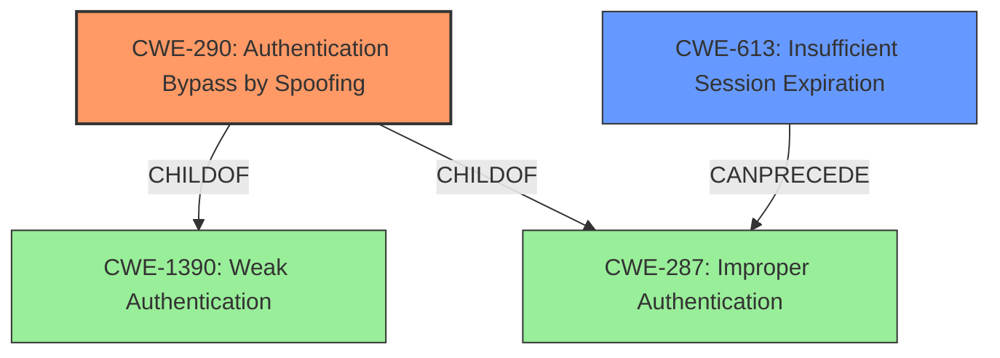

# Analysis for CVE-2022-23131

# Summary
| CWE ID | CWE Name | Confidence | CWE Abstraction Level | CWE Vulnerability Mapping Label | CWE-Vulnerability Mapping Notes |
|---|---|---|---|---|---|
| CWE-290 | Authentication Bypass by Spoofing | 0.9 | Base | Allowed | Primary CWE. The application incorrectly implements authentication, making it susceptible to spoofing attacks by modifying session data. |
| CWE-613 | Insufficient Session Expiration | 0.7 | Base | Allowed | Secondary CWE. The session does not expire correctly, leading to privilege escalation and admin access.|
| CWE-287 | Improper Authentication | 0.6 | Class | Discouraged | Secondary CWE. The product does not sufficiently prove that the claim is correct during the authentication process. |

## Evidence and Confidence

*   **Confidence Score:** 0.8
*   **Evidence Strength:** HIGH

## Relationship Analysis
The primary CWE is CWE-290, which is a base-level weakness and child of both CWE-1390 and CWE-287. The vulnerability involves bypassing authentication by spoofing the session, making CWE-290 the most appropriate. CWE-613 is related because the session doesn't expire, so the attacker can maintain access. CWE-287 is a higher-level class, making CWE-290 more specific and preferred.

## Vulnerability Chain
The vulnerability chain starts with the **root cause** of **session cookie not signed**. This leads to the ability to modify session data and ultimately escalate privileges to gain admin access.

## Summary of Analysis
The initial assessment identified CWE-290 as the primary weakness due to the ability to bypass authentication through spoofing. The vulnerability description and CVE reference summary support this by stating that session data is not properly verified, allowing attackers to modify it. The retriever results also list CWE-290 as the top candidate.

CWE-290 is a Base level, which aligns with the guidance to prefer lower-level CWEs. The description of CWE-290 matches the vulnerability's characteristics: "This attack-focused weakness is caused by incorrectly implemented authentication schemes that are subject to spoofing attacks." The **impact** is significant, as a malicious actor can modify session data to gain unauthorized access and escalate privileges.

CWE-613 is included as a secondary weakness because the **insufficient session expiration** contributes to the overall vulnerability. If sessions expired correctly, the window of opportunity for an attacker to exploit the spoofed session would be reduced.

CWE-287 was considered but classified as a secondary concern because it is a more general class of improper authentication. CWE-290 provides a more specific description of the spoofing attack.

The final decision is based on the evidence from the vulnerability description, the retriever results, and the CWE specifications, which support the selection of CWE-290 as the primary weakness and CWE-613 as a contributing factor. The confidence in this assessment is high (0.8) due to the clear alignment between the vulnerability details and the selected CWEs.

Relevant CWE Information:
- **Vulnerability Description Key Phrases:** **rootcause:** **session cookie not signed**
- **CVE Reference Links Content Summary:** The vulnerability stems from unsafe client-side session storage in Zabbix Frontend when SAML SSO authentication is enabled. Session data, including user login information, was not being properly verified, allowing for manipulation by malicious actors.