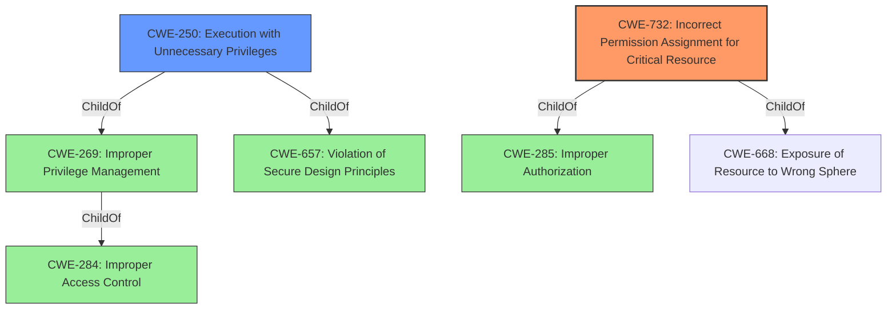

# Raw Analyzer Response for CVE-2022-23132

# Summary
| CWE ID | CWE Name | Confidence | CWE Abstraction Level | CWE Vulnerability Mapping Label | CWE-Vulnerability Mapping Notes |
|---|---|---|---|---|---|
| CWE-732 | Incorrect Permission Assignment for Critical Resource | 0.9 | Class | Allowed-with-Review | Primary CWE. The **rootcause** of the vulnerability is the incorrect assignment of permissions, which allows the Zabbix processes to bypass file system permission checks. |
| CWE-250 | Execution with Unnecessary Privileges | 0.7 | Base | Allowed | Secondary CWE. The Zabbix process runs with **DAC_OVERRIDE SELinux capability**, which grants it unnecessary privileges, amplifying the consequences of the incorrect permission assignment. |

## Evidence and Confidence

*   **Confidence Score:** 0.8
*   **Evidence Strength:** HIGH

## Relationship Analysis
The primary weakness is CWE-732, which is a Class-level CWE. It relates to incorrect permission assignments. CWE-250 is a Base-level CWE and a child of CWE-269 (Improper Privilege Management) and CWE-657 which is relevant because the Zabbix process executes with unnecessary privileges due to the `DAC_OVERRIDE` capability. This execution with elevated privileges amplifies the impact of the incorrect permission assignment.

## Vulnerability Chain
The vulnerability chain starts with the incorrect permission assignment (CWE-732) on the `/var/run/zabbix` directory. The Zabbix process then executes with the `DAC_OVERRIDE` capability (CWE-250), allowing it to bypass file system permission checks. This leads to the impact of unauthorized access, modification, or execution of files within the `/var/run/zabbix` directory.

## Summary of Analysis
The primary CWE is CWE-732 because the **rootcause** is the "incorrect permissions set on the `/var/run/zabbix` directory during Zabbix installation from RPM packages." This aligns with the CWE-732 Description which states: "The product specifies permissions for a security-critical resource in a way that allows that resource to be read or modified by unintended actors." The vulnerability description states that "Zabbix Proxy or Server processes can bypass file read, write and execute permissions check on the file system level". This indicates that the assigned permissions are not correct, leading to the bypass.
CWE-250 is included as a secondary CWE because the Zabbix process runs with the `DAC_OVERRIDE` capability, granting it unnecessary privileges. This privilege escalation amplifies the impact of the incorrect permission assignment. The vulnerability description states that "**DAC_OVERRIDE SELinux capability** is in use to access PID files". This aligns with the CWE-250 Description which states: "The product performs an operation at a privilege level that is higher than the minimum level required, which creates new weaknesses or amplifies the consequences of other weaknesses."
CWE-269 was considered but discarded. The Mapping Guidance states: "CWE-269 is commonly misused. It can be conflated with "privilege escalation," which is a technical impact that is listed in many low-information vulnerability reports [REF-1287]. It is not useful for trend analysis." The description goes on to suggest using children of CWE-269, such as CWE-250.
CWE-863 was considered but not selected. The Mapping Guidance states: "This CWE entry is a Class and might have Base-level children that would be more appropriate." The **rootcause** is not an incorrect authorization check, but an incorrect assignment of permissions.
CWE-278 was considered but not selected because there is no evidence that the permissions were inherited. The **rootcause** is from the installation process.
CWE-59 was considered but not selected. There is no evidence that symbolic links are involved in the **rootcause** of the vulnerability.