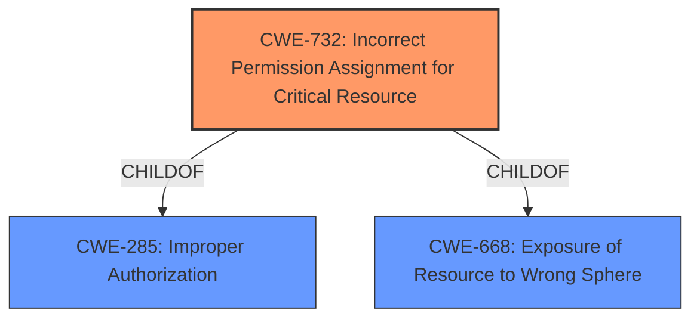

# Raw Analyzer Response for CVE-2022-23143

# Summary
| CWE ID | CWE Name | Confidence | CWE Abstraction Level | CWE Vulnerability Mapping Label | CWE-Vulnerability Mapping Notes |
|---|---|---|---|---|---|
| CWE-732 | Incorrect Permission Assignment for Critical Resource | 0.9 | Class | Allowed-with-Review | Primary CWE. The vulnerability is caused by **improper permission settings** that allows an attacker with high permissions to delete and modify files. |

## Evidence and Confidence

*   **Confidence Score:** 0.9
*   **Evidence Strength:** HIGH

## Relationship Analysis
The primary relationship influencing the decision is the hierarchical relationship where CWE-732 is a child of CWE-285 (Improper Authorization) and CWE-668 (Exposure of Resource to Wrong Sphere). While CWE-285 and CWE-668 are broader, CWE-732 specifically addresses incorrect permission assignments for critical resources, which directly aligns with the vulnerability description of **improper permission settings** leading to unauthorized file modifications.

## Vulnerability Chain
The vulnerability chain starts with **improper permission settings** (CWE-732), which allows an attacker with high privileges to maliciously delete and modify files. The root cause is the misconfiguration of permissions, and the impact is unauthorized file modification and deletion.

## Summary of Analysis
The analysis is based on the provided vulnerability description and the CVE Reference Links Content Summary, which both highlight **improper permission settings** as the root cause. This directly corresponds to CWE-732, Incorrect Permission Assignment for Critical Resource.

The vulnerability description states: "ZTE OTCP product is impacted by a permission and access control vulnerability. Due to **improper permission settings**, an attacker with high permissions could use this vulnerability to maliciously delete and modify files."

The CVE Reference Links Content Summary states:
"Root Cause of Vulnerability:
- Improper permission settings in ZTE OTCP.

Weaknesses/Vulnerabilities Present:
- Permission and access control vulnerability.

Impact of Exploitation:
- An attacker with high permissions could maliciously delete and modify files."

CWE-732 is a Class-level CWE, offering a balance between specificity and generality. It directly addresses the core issue of incorrect permission assignments. The alternative, using a more general CWE like CWE-284 (Improper Access Control), would be less precise. While CWE-285 (Improper Authorization) is also relevant, CWE-732 is a child of CWE-285 and more accurately describes the **improper permission settings** aspect of the vulnerability. The MITRE mapping guidance suggests reviewing Class-level CWEs for more specific Base-level children, but in this case, the Class-level CWE-732 is the most appropriate.