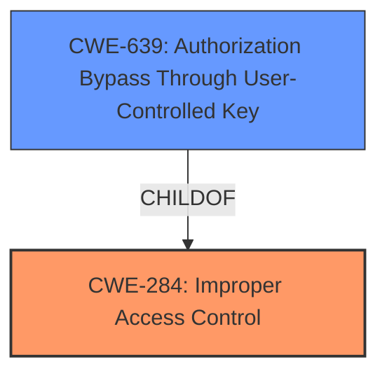

# Raw Analyzer Response for CVE-2022-23144

# Summary
| CWE ID | CWE Name | Confidence | CWE Abstraction Level | CWE Vulnerability Mapping Label | CWE-Vulnerability Mapping Notes |
|---|---|---|---|---|---|
| CWE-284 | Improper Access Control | 0.75 | Pillar | Primary | Discouraged |
| CWE-639 | Authorization Bypass Through User-Controlled Key | 0.6 | Base | Secondary | Allowed |

## Evidence and Confidence

*   **Confidence Score:** 0.7
*   **Evidence Strength:** MEDIUM

## Relationship Analysis
The primary CWE selected is CWE-284, "Improper Access Control," which is a high-level Pillar. However, the detailed analysis suggests a more specific weakness related to authorization. CWE-639, "Authorization Bypass Through User-Controlled Key," a Base-level CWE, was considered as a secondary candidate because the vulnerability description mentioned attackers potentially manipulating keys to bypass authorization. CWE-284 is a parent of CWE-639.

## Vulnerability Chain
The vulnerability chain involves the following:
1.  **Root Cause:** **Broken access control** due to improper permission control.
2.  **Weakness:** Attackers exploit this to delete default application types.
3.  **Impact:** Affects normal system use.

## Summary of Analysis
Initially, the analysis centered on the **broken access control** (**rootcause**) vulnerability reported in the ZTE ZXvSTB product. The "Vulnerability Description Key Phrases" section clearly identifies **broken access control** as the root cause. The CVE Reference Links Content Summary further supports this by highlighting "improper permission control" as the underlying issue.

The selection of CWE-284 "Improper Access Control" as the primary CWE is based on the initial evidence from the vulnerability description. However, CWE-284 is a high-level Pillar, and the MITRE mapping guidance discourages its use, suggesting more specific descendants should be considered.

CWE-639, "Authorization Bypass Through User-Controlled Key," was identified as a secondary candidate. This is because the vulnerability description mentions attackers deleting default application type, implying a bypass of authorization controls through potentially manipulating keys or identifiers. The "CVE Reference Links Content Summary" section mentioned the attacker's need for high privileges (PR:H) suggesting some level of access to the system, which could be exploited to manipulate keys.

The decision to include both CWE-284 and CWE-639 reflects the multi-faceted nature of the vulnerability. CWE-284 captures the high-level **broken access control**, while CWE-639 suggests the potential mechanism of **authorization bypass** through key manipulation.

The optimal level of specificity is challenging due to the limited evidence. While CWE-639 is more specific, the evidence supporting key manipulation is not definitive. Therefore, I consider the selection of the primary CWE with a secondary CWE to be most appropriate.

Relevant CWE Information:

# Enhanced Context (25 CWEs)
The following CWEs were identified as potentially relevant to this vulnerability:

## CWE-1220: Insufficient Granularity of Access Control
**Abstraction Level**: Base
**Similarity Score**: 0.75

## CWE-807: Reliance on Untrusted Inputs in a Security Decision
**Abstraction Level**: Base
**Similarity Score**: 0.75

## CWE-280: Improper Handling of Insufficient Permissions or Privileges
**Abstraction Level**: Base
**Similarity Score**: 0.75

## CWE-274: Improper Handling of Insufficient Privileges
**Abstraction Level**: Base
**Similarity Score**: 0.75

## CWE-303: Incorrect Implementation of Authentication Algorithm
**Abstraction Level**: Base
**Similarity Score**: 0.75

## CWE-639: Authorization Bypass Through User-Controlled Key
**Abstraction Level**: Base
**Similarity Score**: 0.75

## CWE-653: Improper Isolation or Compartmentalization
**Abstraction Level**: Class
**Similarity Score**: 0.74

## CWE-1390: Weak Authentication
**Abstraction Level**: Class
**Similarity Score**: 0.74

## CWE-799: Improper Control of Interaction Frequency
**Abstraction Level**: Class
**Similarity Score**: 0.74

## CWE-1263: Improper Physical Access Control
**Abstraction Level**: Class
**Similarity Score**: 0.74

## CWE-639: Authorization Bypass Through User-Controlled Key
**Abstraction Level**: Base
**Similarity Score**: 6961.41

## CWE-863: Incorrect Authorization
**Abstraction Level**: Class
**Similarity Score**: 6859.92

## CWE-285: Improper Authorization
**Abstraction Level**: Class
**Similarity Score**: 6856.54

## CWE-287: Improper Authentication
**Abstraction Level**: Class
**Similarity Score**: 6544.75

## CWE-1390: Weak Authentication
**Abstraction Level**: Class
**Similarity Score**: 6416.14

## CWE-178: Improper Handling of Case Sensitivity
**Abstraction Level**: Base
**Similarity Score**: 3.76

## CWE-1289: Improper Validation of Unsafe Equivalence in Input
**Abstraction Level**: Base
**Similarity Score**: 3.64

## CWE-73: External Control of File Name or Path
**Abstraction Level**: Base
**Similarity Score**: 3.23

## CWE-41: Improper Resolution of Path Equivalence
**Abstraction Level**: Base
**Similarity Score**: 3.13

## CWE-252: Unchecked Return Value
**Abstraction Level**: Base
**Similarity Score**: 3.08

## CWE-322: Key Exchange without Entity Authentication
**Abstraction Level**: Base
**Similarity Score**: 2.87

## CWE-289: Authentication Bypass by Alternate Name
**Abstraction Level**: Base
**Similarity Score**: 2.87

## CWE-942: Permissive Cross-domain Policy with Untrusted Domains
**Abstraction Level**: Variant
**Similarity Score**: 2.68

## CWE-350: Reliance on Reverse DNS Resolution for a Security-Critical Action
**Abstraction Level**: Variant
**Similarity Score**: 2.68

## CWE-1191: On-Chip Debug and Test Interface With Improper Access Control
**Abstraction Level**: Base
**Similarity Score**: 2.61

CWEs considered but not used:

*   CWE-285 "Improper Authorization": While related, it is a Class-level CWE and less descriptive than CWE-639.
*   CWE-863 "Incorrect Authorization": Similar to CWE-285, it is a Class-level CWE.
*   CWE-732 "Incorrect Permission Assignment for Critical Resource": This CWE focuses on misconfigured permissions, which is not explicitly described in the vulnerability.
*   CWE-269 "Improper Privilege Management": This is a Class-level CWE.
*   CWE-1191 "On-Chip Debug and Test Interface With Improper Access Control": This CWE is too specific.
*   CWE-862 "Missing Authorization": This is not a missing authorization issue but an incorrect one.
*   CWE-287 "Improper Authentication": Authentication is not the primary issue here.