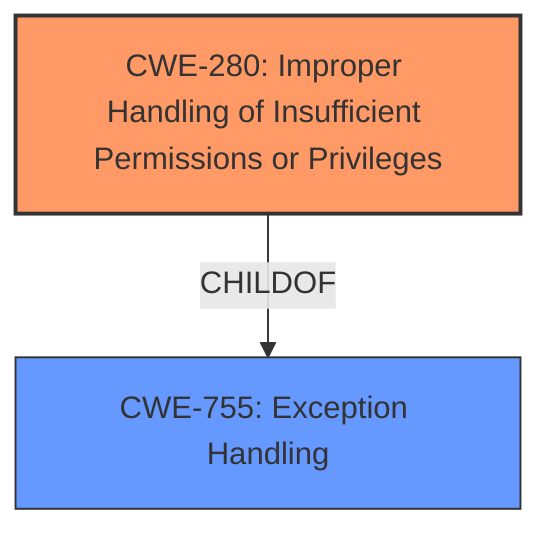

# Analysis for CVE-2022-23160

# Summary
| CWE ID | CWE Name | Confidence | CWE Abstraction Level | CWE Vulnerability Mapping Label | CWE-Vulnerability Mapping Notes |
|---|---|---|---|---|---|
| CWE-280 | Improper Handling of Insufficient Permissions or Privileges | 1.0 | Base | Allowed | Primary CWE |

## Evidence and Confidence

*   **Confidence Score:** 1.0
*   **Evidence Strength:** HIGH

## Relationship Analysis
The primary relationship that influenced my decision was the direct match of CWE-280's description to the vulnerability description. Specifically, the phrase "Improper Handling of Insufficient Permissions" directly aligns with the core concept of CWE-280. While other CWEs like CWE-274, CWE-732, and CWE-269 were considered, they were either discouraged for usage, too high-level (Class instead of Base), or not as direct a fit as CWE-280.

## Vulnerability Chain
The vulnerability chain starts with the **Improper Handling of Insufficient Permissions** (CWE-280). This leads to the impact of a remote malicious user gaining write permissions on read-only files, potentially allowing unauthorized modification of data. The root cause is the **Improper Handling of Insufficient Permissions**, and the impact is unauthorized data modification.

## Summary of Analysis
My assessment is primarily based on the explicit statement in the vulnerability description: "Improper Handling of Insufficient Permissions vulnerability." The CVE Reference Links Content Summary reinforces this by stating: "The vulnerability is described as an 'Improper Handling of Insufficient Permissions' vulnerability."

The retriever results also support this, with CWE-280 being a top candidate and having a "Allowed" usage mapping. CWE-280 is a Base level CWE, which is the preferred level of abstraction.

The analysis of the relationships in the graph, and the definitions of the CWEs, confirms this selection.

I considered other CWEs such as:

*   CWE-274: Improper Handling of Insufficient Privileges: While similar to CWE-280, it is discouraged and slated for potential deprecation. Since CWE-280 is allowed and a better fit, I chose CWE-280.
*   CWE-732: Incorrect Permission Assignment for Critical Resource: While related to permissions, CWE-732 is more about *assigning* incorrect permissions, whereas this vulnerability is about *handling* insufficient permissions. Thus, CWE-280 is a more accurate fit. Additionally, CWE-732's mapping guidance suggests that it is often misused and to analyze the specific mistake that is allowing the resource to be exposed and perform a CWE mapping for that mistake. Since the vulnerability is about handling insufficient permissions, CWE-280 is the best fit.
*   CWE-269: Improper Privilege Management: This is too high-level (Class) and discouraged for usage, making it less suitable than CWE-280.

Therefore, CWE-280 is the most appropriate CWE because it directly reflects the **Improper Handling of Insufficient Permissions**, is at the Base level of abstraction, and has Allowed usage.