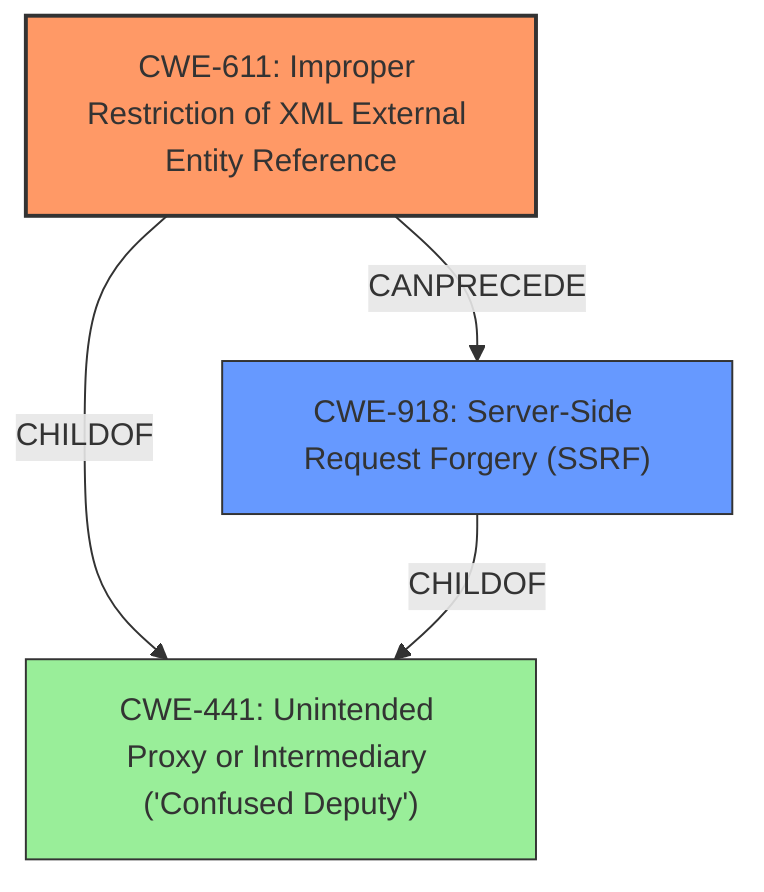

# Analysis Report for CVE-2022-23170

# Vulnerability Analysis Report: CVE-2022-23170

## Description


## Analysis (with Relationship Data)

# Summary
| CWE ID | CWE Name | Confidence | CWE Abstraction Level | CWE Vulnerability Mapping Label | CWE-Vulnerability Mapping Notes |
|---|---|---|---|---|---|
| CWE-611 | Improper Restriction of XML External Entity Reference | 1.0 | Base | Allowed | Primary CWE. The vulnerability description explicitly states that it is an **XML External Entity Injection** vulnerability. |
| CWE-918 | Server-Side Request Forgery (SSRF) | 0.8 | Base | Allowed | Secondary CWE. The vulnerability description states that an attacker can escalate the XXE attack to perform server-side request forgery (SSRF) attacks. |

## Evidence and Confidence

*   **Confidence Score:** 0.9
*   **Evidence Strength:** HIGH

## Relationship Analysis
The primary relationship impacting my decision is the close relationship between CWE-611 (XXE) and CWE-918 (SSRF). The vulnerability description explicitly mentions XXE as the primary weakness and SSRF as a potential escalation path.



## Vulnerability Chain
The vulnerability chain starts with the **XML External Entity Injection** (**CWE-611**). An attacker can then potentially escalate this to a Server-Side Request Forgery (**CWE-918**) to compromise the underlying server or other back-end infrastructure.

## Summary of Analysis
The initial analysis focused on identifying the primary weakness based on the vulnerability description, which clearly states that the vulnerability is an **XML External Entity Injection**. The description also mentions the potential for escalating the attack to a Server-Side Request Forgery. This is supported by the statement: "An attacker can escalate an XXE attack to compromise the underlying server or other back-end infrastructure by leveraging the XXE vulnerability to perform server-side request forgery (SSRF) attacks."

The graph relationships confirm the connection between XXE and SSRF, with both being children of CWE-441 (Unintended Proxy or Intermediary). This indicates that XXE can lead to SSRF, which aligns with the vulnerability description.

The selection of CWE-611 as the primary CWE is based on the explicit mention of "XML External Entity Injection" in the vulnerability description. The inclusion of CWE-918 is due to the potential for escalation to SSRF, as described in the vulnerability. Both CWEs are at the Base level of abstraction, which is the preferred level for mapping root causes.

I also considered CWE-306, CWE-941, CWE-94, CWE-488, CWE-567, CWE-1390, CWE-472, and CWE-287 but those were not selected. CWE-306 (Missing Authentication for Critical Function) was not selected because the primary issue is not a lack of authentication, but rather a vulnerability related to XML processing. CWE-941 (Incorrectly Specified Destination in a Communication Channel) was not selected because the issue is not with specifying the destination of a communication channel, but rather with the parsing of XML data. CWE-94 (Improper Control of Generation of Code ('Code Injection')) was not selected because the vulnerability doesn't involve code injection directly, but rather the exploitation of XML entities. CWE-488 (Exposure of Data Element to Wrong Session) and CWE-567 (Unsynchronized Access to Shared Data in a Multithreaded Context) are not applicable as they relate to session management and multithreading issues, respectively, which are not described in the vulnerability. CWE-1390 (Weak Authentication) and CWE-287 (Improper Authentication) were not selected because the vulnerability can be exploited by an unauthenticated user, so the underlying issue isn't related to weak or improper authentication, but rather the **improper handling of XML data**. CWE-472 (External Control of Assumed-Immutable Web Parameter) was not selected because the issue is not related to immutable web parameters.


## CWE Relationship Analysis

Current CWEs represent these abstraction levels: .


### Vulnerability Chain Analysis

**Chain starting from CWE-918:**
- 918 (Server-Side Request Forgery (SSRF)) - ROOT


**Chain starting from CWE-941:**
- 941 (Incorrectly Specified Destination in a Communication Channel) - ROOT


### CWE Relationship Diagram

```mermaid
graph TD
    classDef primary fill:#f96,stroke:#333,stroke-width:2px
    classDef secondary fill:#69f,stroke:#333
    classDef tertiary fill:#9e9,stroke:#333
```


*Report generated on 2025-03-31 12:18:21*
