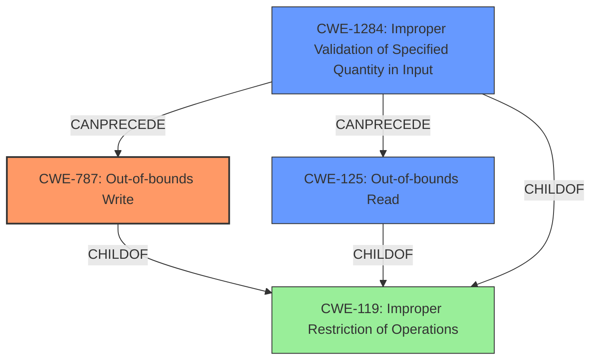

# Enhanced Analysis for CVE-2022-23319

# Summary
| CWE ID    | CWE Name                                                              | Confidence | CWE Abstraction Level | CWE Vulnerability Mapping Label | CWE-Vulnerability Mapping Notes |
| :---------- | :-------------------------------------------------------------------- | :--------- | :---------------------- | :------------------------------ | :------------------------------ |
| CWE-787     | Out-of-bounds Write                                                     | 0.75       | Base                    | Primary                         | Allowed                       |
| CWE-125     | Out-of-bounds Read                                                      | 0.6       | Base                    | Secondary                       | Allowed                       |
| CWE-1284    | Improper Validation of Specified Quantity in Input                      | 0.5       | Base                    | Secondary                       | Allowed                       |

## Evidence and Confidence

*   **Confidence Score:** 0.7
*   **Evidence Strength:** HIGH

## Relationship Analysis
The primary CWE selected is CWE-787 (**Out-of-bounds Write**) due to the segmentation fault being a common result of writing outside the boundaries of allocated memory. CWE-125 (**Out-of-bounds Read**) is a closely related issue and possible contributing factor, as is CWE-1284 (**Improper Validation of Specified Quantity in Input**) as the input file might have a specified quantity that isn't checked, leading to the out-of-bounds access. These are all children of the more general CWE-119 (**Improper Restriction of Operations within the Bounds of a Memory Buffer**), but the base level CWEs provide more specific classifications.



## Vulnerability Chain
The vulnerability chain starts with a specially crafted PCF font file. The program `pcf2bdf` **fails to properly validate** the input. This **improper validation** can lead to an **out-of-bounds read or write**, culminating in a **segmentation fault** and program crash.

`Specially Crafted PCF Font File` -> `CWE-1284 Improper Validation of Specified Quantity in Input` -> `CWE-125 Out-of-bounds Read / CWE-787 Out-of-bounds Write` -> `Segmentation Fault (Program Crash)`

## Summary of Analysis
The analysis is heavily based on the provided evidence, particularly the "CVE Reference Links Content Summary" section which explicitly states the root cause is due to parsing a malformed PCF font file, leading to a segmentation fault. The summary also mentions an access violation at `pcf2bdf.cc:1190`, which strengthens the assessment.

The selection of CWE-787 (**Out-of-bounds Write**) as the primary CWE is based on the fact that a **segmentation fault** is typically caused by writing to a memory location that the program doesn't have permission to access. The graph relationships show how this can be a consequence of various memory-related errors.

CWE-125 (**Out-of-bounds Read**) and CWE-1284 (**Improper Validation of Specified Quantity in Input**) are considered as secondary because they can potentially lead to CWE-787. The **improper validation** of the PCF font file's parameters could cause the program to read or write to an unintended memory location.

The chosen CWEs are at the optimal level of specificity because they directly address the root cause and mechanism of the vulnerability. While a higher-level CWE like CWE-119 (**Improper Restriction of Operations within the Bounds of a Memory Buffer**) could be used, it's less descriptive.

CWE-400 (Resource Exhaustion) was mentioned in the CVE Reference Links Content Summary, but the description of the vulnerability better aligns with memory corruption issues, specifically out-of-bounds read/write operations.

Relevant CWE Information:

# Enhanced Context (25 CWEs)
The following CWEs were identified as potentially relevant to this vulnerability:

## CWE-131: Incorrect Calculation of Buffer Size
**Abstraction Level**: Base
**Similarity Score**: 0.79
**Source**: dense

**Description**:
The product does not correctly calculate the size to be used when allocating a buffer, which could lead to a buffer overflow.

**Mapping Guidance**:
- Usage: Allowed
- Rationale: This CWE entry is at the Base level of abstraction, which is a preferred level of abstraction for mapping to the root causes of vulnerabilities.

## CWE-125: Out-of-bounds Read
**Abstraction Level**: Base
**Similarity Score**: 0.79
**Source**: dense

**Description**:
The product reads data past the end, or before the beginning, of the intended buffer.

**Mapping Guidance**:
- Usage: Allowed
- Rationale: This CWE entry is at the Base level of abstraction, which is a preferred level of abstraction for mapping to the root causes of vulnerabilities.

## CWE-191: Integer Underflow (Wrap or Wraparound)
**Abstraction Level**: Base
**Similarity Score**: 0.78
**Source**: dense

**Description**:
The product subtracts one value from another, such that the result is less than the minimum allowable integer value, which produces a value that is not equal to the correct result.

**Mapping Guidance**:
- Usage: Allowed
- Rationale: This CWE entry is at the Base level of abstraction, which is a preferred level of abstraction for mapping to the root causes of vulnerabilities.

## CWE-404: Improper Resource Shutdown or Release
**Abstraction Level**: Class
**Similarity Score**: 0.78
**Source**: dense

**Description**:
The product does not release or incorrectly releases a resource before it is made available for re-use.

**Mapping Guidance**:
- Usage: Allowed-with-Review
- Rationale: This CWE entry is a Class and might have Base-level children that would be more appropriate

## CWE-119: Improper Restriction of Operations within the Bounds of a Memory Buffer
**Abstraction Level**: Class
**Similarity Score**: 0.78
**Source**: dense

**Description**:
The product performs operations on a memory buffer, but it reads from or writes to a memory location outside the buffer's intended boundary. This may result in read or write operations on unexpected memory locations that could be linked to other variables, data structures, or internal program data.

**Mapping Guidance**:
- Usage: Discouraged
- Rationale: CWE-119 is commonly misused in low-information vulnerability reports when lower-level CWEs could be used instead, or when more details about the vulnerability are available.

## CWE-789: Memory Allocation with Excessive Size Value
**Abstraction Level**: Variant
**Similarity Score**: 0.78
**Source**: dense

**Description**:
The product allocates memory based on an untrusted, large size value, but it does not ensure that the size is within expected limits, allowing arbitrary amounts of memory to be allocated.

**Mapping Guidance**:
- Usage: Allowed
- Rationale: This CWE entry is at the Variant level of abstraction, which is a preferred level of abstraction for mapping to the root causes of vulnerabilities.

## CWE-126: Buffer Over-read
**Abstraction Level**: Variant
**Similarity Score**: 0.78
**Source**: dense

**Description**:
The product reads from a buffer using buffer access mechanisms such as indexes or pointers that reference memory locations after the targeted buffer.

**Mapping Guidance**:
- Usage: Allowed
- Rationale: This CWE entry is at the Variant level of abstraction, which is a preferred level of abstraction for mapping to the root causes of vulnerabilities.

## CWE-805: Buffer Access with Incorrect Length Value
**Abstraction Level**: Base
**Similarity Score**: 0.77
**Source**: dense

**Description**:
The product uses a sequential operation to read or write a buffer, but it uses an incorrect length value that causes it to access memory that is outside of the bounds of the buffer.

**Mapping Guidance**:
- Usage: Allowed
- Rationale: This CWE entry is at the Base level of abstraction, which is a preferred level of abstraction for mapping to the root causes of vulnerabilities.

## CWE-667: Improper Locking
**Abstraction Level**: Class
**Similarity Score**: 0.77
**Source**: dense

**Description


## CWE Relationship Analysis

Current CWEs represent these abstraction levels: .


### Vulnerability Chain Analysis

**Chain starting from CWE-131:**
- 131 (Incorrect Calculation of Buffer Size) - ROOT


**Chain starting from CWE-400:**
- 400 (Uncontrolled Resource Consumption) - ROOT


### CWE Relationship Diagram

```mermaid
graph TD
    classDef primary fill:#f96,stroke:#333,stroke-width:2px
    classDef secondary fill:#69f,stroke:#333
    classDef tertiary fill:#9e9,stroke:#333
```