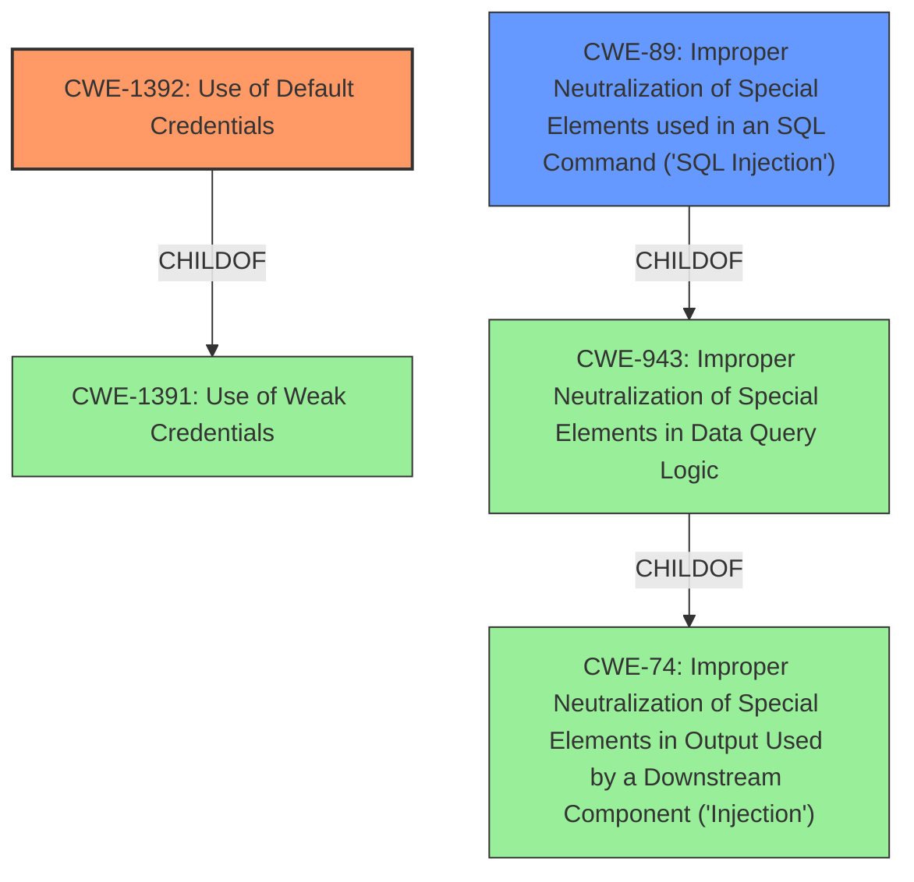

# Enhanced Analysis for CVE-2022-23320

# Summary
| CWE ID | CWE Name | Confidence | CWE Abstraction Level | CWE Vulnerability Mapping Label | CWE-Vulnerability Mapping Notes |
|---|---|---|---|---|---|
| CWE-1392 | Use of Default Credentials | 1.0 | Base | Allowed | Primary CWE |
| CWE-89 | Improper Neutralization of Special Elements used in an SQL Command ('SQL Injection') | 0.9 | Base | Allowed | Secondary Candidate |

## Evidence and Confidence

*   **Confidence Score:** 0.95
*   **Evidence Strength:** HIGH

## Relationship Analysis
The primary weakness, CWE-1392, is a base-level CWE describing the use of default credentials. It's a child of CWE-1391 (Use of Weak Credentials), which is a class-level CWE. The secondary weakness, CWE-89, is also a base-level CWE that falls under CWE-943 (Improper Neutralization of Special Elements in Data Query Logic) and CWE-74 (Improper Neutralization of Special Elements in Output Used by a Downstream Component ('Injection')). The vulnerability chain starts with the use of default credentials, leading to access to the administrative panel and the ability to execute arbitrary SQL queries, ultimately enabling SQL injection.



## Vulnerability Chain
The chain of root cause and weaknesses is as follows:
1.  **Root Cause:** CWE-1392 (Use of Default Credentials)
2.  **Weakness:** Access to administrative panel due to default credentials
3.  **Weakness:** CWE-89 (Improper Neutralization of Special Elements used in an SQL Command ('SQL Injection')) - Ability to execute arbitrary SQL queries.
4.  **Impact:** Exfiltration of sensitive information from the database.

## Summary of Analysis
The initial assessment identified two key weaknesses: the use of default credentials (CWE-1392) and the presence of SQL injection vulnerabilities (CWE-89).

The **Vulnerability Description** states that "XMPie uStore 12.3.7244.0 allows for administrators to **generate reports based on raw SQL queries**. Since the application ships with default administrative credentials, an attacker may authenticate into the application and exfiltrate sensitive information from the database." The **Vulnerability Description Key Phrases** highlights "generate reports based on raw SQL queries" as a **weakness**. The **CVE Reference Links Content Summary** provides more details, stating that the application "ships with a default username and password ("admin") which are not required to be changed during initial setup" and that the application "allows administrators to execute arbitrary SQL queries via a built-in feature."

CWE-1392 is selected as the primary CWE because the vulnerability description explicitly mentions the use of default administrative credentials. This allows an attacker to gain access to the application. CWE-1392 is a Base level CWE, which is the preferred level of abstraction.

CWE-89 is selected as the secondary CWE because the application allows administrators to **generate reports based on raw SQL queries**. This functionality is exposed to authenticated administrators. With improper input validation, this allows for SQL injection. CWE-89 is a Base level CWE, which is the preferred level of abstraction.

The selection of CWE-1392 and CWE-89 is based on the provided evidence and the CWE specifications. The CWEs are at the optimal level of specificity, accurately representing the weaknesses described in the vulnerability.


## CWE Relationship Analysis

Current CWEs represent these abstraction levels: .


### Vulnerability Chain Analysis

**Chain starting from CWE-89:**
- 89 (Improper Neutralization of Special Elements used in an SQL Command ('SQL Injection')) - ROOT


**Chain starting from CWE-1392:**
- 1392 (Use of Default Credentials) - ROOT


### CWE Relationship Diagram

```mermaid
graph TD
    classDef primary fill:#f96,stroke:#333,stroke-width:2px
    classDef secondary fill:#69f,stroke:#333
    classDef tertiary fill:#9e9,stroke:#333
```