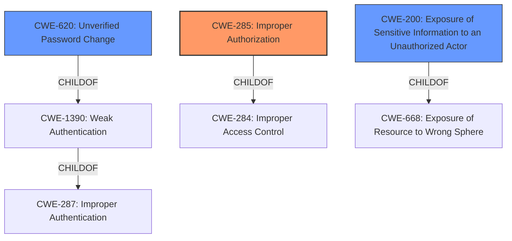

# Analysis for CVE-2022-23331

# Summary
| CWE ID | CWE Name | Confidence | CWE Abstraction Level | CWE Vulnerability Mapping Label | CWE-Vulnerability Mapping Notes |
|---|---|---|---|---|---|
| CWE-285 | Improper Authorization | 0.9 | Class | Primary | Allowed-with-Review |
| CWE-620 | Unverified Password Change | 0.7 | Base | Secondary | Allowed |
| CWE-200 | Exposure of Sensitive Information to an Unauthorized Actor | 0.6 | Class | Secondary | Discouraged |

## Evidence and Confidence

*   **Confidence Score:** 0.8
*   **Evidence Strength:** HIGH

## Relationship Analysis
The primary CWE selected is CWE-285, Improper Authorization, which is a Class-level CWE. The vulnerability involves an authenticated user gaining unauthorized access, which directly falls under the umbrella of improper authorization. However, CWE-285 is a high-level class, and its children should be considered. CWE-863 (Incorrect Authorization) and CWE-862 (Missing Authorization) are potential candidates but don't fully capture the nuances.

CWE-620 (Unverified Password Change) is related because the vulnerability allows changing the administrator password without proper verification. This is a specific type of authorization issue.

CWE-200 (Exposure of Sensitive Information to an Unauthorized Actor) is also potentially relevant as the vulnerability allows access to all user information. However, the primary issue is the authorization bypass, making CWE-200 a secondary concern.

## Vulnerability Chain
The vulnerability chain starts with **Broken Access Control**. This leads to two distinct impacts: unauthorized access to all user information and the ability to change the administrator password.

1.  **Broken Access Control** (Root Cause): The DataEase application fails to properly validate permissions for authenticated users.
2.  Unauthorized Access to User Information (Impact): An authenticated user can access sensitive information about all users.
3.  Ability to Change Administrator Password (Impact): An authenticated user can modify the administrator's password and gain full control.

## Summary of Analysis
Initially, the vulnerability description points to a Broken Access Control issue. The Retriever Results suggest CWE-285 (Improper Authorization) as a potential candidate. The CVE Reference Links Content Summary confirms this by stating, "The vulnerability stems from a Broken Access Control issue." The key phrase "gain unauthorized access to all user information and change administrator password" directly aligns with the description of CWE-285.

CWE-285 is a Class-level CWE, and the mapping guidance discourages its use when lower-level CWEs are applicable. However, none of the child CWEs of CWE-285, such as CWE-862 (Missing Authorization) or CWE-863 (Incorrect Authorization), fully capture the scope of the vulnerability. While authorization is indeed missing or incorrect, the core issue is the broader failure to properly restrict access based on user roles and permissions.

CWE-620 (Unverified Password Change) is considered because an authenticated user can change the administrator's password. This is a specific instance of **improper authorization**.

CWE-200 (Exposure of Sensitive Information to an Unauthorized Actor) is included because the vulnerability allows access to all user information. However, this is a consequence of the **improper authorization**, not the primary weakness.

The final decision is to assign CWE-285 as the primary CWE because it best represents the root cause of the vulnerability: the failure to properly enforce access controls. CWE-620 and CWE-200 are included as secondary CWEs to capture the specific impacts of the vulnerability.

The selected CWEs are at the optimal level of specificity because they accurately represent the root cause and impacts of the vulnerability. While CWE-285 is a Class-level CWE, the available evidence does not support a more specific Base-level CWE.