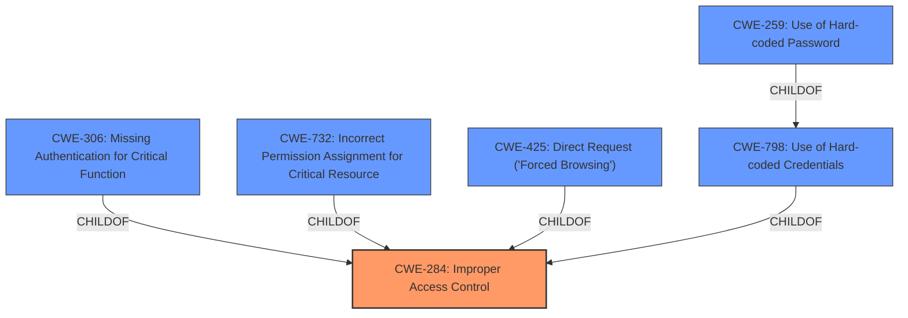

# Enhanced Analysis for CVE-2022-23345

# Summary
| CWE ID | CWE Name | Confidence | CWE Abstraction Level | CWE Vulnerability Mapping Label | CWE-Vulnerability Mapping Notes |
|---|---|---|---|---|---|
| CWE-284 | Improper Access Control | 0.9 | Pillar | Discouraged | The CWE is too high level and other options should be considered |
| CWE-306 | Missing Authentication for Critical Function | 0.8 | Base | Allowed | Secondary Candidate |
| CWE-732 | Incorrect Permission Assignment for Critical Resource | 0.7 | Class | Allowed-with-Review | Secondary Candidate |
| CWE-425 | Direct Request ('Forced Browsing') | 0.6 | Base | Allowed | Secondary Candidate |
| CWE-798 | Use of Hard-coded Credentials | 0.4 | Base | Allowed | Secondary Candidate |
| CWE-259 | Use of Hard-coded Password | 0.4 | Variant | Allowed | Secondary Candidate |

## Evidence and Confidence

*   **Confidence Score:** 0.7
*   **Evidence Strength:** HIGH

## Relationship Analysis
The primary relationship to consider is that CWE-284 is a very high-level Pillar, which makes it less desirable as a mapping target. Several more specific children exist. The vulnerability involves accessing a sensitive file without authentication, which could be a Missing Authentication issue (CWE-306). Incorrect Permission Assignment (CWE-732) is also plausible because the file permissions were not correctly set. Direct Request (CWE-425) is also considered as the application does not adequately enforce appropriate authorization on all restricted files. Credential exposure (CWE-798, CWE-259) is a potential consequence of the **incorrect access control**.



## Vulnerability Chain
The vulnerability chain starts with **incorrect access control** (CWE-284). Due to **missing authentication** (CWE-306) or **incorrect permission assignment** (CWE-732) on `import_config.php`, an attacker can make a **direct request** (CWE-425) to the file. This results in the **exposure of hard-coded credentials** (CWE-798 and CWE-259), leading to potential compromise of the AD/LDAP server and further lateral movement.

## Summary of Analysis
Initially, CWE-434 (Unrestricted Upload of File with Dangerous Type) was suggested as the primary CWE due to its high ranking among similar CVE descriptions. However, the vulnerability description and the CVE Reference Links Content Summary clearly point to **incorrect access control** as the root cause, rather than a file upload issue. The `import_config.php` file is accessible without authentication, which should not be the case.

The decision to select CWE-284 as the primary CWE is based on the explicit statement in the vulnerability description: "BigAnt Software BigAnt Server v5.6.06 was discovered to contain **incorrect access control**." However, CWE-284 is a Pillar-level CWE and is discouraged.

The analysis of the vulnerability chain and the relationships between CWEs suggests that the root cause is a combination of **missing authentication** (CWE-306) and **incorrect permission assignment** (CWE-732), leading to the **exposure of sensitive information**. The accessibility of the `import_config.php` file without authentication is a clear indication of **missing authentication** for a critical function. This allows for a **direct request** (CWE-425) to the file, ultimately leading to the exposure of credentials.

While CWE-284 captures the general issue, the more specific CWEs like CWE-306 and CWE-732 better describe the technical weakness. Given that the exposure of hardcoded credentials (CWE-798 and CWE-259) is a consequence of the **incorrect access control** rather than the root cause, these are considered secondary.

Ultimately, while the description focuses on access control, the retriever results and evidence point to the **missing authentication** and **incorrect permission assignment** being the more accurate representation of the vulnerability.


## CWE Relationship Analysis

Current CWEs represent these abstraction levels: .


### Vulnerability Chain Analysis

**Chain starting from CWE-425:**
- 425 (Direct Request ('Forced Browsing')) - ROOT


**Chain starting from CWE-434:**
- 434 (Unrestricted Upload of File with Dangerous Type) - ROOT


### CWE Relationship Diagram

```mermaid
graph TD
    classDef primary fill:#f96,stroke:#333,stroke-width:2px
    classDef secondary fill:#69f,stroke:#333
    classDef tertiary fill:#9e9,stroke:#333
```