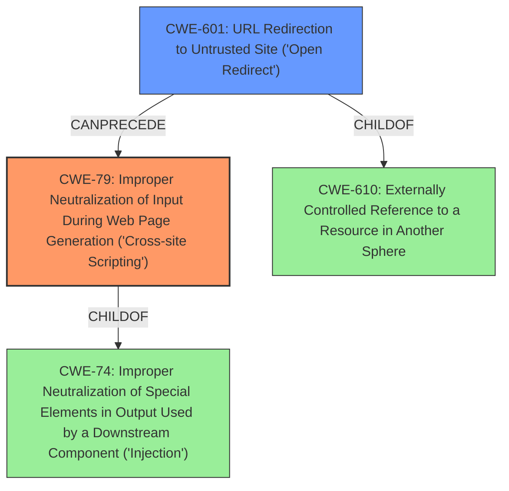

# Raw Analyzer Response for CVE-2022-23367

# Summary
| CWE ID | CWE Name | Confidence | CWE Abstraction Level | CWE Vulnerability Mapping Label | CWE-Vulnerability Mapping Notes |
|---|---|---|---|---|---|
| CWE-79 | Improper Neutralization of Input During Web Page Generation ('Cross-site Scripting') | 1.0 | Base | Allowed | Primary CWE |
| CWE-601 | URL Redirection to Untrusted Site ('Open Redirect') | 0.7 | Base | Allowed | Secondary CWE |

## Evidence and Confidence

*   **Confidence Score:** 0.85
*   **Evidence Strength:** HIGH

## Relationship Analysis
The primary weakness is CWE-79 [Improper Neutralization of Input During Web Page Generation ('Cross-site Scripting')], which is a Base level CWE. CWE-79 is related to CWE-74 [Improper Neutralization of Special Elements in Output Used by a Downstream Component ('Injection')] as a child.
The secondary weakness is CWE-601 [URL Redirection to Untrusted Site ('Open Redirect')], which is a Base level CWE. CWE-601 is related to CWE-610 [Externally Controlled Reference to a Resource in Another Sphere] as a child.
The vulnerability involves a DOM-based XSS (**weakness**) through open redirection (**vector**). The URL redirection is a prerequisite for the XSS to occur.

## Vulnerability Chain
The vulnerability chain starts with the open redirection (CWE-601), which leads to the DOM-based XSS (CWE-79).
1.  **Open Redirection (CWE-601):** The application allows redirection to an arbitrary URL specified in the `ReturnUrl` parameter.
2.  **DOM-based XSS (CWE-79):** The application parses the `location.search` query and uses it without proper escaping on the front page React object (`frontend/src/pages/BindAccount/SuccessTips.js`). This allows an attacker to inject malicious JavaScript code.

## Summary of Analysis
The analysis indicates a DOM-based cross-site scripting (**weakness**) vulnerability. The application parses the `location.search` query and uses it without proper escaping on the front page React object (`frontend/src/pages/BindAccount/SuccessTips.js`).

The primary CWE is CWE-79 [Improper Neutralization of Input During Web Page Generation ('Cross-site Scripting')], since the **weakness** is DOM-based cross-site scripting (XSS). The **Vulnerability Description Key Phrases** section also identifies the **weakness** as DOM-based cross-site scripting.

The secondary CWE is CWE-601 [URL Redirection to Untrusted Site ('Open Redirect')], as the open redirection is the attack vector that allows the XSS to be triggered. The vulnerability description states, "This vulnerability allows attackers to inject malicious code into a victim users device via open redirection."

CWE-352 [Cross-Site Request Forgery (CSRF)] was considered, as the **Retriever Results** showed it as a possible CWE, but the vulnerability description does not mention or imply cross-site request forgery.

The selected CWEs are at the optimal level of specificity, as they accurately represent the **weakness** (DOM-based XSS) and the attack vector (open redirection). The confidence in this assessment is high due to the clear description of the vulnerability and the root cause analysis provided in the CVE reference.

Relevant CWE Information:

# Enhanced Context (25 CWEs)

## CWE-942: Permissive Cross-domain Policy with Untrusted Domains
**Abstraction Level**: Variant
**Similarity Score**: 0.80
**Source**: dense

**Description**:
The product uses a cross-domain policy file that includes domains that should not be trusted.

**Mapping Guidance**:
- Usage: Allowed
- Rationale: This CWE entry is at the Variant level of abstraction, which is a preferred level of abstraction for mapping to the root causes of vulnerabilities.

## CWE-184: Incomplete List of Disallowed Inputs
**Abstraction Level**: Base
**Similarity Score**: 0.79
**Source**: dense

**Description**:
The product implements a protection mechanism that relies on a list of inputs (or properties of inputs) that are not allowed by policy or otherwise require other action to neutralize before additional processing takes place, but the list is incomplete.

**Mapping Guidance**:
- Usage: Allowed
- Rationale: This CWE entry is at the Base level of abstraction, which is a preferred level of abstraction for mapping to the root causes of vulnerabilities.

## CWE-41: Improper Resolution of Path Equivalence
**Abstraction Level**: Base
**Similarity Score**: 0.79
**Source**: dense

**Description**:
The product is vulnerable to file system contents disclosure through path equivalence. Path equivalence involves the use of special characters in file and directory names. The associated manipulations are intended to generate multiple names for the same object.

**Mapping Guidance**:
- Usage: Allowed
- Rationale: This CWE entry is at the Base level of abstraction, which is a preferred level of abstraction for mapping to the root causes of vulnerabilities.

## CWE-451: User Interface (UI) Misrepresentation of Critical Information
**Abstraction Level**: Class
**Similarity Score**: 0.79
**Source**: dense

**Description**:
The user interface (UI) does not properly represent critical information to the user, allowing the information - or its source - to be obscured or spoofed. This is often a component in phishing attacks.

**Mapping Guidance**:
- Usage: Allowed-with-Review
- Rationale: This CWE entry is a Class and might have Base-level children that would be more appropriate

## CWE-668: Exposure of Resource to Wrong Sphere
**Abstraction Level**: Class
**Similarity Score**: 0.78
**Source**: dense

**Description**:
The product exposes a resource to the wrong control sphere, providing unintended actors with inappropriate access to the resource.

**Mapping Guidance**:
- Usage: Discouraged
- Rationale: CWE-668 is high-level and is often misused as a catch-all when lower-level CWE IDs might be applicable. It is sometimes used for low-information vulnerability reports [REF-1287]. It is a level-1 Class (i.e., a child of a Pillar). It is not useful for trend analysis.

## CWE-74: Improper Neutralization of Special Elements in Output Used by a Downstream Component ('Injection')
**Abstraction Level**: Class
**Similarity Score**: 0.78
**Source**: dense

**Description**:
The product constructs all or part of a command, data structure, or record using externally-influenced input from an upstream component, but it does not neutralize or incorrectly neutralizes special elements that could modify how it is parsed or interpreted when it is sent to a downstream component.

**Mapping Guidance**:
- Usage: Discouraged
- Rationale: CWE-74 is high-level and often misused when lower-level weaknesses are more appropriate.

## CWE-80: Improper Neutralization of Script-Related HTML Tags in a Web Page (Basic XSS)
**Abstraction Level**: Variant
**Similarity Score**: 0.78
**Source**: dense

**Description**:
The product receives input from an upstream component, but it does not neutralize or incorrectly neutralizes special characters such as "<", ">", and "&" that could be interpreted as web-scripting elements when they are sent to a downstream component that processes web pages.

**Mapping Guidance**:
- Usage: Allowed
- Rationale: This CWE entry is at the Variant level of abstraction, which is a preferred level of abstraction for mapping to the root causes of vulnerabilities.

## CWE-923: Improper Restriction of Communication Channel to Intended Endpoints
**Abstraction Level**: Class
**Similarity Score**: 0.78
**Source**: dense

**Description**:
The product establishes a communication channel to (or from) an endpoint for privileged or protected operations, but it does not properly ensure that it is communicating with the correct endpoint.

**Mapping Guidance**:
- Usage: Allowed-with-Review
- Rationale: This CWE entry is a Class and might have Base-level children that would be more appropriate

## CWE-610: Externally Controlled Reference