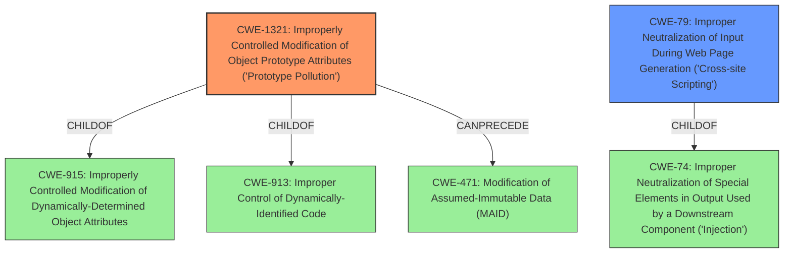

# Analysis Report for CVE-2022-23395

# Vulnerability Analysis Report: CVE-2022-23395

## Description


## Analysis (with Relationship Data)

# Summary
| CWE ID | CWE Name | Confidence | CWE Abstraction Level | CWE Vulnerability Mapping Label | CWE-Vulnerability Mapping Notes |
|---|---|---|---|---|---|
| CWE-1321 | Improperly Controlled Modification of Object Prototype Attributes ('Prototype Pollution') | 1 | Variant | Allowed | Primary CWE |
| CWE-79 | Improper Neutralization of Input During Web Page Generation ('Cross-site Scripting') | 0.7 | Base | Allowed | Secondary Candidate |

## Evidence and Confidence

*   **Confidence Score:** 0.85
*   **Evidence Strength:** HIGH

## Relationship Analysis
The primary CWE, CWE-1321, is a Variant of CWE-915 and CWE-913, indicating a more specific type of weakness related to object attribute modification. It can also precede CWE-471 (Modification of Assumed-Immutable Data). CWE-79, a Base CWE, is a parent of several other CWEs related to XSS. The choice of CWE-1321 is based on the vulnerability description explicitly mentioning "prototype pollution," which aligns directly with CWE-1321's description. CWE-79 is considered as a secondary candidate due to the impact (DOM XSS) but is less specific than CWE-1321 in terms of root cause.



## Vulnerability Chain
The vulnerability chain starts with **prototype pollution** (CWE-1321), which leads to the ability to modify object prototypes. This modification can then lead to DOM cross-site scripting (XSS). The chain is: CWE-1321 -> DOM XSS.

## Summary of Analysis
The initial assessment focused on identifying the root cause and the resulting impact. The vulnerability description explicitly mentions "**prototype pollution**", which is the key indicator for CWE-1321. The impact, DOM XSS, suggests CWE-79, but CWE-1321 more accurately describes the root cause.

The assessment is primarily based on the vulnerability description and CVE Reference Links Content Summary, which states that jQuery Cookie 1.4.1 is affected by **prototype pollution**, which can lead to DOM cross-site scripting (XSS).

The graph relationships further solidified the selection of CWE-1321, as it is directly related to the **modification of object prototypes**, which is the **root cause** described in the vulnerability.

The selection of CWE-1321 is at the optimal level of specificity because it is a Variant that directly addresses the specific type of weakness present in the vulnerability: **improperly controlled modification of object prototype attributes**.

Relevant CWE Information:

*   **CWE-1321:** Improperly Controlled Modification of Object Prototype Attributes ('Prototype Pollution')
    *   This is the primary CWE because the vulnerability description explicitly mentions "**prototype pollution**".
*   **CWE-79:** Improper Neutralization of Input During Web Page Generation ('Cross-site Scripting')
    *   This is a secondary CWE because the impact of the vulnerability is DOM cross-site scripting. It is a consequence of the prototype pollution.

CWEs considered but not used:

*   CWE-352: Cross-Site Request Forgery (CSRF) - This was considered because XSS is sometimes related to CSRF, but the provided information does not suggest CSRF is involved.
*   CWE-80: Improper Neutralization of Script-Related HTML Tags in a Web Page (Basic XSS) - This is too specific to HTML tags, while the XSS in this vulnerability is DOM-based.
*   CWE-1004: Sensitive Cookie Without 'HttpOnly' Flag - This is related to cookie security, but the vulnerability does not mention anything about cookies.
*   CWE-471: Modification of Assumed-Immutable Data (MAID) - While prototype pollution does modify assumed-immutable data, CWE-1321 is a more specific variant that describes the weakness more accurately.
*   CWE-116: Improper Encoding or Escaping of Output - While encoding/escaping can prevent XSS, the root cause is prototype pollution, so this is not the primary weakness.
*   CWE-434: Unrestricted Upload of File with Dangerous Type - This is related to file uploads, which is not relevant to the described vulnerability.
*   CWE-184: Incomplete List of Disallowed Inputs - This is related to incomplete input validation, but it doesn't directly relate to the **prototype pollution** issue.


## CWE Relationship Analysis

Current CWEs represent these abstraction levels: .


### Vulnerability Chain Analysis

**Chain starting from CWE-80:**
- 80 (Improper Neutralization of Script-Related HTML Tags in a Web Page (Basic XSS)) - ROOT


**Chain starting from CWE-434:**
- 434 (Unrestricted Upload of File with Dangerous Type) - ROOT


### CWE Relationship Diagram

```mermaid
graph TD
    classDef primary fill:#f96,stroke:#333,stroke-width:2px
    classDef secondary fill:#69f,stroke:#333
    classDef tertiary fill:#9e9,stroke:#333
```


*Report generated on 2025-03-31 02:06:59*
