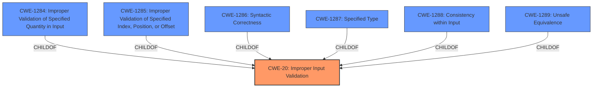

# Raw Analyzer Response for CVE-2022-23403

# Summary
| CWE ID | CWE Name | Confidence | CWE Abstraction Level | CWE Vulnerability Mapping Label | CWE-Vulnerability Mapping Notes |
|---|---|---|---|---|---|
| CWE-20 | Improper Input Validation | 1.0 | Class | Primary | Discouraged |

## Evidence and Confidence

*   **Confidence Score:** 1.0
*   **Evidence Strength:** HIGH

## Relationship Analysis
The primary CWE, CWE-20 [CWE-20: Improper Input Validation], is a class-level CWE. The analysis considered its relationships, particularly the parent CWEs and potential child CWEs that might offer a more specific classification. However, based on the provided information, CWE-20 [CWE-20: Improper Input Validation] is the most fitting, though still a bit generic. There isn't enough detail to pinpoint a more specific child CWE.

## Vulnerability Chain
The vulnerability chain is straightforward: **improper input validation** leads to a denial of service.

## Summary of Analysis
The initial assessment, based on the description highlighting **"Improper input validation,"** strongly points to CWE-20 [CWE-20: Improper Input Validation]. The CVE Reference Links Content Summary confirms this by explicitly stating "Improper input validation in the Intel(R) Data Center Manager software."

The retriever results also list CWE-20 [CWE-20: Improper Input Validation] as a strong candidate, but also list CWE-691 [CWE-691: Insufficient Control Flow Management], CWE-284 [CWE-284: Improper Access Control], and CWE-287 [CWE-287: Improper Authentication]. However, the vulnerability description and CVE reference summary do not provide evidence to support those other CWEs.

CWE-20 [CWE-20: Improper Input Validation] is a class-level CWE, and the mapping guidance discourages its use when more specific CWEs are available. The suggested alternatives include CWE-1284 [CWE-1284: Improper Validation of Specified Quantity in Input], CWE-1285 [CWE-1285: Improper Validation of Specified Index, Position, or Offset], CWE-1286 [CWE-1286: Syntactic Correctness], CWE-1287 [CWE-1287: Specified Type], CWE-1288 [CWE-1288: Consistency within Input], and CWE-1289 [CWE-1289: Unsafe Equivalence].

However, the provided information does not specify the type of input that is not being validated, which prevents using a more specific CWE. Therefore, CWE-20 [CWE-20: Improper Input Validation] is the most appropriate choice despite its generality.

Relevant CWE Information:
# Enhanced Context (25 CWEs)
The following CWEs were identified as potentially relevant to this vulnerability:

## CWE-1289: Improper Validation of Unsafe Equivalence in Input
**Abstraction Level**: Base
**Similarity Score**: 0.76

## CWE-807: Reliance on Untrusted Inputs in a Security Decision
**Abstraction Level**: Base
**Similarity Score**: 0.75

## CWE-274: Improper Handling of Insufficient Privileges
**Abstraction Level**: Base
**Similarity Score**: 0.75

## CWE-668: Exposure of Resource to Wrong Sphere
**Abstraction Level**: Class
**Similarity Score**: 0.75

## CWE-41: Improper Resolution of Path Equivalence
**Abstraction Level**: Base
**Similarity Score**: 0.75

## CWE-653: Improper Isolation or Compartmentalization
**Abstraction Level**: Class
**Similarity Score**: 0.74

## CWE-691: Insufficient Control Flow Management
**Abstraction Level**: Pillar
**Similarity Score**: 0.74

## CWE-280: Improper Handling of Insufficient Permissions or Privileges 
**Abstraction Level**: Base
**Similarity Score**: 0.74

## CWE-1173: Improper Use of Validation Framework
**Abstraction Level**: Base
**Similarity Score**: 0.74

## CWE-703: Improper Check or Handling of Exceptional Conditions
**Abstraction Level**: Pillar
**Similarity Score**: 0.74

## CWE-863: Incorrect Authorization
**Abstraction Level**: Class
**Similarity Score**: 5756.81

## CWE-22: Improper Limitation of a Pathname to a Restricted Directory ('Path Traversal')
**Abstraction Level**: Base
**Similarity Score**: 5700.89

## CWE-639: Authorization Bypass Through User-Controlled Key
**Abstraction Level**: Base
**Similarity Score**: 5688.22

## CWE-287: Improper Authentication
**Abstraction Level**: Class
**Similarity Score**: 5686.88

## CWE-1390: Weak Authentication
**Abstraction Level**: Class
**Similarity Score**: 5667.64

## CWE-22: Improper Limitation of a Pathname to a Restricted Directory ('Path Traversal')
**Abstraction Level**: base
**Similarity Score**: 4.33

## CWE-770: Allocation of Resources Without Limits or Throttling
**Abstraction Level**: base
**Similarity Score**: 4.33

## CWE-73: External Control of File Name or Path
**Abstraction Level**: base
**Similarity Score**: 4.33

## CWE-190: Integer Overflow or Wraparound
**Abstraction Level**: base
**Similarity Score**: 4.33

## CWE-193: Off-by-one Error
**Abstraction Level**: base
**Similarity Score**: 4.33

## CWE-613: Insufficient Session Expiration
**Abstraction Level**: base
**Similarity Score**: 4.33

## CWE-266: Incorrect Privilege Assignment
**Abstraction Level**: base
**Similarity Score**: 3.64

## CWE-322: Key Exchange without Entity Authentication
**Abstraction Level**: base
**Similarity Score**: 3.57

## CWE-843: Access of Resource Using Incompatible Type ('Type Confusion')
**Abstraction Level**: base
**Similarity Score**: 3.44

## CWE-1284: Improper Validation of Specified Quantity in Input
**Abstraction Level**: base
**Similarity Score**: 3.42