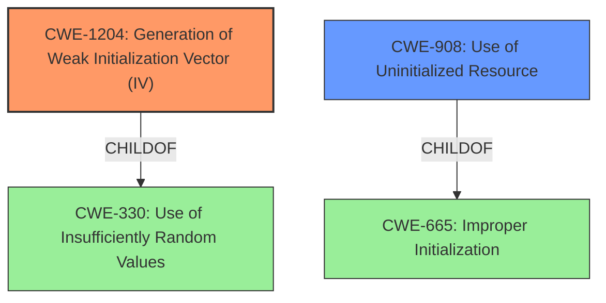

# Analysis Report for CVE-2022-23408

# Vulnerability Analysis Report: CVE-2022-23408

## Description


## Analysis (with Relationship Data)

# Summary
| CWE ID | CWE Name | Confidence | CWE Abstraction Level | CWE Vulnerability Mapping Label | CWE-Vulnerability Mapping Notes |
|---|---|---|---|---|---|
| CWE-1204 | Generation of Weak Initialization Vector (IV) | 1.0 | Base | Allowed | Primary CWE. The vulnerability description explicitly mentions the use of **non-random IV values**, which directly aligns with the description of CWE-1204. |
| CWE-908 | Use of Uninitialized Resource | 0.7 | Base | Allowed | Secondary CWE. The vulnerability description mentions **misplaced memory initialization**, suggesting that the memory used for IV generation might not have been properly initialized, leading to predictable or non-random values. |

## Evidence and Confidence

*   **Confidence Score:** 0.85
*   **Evidence Strength:** HIGH

## Relationship Analysis
The primary CWE is CWE-1204, which has a parent CWE of CWE-330 (Use of Insufficiently Random Values). CWE-908 (Use of Uninitialized Resource) is a possible secondary CWE, and it is a child of CWE-665 (Improper Initialization).



## Vulnerability Chain
The vulnerability chain starts with **misplaced memory initialization** (potentially CWE-908), which leads to the use of **non-random IV values** (CWE-1204), ultimately affecting the security of connections using AES-CBC or DES3 with TLS/DTLS.

## Summary of Analysis
The primary weakness is the generation of weak IVs (CWE-1204) due to a **misplaced memory initialization**.

The vulnerability description states, "wolfSSL 5.x before 5.1.1 uses **non-random IV values** in certain situations. This affects connections (without AEAD) using AES-CBC or DES3 with TLS 1.1 or 1.2 or DTLS 1.1 or 1.2. This occurs because of **misplaced memory initialization** in BuildMessage in internal.c." This clearly indicates that the root cause is related to how IVs are generated and that they are not sufficiently random.

CWE-1204 is at the Base level of abstraction, which is the preferred level. The description of CWE-1204, "The product uses a cryptographic primitive that uses an Initialization Vector (IV), but the product does not generate IVs that are sufficiently unpredictable or unique according to the expected cryptographic requirements for that primitive," matches the vulnerability description almost perfectly.

CWE-908 is a possible contributing factor. The **misplaced memory initialization** could mean the memory used for the IV wasn't initialized. However, the core issue is the resultant weak IV. The retriever results also listed CWE-908 as a possibility.

CWE-329 (Generation of Predictable IV with CBC Mode) was considered, but it's more specific to CBC mode, whereas the vulnerability affects both AES-CBC and DES3. While CBC mode is mentioned, DES3 is not directly related. Therefore, CWE-1204 is more appropriate.

Other CWEs like CWE-126 (Buffer Over-read), CWE-327 (Use of a Broken or Risky Cryptographic Algorithm), CWE-203 (Observable Discrepancy), and CWE-1284 (Improper Validation of Specified Quantity in Input) were considered but ultimately deemed less relevant because they don't directly address the core issue of weak IV generation due to memory initialization problems.


## CWE Relationship Analysis

Current CWEs represent these abstraction levels: .


### Vulnerability Chain Analysis

**Chain starting from CWE-329:**
- 329 (Generation of Predictable IV with CBC Mode) - ROOT


**Chain starting from CWE-203:**
- 203 (Observable Discrepancy) - ROOT


### CWE Relationship Diagram

```mermaid
graph TD
    classDef primary fill:#f96,stroke:#333,stroke-width:2px
    classDef secondary fill:#69f,stroke:#333
    classDef tertiary fill:#9e9,stroke:#333
```


*Report generated on 2025-03-30 17:37:36*
