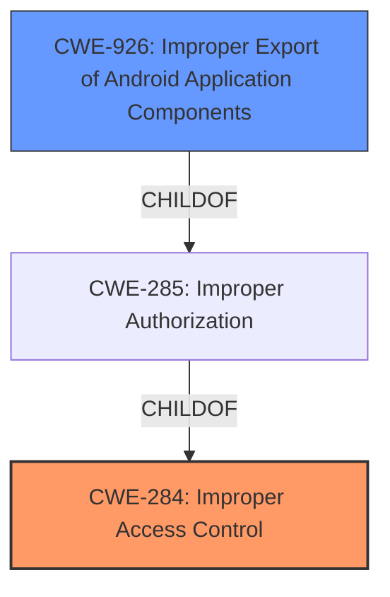

# Enhanced Analysis for CVE-2022-23433

# Summary
| CWE ID | CWE Name | Confidence | CWE Abstraction Level | CWE Vulnerability Mapping Label | CWE-Vulnerability Mapping Notes |
|---|---|---|---|---|---|
| CWE-284 | Improper Access Control | 0.75 | Pillar | Primary | Discouraged |
| CWE-926 | Improper Export of Android Application Components | 0.60 | Variant | Secondary | Allowed |

## Evidence and Confidence

*   **Confidence Score:** 0.70
*   **Evidence Strength:** MEDIUM

## Relationship Analysis
The primary CWE selected is CWE-284, a high-level Pillar. The retriever results suggest more specific CWEs, particularly related to Android application components. CWE-926, a Variant of CWE-285 (which is a child of CWE-284), focuses on improper export of Android components and aligns with the ability to execute exported activities remotely. However, the core issue described in the vulnerability is **improper access control**, making CWE-284 a reasonable starting point, despite its discouraged usage. Because the impact specifically involves exported Android components, CWE-926 is added as a secondary CWE to provide additional specificity.



## Vulnerability Chain
The vulnerability chain starts with **improper access control**, leading to the ability to remotely register reminders and execute exported activities. The root cause is the **improper access control**, and the impact is the unauthorized execution of activities and registration of reminders.

## Summary of Analysis
The initial analysis identified **improper access control** as the root cause, aligning with CWE-284. The retriever results suggested more specific CWEs related to Android applications. While CWE-284 is discouraged due to its high-level nature, it accurately reflects the core weakness. CWE-926 is added as a secondary CWE because the vulnerability description states that attackers can "execute exported activities remotely", and CWE-926 is about the "Improper Export of Android Application Components". This provides a more specific context within the Android environment. The final decision is based on both the provided evidence and the relationship analysis of relevant CWEs, opting for a combination of a general **improper access control** CWE and a more specific Android-related CWE.

The primary evidence for this is from the "Vulnerability Description Key Phrases" where the **rootcause** is listed as "**Improper access control**". Additionally, the "CVE Reference Links Content Summary" states: "*   **Root Cause:** Improper access control within the Reminder application."

Relevant CWE Information:

# Enhanced Context (25 CWEs)
The following CWEs were identified as potentially relevant to this vulnerability:

## CWE-405: Asymmetric Resource Consumption (Amplification)
**Abstraction Level**: Class
**Similarity Score**: 0.77
**Source**: dense

## CWE-404: Improper Resource Shutdown or Release
**Abstraction Level**: Class
**Similarity Score**: 0.76
**Source**: dense

## CWE-664: Improper Control of a Resource Through its Lifetime
**Abstraction Level**: Pillar
**Similarity Score**: 0.76
**Source**: dense

## CWE-668: Exposure of Resource to Wrong Sphere
**Abstraction Level**: Class
**Similarity Score**: 0.76
**Source**: dense

## CWE-799: Improper Control of Interaction Frequency
**Abstraction Level**: Class
**Similarity Score**: 0.75
**Source**: dense

## CWE-789: Memory Allocation with Excessive Size Value
**Abstraction Level**: Variant
**Similarity Score**: 0.74
**Source**: dense

## CWE-226: Sensitive Information in Resource Not Removed Before Reuse
**Abstraction Level**: Base
**Similarity Score**: 0.74
**Source**: dense

## CWE-400: Uncontrolled Resource Consumption
**Abstraction Level**: Class
**Similarity Score**: 0.74
**Source**: dense

## CWE-407: Inefficient Algorithmic Complexity
**Abstraction Level**: Class
**Similarity Score**: 0.74
**Source**: dense

## CWE-770: Allocation of Resources Without Limits or Throttling
**Abstraction Level**: Base
**Similarity Score**: 0.74
**Source**: dense

## CWE-22: Improper Limitation of a Pathname to a Restricted Directory ('Path Traversal')
**Abstraction Level**: Base
**Similarity Score**: 9027.84
**Source**: sparse

## CWE-941: Incorrectly Specified Destination in a Communication Channel
**Abstraction Level**: Base
**Similarity Score**: 8883.30
**Source**: sparse

## CWE-863: Incorrect Authorization
**Abstraction Level**: Class
**Similarity Score**: 8832.01
**Source**: sparse

## CWE-639: Authorization Bypass Through User-Controlled Key
**Abstraction Level**: Base
**Similarity Score**: 8698.49
**Source**: sparse

## CWE-23: Relative Path Traversal
**Abstraction Level**: Base
**Similarity Score**: 8674.70
**Source**: sparse

## CWE-73: External Control of File Name or Path
**Abstraction Level**: base
**Similarity Score**: 4.82
**Source**: graph

## CWE-22: Improper Limitation of a Pathname to a Restricted Directory ('Path Traversal')
**Abstraction Level**: base
**Similarity Score**: 4.33
**Source**: graph

## CWE-410: Insufficient Resource Pool
**Abstraction Level**: base
**Similarity Score**: 4.33
**Source**: graph

## CWE-941: Incorrectly Specified Destination in a Communication Channel
**Abstraction Level**: base
**Similarity Score**: 4.33
**Source**: graph

## CWE-613: Insufficient Session Expiration
**Abstraction Level**: base
**Similarity Score**: 4.33
**Source**: graph

## CWE-190: Integer Overflow or Wraparound
**Abstraction Level**: base
**Similarity Score**: 4.33
**Source**: graph

## CWE-1284: Improper Validation of Specified Quantity in Input
**Abstraction Level**: base
**Similarity Score**: 4.33
**Source**: graph

## CWE-772: Missing Release of Resource after Effective Lifetime
**Abstraction Level**: base
**Similarity Score**: 3.89
**Source**: graph

## CWE-843: Access of Resource Using Incompatible Type ('Type Confusion')
**Abstraction Level**: base
**Similarity Score**: 3.44
**Source**: graph

## CWE-41: Improper Resolution of Path Equivalence
**Abstraction Level**: Base
**Similarity Score**: 3.31
**Source**: graph

CWEs considered but not used:

*   CWE-927 (Use of Implicit Intent for Sensitive Communication): While relevant to Android, the description focuses on implicit intents, which isn't explicitly mentioned in the vulnerability description.
*   CWE-732 (Incorrect Permission Assignment for Critical Resource): The vulnerability is about **improper access control** rather than incorrect permission assignment. While related, the core issue is broader than just permissions.
*   CWE-287 (Improper Authentication): The vulnerability description does not mention authentication issues, so this CWE is not applicable.
*   CWE-20 (Improper Input Validation): Although the ability to "register reminders" might imply input, the core weakness isn't about input validation, but rather about **access control**.


## CWE Relationship Analysis

Current CWEs represent these abstraction levels: .


### Vulnerability Chain Analysis

**Chain starting from CWE-41:**
- 41 (Improper Resolution of Path Equivalence) - ROOT


**Chain starting from CWE-668:**
- 668 (Exposure of Resource to Wrong Sphere) - ROOT


### CWE Relationship Diagram

```mermaid
graph TD
    classDef primary fill:#f96,stroke:#333,stroke-width:2px
    classDef secondary fill:#69f,stroke:#333
    classDef tertiary fill:#9e9,stroke:#333
```