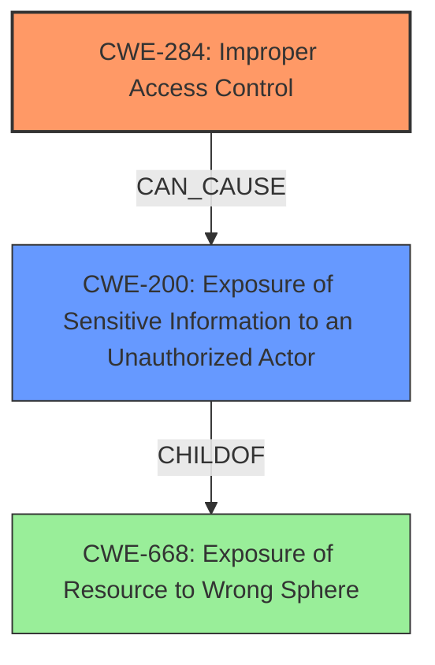

# Raw Analyzer Response for CVE-2022-23442

# Summary
| CWE ID | CWE Name | Confidence | CWE Abstraction Level | CWE Vulnerability Mapping Label | CWE-Vulnerability Mapping Notes |
|---|---|---|---|---|---|
| CWE-284 | Improper Access Control | 0.75 | Pillar | Primary | Discouraged |
| CWE-200 | Exposure of Sensitive Information to an Unauthorized Actor | 0.5 | Class | Secondary | Discouraged |

## Evidence and Confidence

*   **Confidence Score:** 0.7
*   **Evidence Strength:** MEDIUM

## Relationship Analysis
The primary CWE, CWE-284, is a Pillar-level CWE, which is a very high level of abstraction. The mapping guidance discourages the use of this CWE due to its high level and recommends more specific descendants. The vulnerability description indicates **improper access control** which allows an authenticated attacker to gather checksum information about other VDOMs via CLI commands. This suggests a potential information exposure, leading to consideration of CWE-200.

## Vulnerability Chain
The vulnerability chain starts with **improper access control** [CWE-284]. This allows an authenticated attacker with a restricted user profile to gather checksum information about other VDOMs, leading to potential information disclosure [CWE-200].
- Root Cause: **Improper Access Control** [CWE-284]
- Impact: Information disclosure [CWE-200]

## Summary of Analysis
The initial assessment identifies **improper access control** as the root cause, leading to the primary CWE mapping of CWE-284. The vulnerability description specifically mentions that an authenticated attacker with a restricted user profile can gather checksum information about other VDOMs via CLI commands.

However, CWE-284 is a Pillar-level CWE and the mapping guidance discourages its use, recommending more specific descendants. The ability to gather checksum information suggests an information exposure. Therefore, CWE-200 is considered as a secondary CWE to represent the information disclosure aspect of the vulnerability. While CWE-200 is a Class-level CWE, it's preferred over CWE-284 due to its more specific nature and the evidence supporting information exposure.

The final decision involves mapping to CWE-284 as the primary root cause while acknowledging its high-level nature, and adding CWE-200 to represent the information disclosure aspect. This provides a more complete picture of the vulnerability.

Relevant CWE Information:

# Enhanced Context (25 CWEs)
The following CWEs were identified as potentially relevant to this vulnerability:

## CWE-668: Exposure of Resource to Wrong Sphere
**Abstraction Level**: Class
**Similarity Score**: 0.75
**Source**: dense

**Description**:
The product exposes a resource to the wrong control sphere, providing unintended actors with inappropriate access to the resource.

**Mapping Guidance**:
- Usage: Discouraged
- Rationale: CWE-668 is high-level and is often misused as a catch-all when lower-level CWE IDs might be applicable. It is sometimes used for low-information vulnerability reports [REF-1287]. It is a level-1 Class (i.e., a child of a Pillar). It is not useful for trend analysis.

## CWE-284: Improper Access Control
**Abstraction:** Pillar
**Status:** Incomplete

### Description
The product does not restrict or incorrectly restricts access to a resource from an unauthorized actor.

### Extended Description
Access control involves the use of several protection mechanisms such as:
  - Authentication (proving the identity of an actor)
  - Authorization (ensuring that a given actor can access a resource), and
  - Accountability (tracking of activities that were performed)

When any mechanism is not applied or otherwise fails, attackers can compromise the security of the product by gaining privileges, reading sensitive information, executing commands, evading detection, etc.

### Mapping Guidance
**Usage:** Discouraged
**Rationale:** CWE-284 is extremely high-level, a Pillar. Its name, "Improper Access Control," is often misused in low-information vulnerability reports [REF-1287] or by active use of the OWASP Top Ten, such as "A01:2021-Broken Access Control". It is not useful for trend analysis.
**Comments:** Consider using descendants of CWE-284 that are more specific to the kind of access control involved, such as those involving authorization (Missing Authorization (CWE-862), Incorrect Authorization (CWE-863), Incorrect Permission Assignment for Critical Resource (CWE-732), etc.); authentication (Missing Authentication (CWE-306) or Weak Authentication (CWE-1390)); Incorrect User Management (CWE-286); Improper Restriction of Communication Channel to Intended Endpoints (CWE-923); etc.

## CWE-200: Exposure of Sensitive Information to an Unauthorized Actor
**Abstraction:** Class
**Status:** Draft

### Description
The product exposes sensitive information to an actor that is not explicitly authorized to have access to that information.

### Mapping Guidance
**Usage:** Discouraged
**Rationale:** CWE-200 is commonly misused to represent the loss of confidentiality in a vulnerability, but confidentiality loss is a technical impact - not a root cause error. As of CWE 4.9, over 400 CWE entries can lead to a loss of confidentiality. Other options are often available. [REF-1287].
**Comments:** If an error or mistake causes information to be disclosed, then use the CWE ID for that error. Consider starting with improper authorization (CWE-285), insecure permissions (CWE-732), improper authentication (CWE-287), etc. Also consider children such as Insertion of Sensitive Information Into Sent Data (CWE-201), Observable Discrepancy (CWE-203), Insertion of Sensitive Information into Externally-Accessible File or Directory (CWE-538), or others.

CWEs considered but not used:

- CWE-668: Exposure of Resource to Wrong Sphere: While related to information exposure, it is a higher-level class than CWE-200 and less specific to the vulnerability's impact.
- CWE-23: Relative Path Traversal and CWE-22: Improper Limitation of a Pathname to a Restricted Directory ('Path Traversal'): These CWEs are related to file path manipulation, which is not the primary issue in this vulnerability.
- CWE-269: Improper Privilege Management: While related to access control, the description focuses on privilege assignment, which is not the core issue here.
- CWE-280: Improper Handling of Insufficient Permissions or Privileges : This CWE focuses on handling insufficient privileges, whereas the vulnerability is about excessive access due to **improper access control**.
- CWE-942: Permissive Cross-domain Policy with Untrusted Domains: This CWE is specific to cross-domain policies, which are not relevant to the vulnerability.
- CWE-285: Improper Authorization: This CWE is a Class-level CWE, and the primary root cause is already captured by the higher-level CWE-284.
- CWE-639: Authorization Bypass Through User-Controlled Key: This CWE focuses on bypassing authorization through user-controlled keys, which is not explicitly mentioned in the vulnerability description.