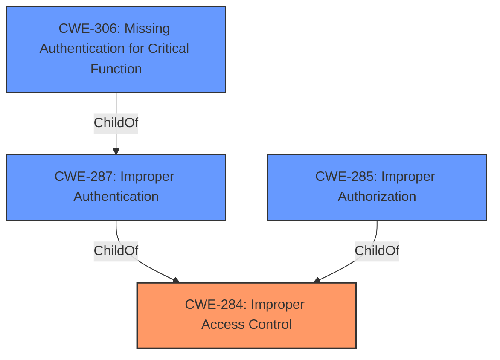

# Analysis Report for CVE-2022-23443

# Vulnerability Analysis Report: CVE-2022-23443

## Description


## Analysis (with Relationship Data)

# Summary
| CWE ID | CWE Name | Confidence | CWE Abstraction Level | CWE Vulnerability Mapping Label | CWE-Vulnerability Mapping Notes |
|---|---|---|---|---|---|
| CWE-284 | Improper Access Control | 0.75 | Pillar | Primary | Discouraged |
| CWE-306 | Missing Authentication for Critical Function | 0.65 | Base | Secondary | Allowed |

## Evidence and Confidence

*   **Confidence Score:** 0.70
*   **Evidence Strength:** MEDIUM

## Relationship Analysis
The primary CWE is CWE-284, which is a high-level Pillar. The vulnerability involves an **improper access control** issue which means the system is failing to restrict access from an unauthorized actor. CWE-284 has a parent-child relationship with both CWE-287 (Improper Authentication) and CWE-285 (Improper Authorization). CWE-306 (Missing Authentication for Critical Function) is a child of CWE-287, indicating a lack of authentication for critical functionalities.



## Vulnerability Chain
The chain starts with an **improper access control**, leading to unauthenticated attackers gaining access to gateway API data.
  - **Root Cause:** **Improper access control** (CWE-284)
  - **Weakness:** Missing authentication for critical functions (CWE-306)
  - **Impact:** Access to gateway API data

## Summary of Analysis
The initial assessment identified **improper access control** as the primary issue, which aligns with CWE-284. However, CWE-284 is a high-level Pillar, and the provided mapping guidance discourages its use in favor of more specific CWEs. The vulnerability description indicates that unauthenticated attackers can access gateway API data, suggesting a missing authentication component. Therefore, CWE-306 (Missing Authentication for Critical Function) is included as a secondary, more specific weakness.

The evidence supporting this assessment includes:
*   "**improper access control** in Fortinet FortiSOAR before 7.2.0 allows unauthenticated attackers to access gateway API data via crafted HTTP GET requests."
*   "**Root Cause:** **Improper access control** in the FortiSOAR gateway API."
*   "**Weaknesses/Vulnerabilities:** Improper access control (CWE-284). Unauthenticated access to the gateway API."

CWE-284 is retained as the primary CWE because it captures the general **improper access control** issue, while CWE-306 highlights the specific lack of authentication that enables the attack. CWE-284 is a high level Pillar that can be refined using children CWEs such as CWE-306.

Other CWEs considered but not used:

*   CWE-23 (Relative Path Traversal): This CWE is not relevant as the vulnerability description focuses on access control issues rather than path manipulation.
*   CWE-287 (Improper Authentication): While related, CWE-306 (Missing Authentication for Critical Function) is more specific and accurately describes the lack of authentication for the gateway API.
*   CWE-285 (Improper Authorization): Authorization is not the main problem, the API is missing Authentication.
*   CWE-280 (Improper Handling of Insufficient Permissions or Privileges): This is not relevant as the problem is the API is missing Authentication.
*   CWE-613 (Insufficient Session Expiration): This is not relevant as the problem is the API is missing Authentication.
*   CWE-639 (Authorization Bypass Through User-Controlled Key): This is not relevant as the problem is the API is missing Authentication.
*   CWE-269 (Improper Privilege Management): This is not relevant as the problem is the API is missing Authentication.
*   CWE-863 (Incorrect Authorization): This is not relevant as the problem is the API is missing Authentication.


## CWE Relationship Analysis

Current CWEs represent these abstraction levels: .


### Vulnerability Chain Analysis

**Chain starting from CWE-280:**
- 280 (Improper Handling of Insufficient Permissions or Privileges ) - ROOT


**Chain starting from CWE-639:**
- 639 (Authorization Bypass Through User-Controlled Key) - ROOT


### CWE Relationship Diagram

```mermaid
graph TD
    classDef primary fill:#f96,stroke:#333,stroke-width:2px
    classDef secondary fill:#69f,stroke:#333
    classDef tertiary fill:#9e9,stroke:#333
```


*Report generated on 2025-03-31 01:28:03*
