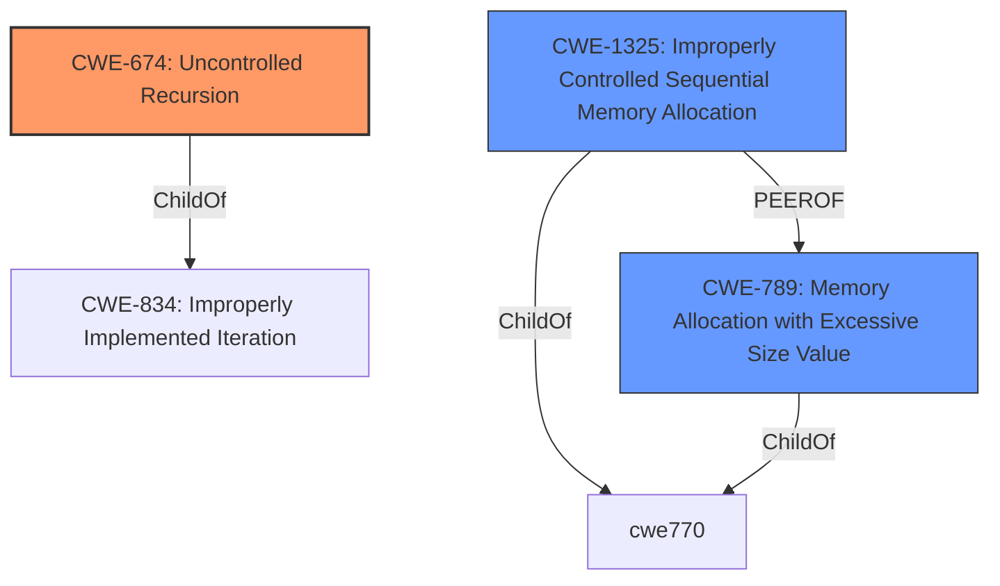

# Raw Analyzer Response for CVE-2022-23460

# Summary
| CWE ID | CWE Name | Confidence | CWE Abstraction Level | CWE Vulnerability Mapping Label | CWE-Vulnerability Mapping Notes |
|---|---|---|---|---|---|
| CWE-674 | Uncontrolled Recursion | 0.9 | Class | Allowed-with-Review | The parsing logic for arrays does not limit recursion, leading to a stack overflow when parsing deeply nested JSON arrays. |
| CWE-1325 | Improperly Controlled Sequential Memory Allocation | 0.7 | Base | Allowed | Stack exhaustion is a technical impact of the weakness. |
| CWE-789 | Memory Allocation with Excessive Size Value | 0.6 | Variant | Allowed | Stack exhaustion is a technical impact of the weakness. |

## Evidence and Confidence

*   **Confidence Score:** 0.8
*   **Evidence Strength:** HIGH

## Relationship Analysis
The primary CWE is CWE-674, Uncontrolled Recursion, which is a Class-level CWE. It is related to CWE-834 (Improperly Implemented Iteration). CWE-1325 (Improperly Controlled Sequential Memory Allocation) and CWE-789 (Memory Allocation with Excessive Size Value) are both related to stack exhaustion and can be consequences of uncontrolled recursion. They are also peers of each other, representing different aspects of memory allocation issues.

## Vulnerability Chain
The vulnerability chain starts with the **improper parsing logic** in the jsonxx library, which **does not limit recursion** when parsing deeply nested JSON arrays. This leads to **uncontrolled recursion** (CWE-674), potentially causing **excessive memory allocation** on the stack (CWE-1325 and/or CWE-789), ultimately resulting in **stack exhaustion** and a **denial of service**.

## Summary of Analysis
Initially, the analysis focused on the **stack exhaustion** reported in the vulnerability description. The "CVE Reference Links Content Summary" section mentions that the **root cause of the vulnerability** is stack exhaustion during JSON parsing due to deeply nested arrays and that the `jsonxx` library's parsing logic for arrays **does not limit recursion**.

The Retriever results showed CWE-1325, CWE-674, and CWE-789 as top candidates.

*   CWE-1325 (Improperly Controlled Sequential Memory Allocation) was considered because the vulnerability involves allocating memory for each nested array, but the **lack of recursion control** is the main driver.
*   CWE-674 (Uncontrolled Recursion) was chosen as the primary CWE because the recursive parsing of nested arrays without proper limits is the core issue.
*   CWE-789 (Memory Allocation with Excessive Size Value) was considered because the nested arrays could potentially lead to large memory allocations, but the uncontrolled recursion is the more direct cause.

The graph relationships indicate that CWE-674 can lead to CWE-1325 and CWE-789. This reinforces the selection of CWE-674 as the primary CWE, as it represents the initial **flaw** in the parsing logic. CWE-1325 and CWE-789 are consequences of the uncontrolled recursion.

The final selection of CWE-674 as the primary CWE, with CWE-1325 and CWE-789 as secondary candidates, represents the optimal level of specificity. CWE-674 captures the root cause, while CWE-1325 and CWE-789 describe potential consequences. The evidence supports this classification with a high degree of confidence.

Relevant CWE Information:
INSERT