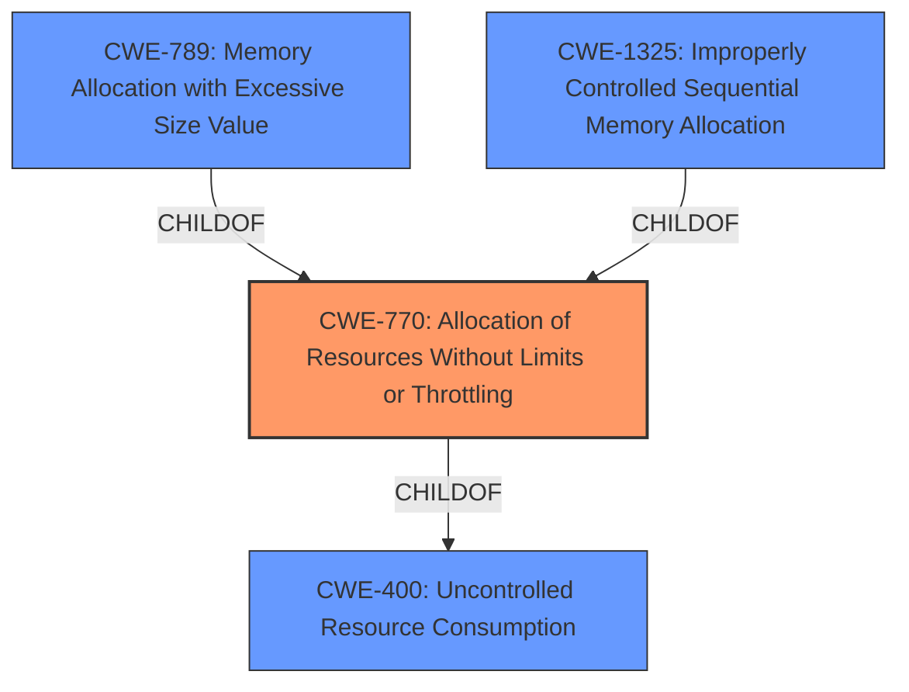

# Analysis for CVE-2022-23487

# Summary
| CWE ID | CWE Name | Confidence | CWE Abstraction Level | CWE Vulnerability Mapping Label | CWE-Vulnerability Mapping Notes |
|---|---|---|---|---|---|
| CWE-770 | Allocation of Resources Without Limits or Throttling | 0.9 | Base | Allowed | Primary CWE |
| CWE-400 | Uncontrolled Resource Consumption | 0.7 | Class | Discouraged | Secondary Candidate |
| CWE-789 | Memory Allocation with Excessive Size Value | 0.6 | Variant | Allowed | Secondary Candidate |
| CWE-1325 | Improperly Controlled Sequential Memory Allocation | 0.6 | Base | Allowed | Secondary Candidate |

## Evidence and Confidence

*   **Confidence Score:** 0.9
*   **Evidence Strength:** HIGH

## Relationship Analysis
The primary weakness identified is CWE-770 **Allocation of Resources Without Limits or Throttling**. This is a child of CWE-400 **Uncontrolled Resource Consumption** and is related to CWE-789 **Memory Allocation with Excessive Size Value** and CWE-1325 **Improperly Controlled Sequential Memory Allocation**. The relationship analysis indicates a progression from a general resource consumption issue to more specific allocation problems, where resources (particularly memory) are allocated without proper limits. This can lead to a denial-of-service condition as described in the vulnerability.

## Vulnerability Chain
The vulnerability chain starts with the **lack of resource management** which leads to **uncontrolled allocation of memory, connections, streams, and peers** and finally results in **resource exhaustion** and denial of service.
  - **Root Cause:** **Lack of resource management** in js-libp2p versions prior to v0.38.0
  - **Weakness 1:** CWE-770 **Allocation of Resources Without Limits or Throttling**
  - **Weakness 2:** Potential excessive memory allocation (CWE-789) or sequential memory allocation (CWE-1325)
  - **Impact:** **Resource Exhaustion**, leading to denial of service (DoS).

## Summary of Analysis
The initial analysis focused on **resource exhaustion** as the primary symptom. However, deeper analysis, particularly of the CVE Reference Links Content Summary, revealed that the root cause is the **lack of resource management** leading to uncontrolled allocation of resources. The retriever results also strongly suggested CWE-770 **Allocation of Resources Without Limits or Throttling**.

The evidence supporting this includes:
*   "Root cause of vulnerability: **Lack of resource management** in `js-libp2p` versions prior to `v0.38.0`."
*   "Weaknesses/vulnerabilities present: Vulnerable to **resource exhaustion** attacks targeting connection, stream, peer, and memory management."
*   "An attacker can cause the allocation of large amounts of memory, leading to the process being killed by the host's operating system (DoS)."

Given this evidence, CWE-770 **Allocation of Resources Without Limits or Throttling** is the most appropriate primary CWE. While CWE-400 **Uncontrolled Resource Consumption** is a broader category, CWE-770 pinpoints the specific issue of allocating resources without proper limits. CWE-789 **Memory Allocation with Excessive Size Value** and CWE-1325 **Improperly Controlled Sequential Memory Allocation** could be present in some exploitation scenarios, but are not the root cause itself, rather potential exploitable flaws that stem from the main weakness. The graph relationships support the selection of CWE-770 as the primary weakness because it is a direct child of CWE-400 and a parent to more specific memory allocation issues.

The selected CWEs are at the optimal level of specificity because they directly address the root cause (**uncontrolled resource allocation**) and potential exploitable aspects (excessive memory allocation) of the vulnerability.

Relevant CWE Information:

# Enhanced Context (25 CWEs)
The following CWEs were identified as potentially relevant to this vulnerability:

## CWE-404: Improper Resource Shutdown or Release
**Abstraction Level**: Class
**Similarity Score**: 0.80
**Source**: dense

**Description**:
The product does not release or incorrectly releases a resource before it is made available for re-use.

**Mapping Guidance**:
- Usage: Allowed-with-Review
- Rationale: This CWE entry is a Class and might have Base-level children that would be more appropriate

## CWE-226: Sensitive Information in Resource Not Removed Before Reuse
**Abstraction Level**: Base
**Similarity Score**: 0.78
**Source**: dense

**Description**:
The product releases a resource such as memory or a file so that it can be made available for reuse, but it does not clear or "zeroize" the information contained in the resource before the product performs a critical state transition or makes the resource available for reuse by other entities.

**Mapping Guidance**:
- Usage: Allowed
- Rationale: This CWE entry is at the Base level of abstraction, which is a preferred level of abstraction for mapping to the root causes of vulnerabilities.

## CWE-664: Improper Control of a Resource Through its Lifetime
**Abstraction Level**: Pillar
**Similarity Score**: 0.77
**Source**: dense

**Description**:
The product does not maintain or incorrectly maintains control over a resource throughout its lifetime of creation, use, and release.

**Mapping Guidance**:
- Usage: Discouraged
- Rationale: This CWE entry is high-level when lower-level children are available.

## CWE-772: Missing Release of Resource after Effective Lifetime
**Abstraction Level**: Base
**Similarity Score**: 0.77
**Source**: dense

**Description**:
The product does not release a resource after its effective lifetime has ended, i.e., after the resource is no longer needed.

**Mapping Guidance**:
- Usage: Allowed
- Rationale: This CWE entry is at the Base level of abstraction, which is a preferred level of abstraction for mapping to the root causes of vulnerabilities.

## CWE-789: Memory Allocation with Excessive Size Value
**Abstraction Level**: Variant
**Similarity Score**: 0.76
**Source**: dense

**Description**:
The product allocates memory based on an untrusted, large size value, but it does not ensure that the size is within expected limits, allowing arbitrary amounts of memory to be allocated.

**Mapping Guidance**:
- Usage: Allowed
- Rationale: This CWE entry is at the Variant level of abstraction, which is a preferred level of abstraction for mapping to the root causes of vulnerabilities.

## CWE-405: Asymmetric Resource Consumption (Amplification)
**Abstraction Level**: Class
**Similarity Score**: 0.76
**Source**: dense

**Description**:
The product does not properly control situations in which an adversary can cause the product to consume or produce excessive resources without requiring the adversary to invest equivalent work or otherwise prove authorization, i.e., the adversary's influence is "asymmetric."

**Mapping Guidance**:
- Usage: Allowed-with-Review
- Rationale: This CWE entry is a Class and might have Base-level children that would be more appropriate

## CWE-1325: Improperly Controlled Sequential Memory Allocation
**Abstraction Level**: Base
**Similarity Score**: 0.76
**Source**: dense

**Description**:
The product manages a group of objects or resources and performs a separate memory allocation for each object, but it does not properly limit the total amount of memory that is consumed by all of the combined objects.

**Mapping Guidance**:
- Usage: Allowed
- Rationale: This CWE entry is at the Base level of abstraction, which is a preferred level of abstraction for mapping to the root causes of vulnerabilities.

## CWE-668: Exposure of Resource to Wrong Sphere
**Abstraction Level**: Class
**Similarity Score**: 0.75
**Source**: dense

**Description**:
The product exposes a resource to the wrong control sphere, providing unintended actors with inappropriate access to the resource.

**Mapping Guidance**:
- Usage: Discouraged
- Rationale: CWE-668 is high-level and is often misused as a catch-all when lower-level CWE IDs might be applicable. It is sometimes used for low-information vulnerability reports [REF-1287]. It is a level-1 Class (i.e., a child of