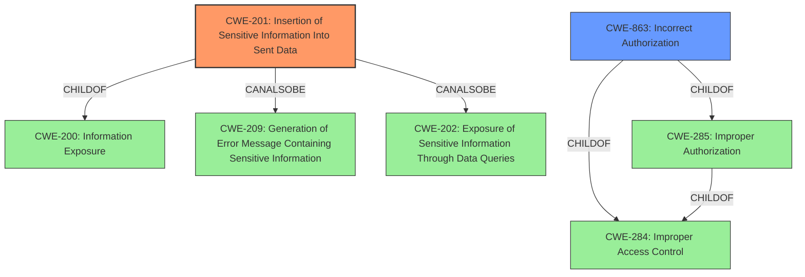

# Analysis for CVE-2022-23488

# Summary
| CWE ID | CWE Name | Confidence | CWE Abstraction Level | CWE Vulnerability Mapping Label | CWE-Vulnerability Mapping Notes |
|---|---|---|---|---|---|
| CWE-201 | Insertion of Sensitive Information Into Sent Data | 0.9 | Base | Allowed | Primary CWE |
| CWE-863 | Incorrect Authorization | 0.7 | Class | Allowed-with-Review | Secondary Candidate |

## Evidence and Confidence

*   **Confidence Score:** 0.8
*   **Evidence Strength:** HIGH

## Relationship Analysis
The primary CWE, CWE-201, is a Base level CWE, which is preferred for mapping. It has peer relationships with CWE-209 and CWE-202, which also deal with sensitive information exposure, but through error messages and data queries respectively. CWE-863, Incorrect Authorization, is a Class level CWE and a parent of more specific Base level CWEs dealing with authorization issues. While authorization is a factor, the core issue is the sensitive information being sent when it should not have been. Thus, I will choose CWE-201 as the primary CWE.

## Vulnerability Chain
The vulnerability chain begins with **the moderators-only webcams lock setting not being enforced on the backend**. This leads to the **insertion of sensitive information (streamId)** into the data sent to all users, which allows an attacker to subscribe to viewers' webcams even when the lock setting is applied. The root cause is the **lack of enforcement**, and the weakness is the **insertion of sensitive information**.

## Summary of Analysis
The initial analysis focused on the **weakness: Insertion of Sensitive Information Into Sent Data** and the **rootcause: the moderators-only webcams lock setting is not enforced on the backend**. The description states that the 'required streamId was being sent to all users even with lock setting applied,' which directly supports the selection of CWE-201. The CVE Reference Links Content Summary further confirms this, stating the root cause as "The moderators-only webcams lock setting was not enforced on the backend."

The relationship graph helped to illustrate how CWE-201 relates to other information exposure CWEs. While authorization plays a role (hence the consideration of CWE-863), the fundamental issue is the exposure of the `streamId` when it should not have been.

The selection of CWE-201 is at the optimal level of specificity because it directly addresses the vulnerability's core characteristic: the insertion of sensitive information into sent data.

Relevant CWE Information:

*   **CWE-201: Insertion of Sensitive Information Into Sent Data**
    *   **Technical Explanation:** The vulnerability involves the BigBlueButton server sending the `streamId` to all users, including those who should not have access due to the moderators-only webcams lock setting. This is a clear example of inserting sensitive information (the `streamId`, which allows subscribing to webcams) into data that is sent to unauthorized users.
    *   **Security Implications and Potential Impact:** The impact is that an attacker can subscribe to viewers' webcams even when the lock setting is enabled, leading to a privacy breach.
    *   **Parent-Child Relationships:** CWE-201 is a child of CWE-200 (Information Exposure).
    *   **Mapping Guidance Influence:** The MITRE mapping guidance recommends using the Base level of abstraction, which supports the choice of CWE-201. The guidance also states to "Carefully read both the name and description to ensure that this mapping is an appropriate fit," which it is.
*   **CWE-863: Incorrect Authorization**
    *   **Technical Explanation:** The moderators-only webcams lock setting is meant to restrict access to viewers' webcams. The fact that the `streamId` is still being sent to unauthorized users indicates an authorization issue. However, the more precise issue is the actual sending of the sensitive data.
    *   **Security Implications and Potential Impact:** Similar to CWE-201, the impact is the unauthorized access to viewers' webcams.
    *   **Parent-Child Relationships:** CWE-863 is a child of CWE-285 (Improper Authorization) and CWE-284 (Improper Access Control).
    *   **Mapping Guidance Influence:** The MITRE mapping guidance suggests examining children of CWE-863 to see if there is a better fit, but none of the children fit better than CWE-201. It is also at the Class level of abstraction.

CWEs considered but not used:

*   CWE-319 (Cleartext Transmission of Sensitive Information): While the `streamId` is sensitive, the issue is not about transmitting it in cleartext but about transmitting it to unauthorized users.
*   CWE-306 (Missing Authentication for Critical Function): Authentication isn't the primary problem here; it's the authorization mechanism that's failing.
*   CWE-359 (Exposure of Private Personal Information to an Unauthorized Actor): This is a more specific type of information exposure, but CWE-201 is a better fit because it focuses on the insertion of sensitive information into sent data, which is the direct cause of the exposure.
*   CWE-226 (Sensitive Information in Resource Not Removed Before Reuse): This CWE focuses on resources not being cleared before reuse, which is not relevant to this vulnerability.
*   CWE-285 (Improper Authorization): This is a higher-level class, and CWE-863 is a more specific and applicable child, but still not as precise as CWE-201.
*   CWE-1390 (Weak Authentication) and CWE-287 (Improper Authentication): These are not relevant because the issue is not with authentication but with authorization.