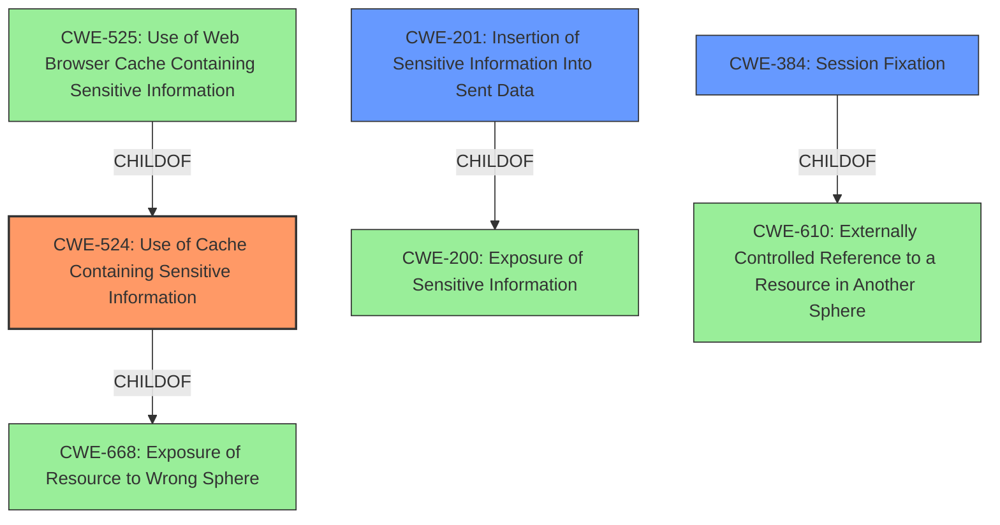

# Raw Analyzer Response for CVE-2022-23498

# Summary
| CWE ID | CWE Name | Confidence | CWE Abstraction Level | CWE Vulnerability Mapping Label | CWE-Vulnerability Mapping Notes |
|---|---|---|---|---|---|
| CWE-524 | Use of Cache Containing Sensitive Information | 0.9 | Base | Allowed | Primary CWE |
| CWE-201 | Insertion of Sensitive Information Into Sent Data | 0.7 | Base | Allowed | Secondary CWE |
| CWE-384 | Session Fixation | 0.6 | Compound | Allowed | Secondary CWE |

## Evidence and Confidence

*   **Confidence Score:** 0.8
*   **Evidence Strength:** HIGH

## Relationship Analysis
The primary relationship that influenced the selection was the ChildOf relationship between CWE-525 (Use of Web Browser Cache Containing Sensitive Information) and CWE-524 (Use of Cache Containing Sensitive Information). Since the vulnerability is specifically related to caching in general, not just web browser caching, the more general CWE-524 was chosen. The CanAlsoBe relationship between CWE-201 (Insertion of Sensitive Information Into Sent Data) and CWE-209 (Generation of Error Message Containing Sensitive Information) was considered, but CWE-201 was deemed more appropriate.

## Vulnerability Chain
The vulnerability chain starts with the **improper caching of sensitive information**, specifically the `grafana_session` cookie. This leads to the **insertion of sensitive information into sent data**, as the cached session cookie can be accessed by other users. The final impact is **session hijacking**, where an attacker can use the stolen session cookie to impersonate another user.

## Summary of Analysis
The initial analysis identified **improper caching of sensitive information** as the root cause of the vulnerability. The retriever results strongly suggested CWE-524 (Use of Cache Containing Sensitive Information), which aligns well with the vulnerability description. The vulnerability description key phrases also indicate session information disclosure.

The final assessment is primarily based on the vulnerability description and the CVE reference links content summary. The evidence for CWE-524 is strong, as the Grafana advisory explicitly states that the caching mechanism caches session cookies.

>   **Vulnerability Description Key Phrases**
>   - **rootcause:** **improper caching of sensitive information**

>   **CVE Reference Links Content Summary**
>   -   **Improper Caching of Sensitive Information:** The core weakness is that Grafana caches sensitive session cookies along with other headers when datasource query caching is enabled. This leads to a potential for session hijacking.

CWE-524 is the most specific and appropriate CWE for this vulnerability. The description of CWE-524 directly mentions sensitive information being accessible to unauthorized actors due to caching. This is precisely what is happening in the Grafana vulnerability, where the `grafana_session` cookie is being cached and potentially exposed to other users.

CWE-201 is included as a secondary weakness since the sensitive information (session cookie) is ultimately being sent to other users who should not have access to it.

CWE-384 is also included because the vulnerability could lead to session fixation.

The selected CWEs are at the optimal level of specificity, as they accurately represent the root cause and potential impacts of the vulnerability.

Relevant CWE Information:

# Enhanced Context (25 CWEs)
The following CWEs were identified as potentially relevant to this vulnerability:

## CWE-668: Exposure of Resource to Wrong Sphere
**Abstraction Level**: Class
**Similarity Score**: 0.78
**Source**: dense

**Description**:
The product exposes a resource to the wrong control sphere, providing unintended actors with inappropriate access to the resource.

**Mapping Guidance**:
- Usage: Discouraged
- Rationale: CWE-668 is high-level and is often misused as a catch-all when lower-level CWE IDs might be applicable. It is sometimes used for low-information vulnerability reports [REF-1287]. It is a level-1 Class (i.e., a child of a Pillar). It is not useful for trend analysis.

*This CWE was considered but not chosen because it's too general. CWE-524 is a more specific child of CWE-668 and is more appropriate.*

## CWE-538: Insertion of Sensitive Information into Externally-Accessible File or Directory
**Abstraction Level**: Base
**Similarity Score**: 0.78
**Source**: dense

**Description**:
The product places sensitive information into files or directories that are accessible to actors who are allowed to have access to the files, but not to the sensitive information.

**Mapping Guidance**:
- Usage: Allowed
- Rationale: This CWE entry is at the Base level of abstraction, which is a preferred level of abstraction for mapping to the root causes of vulnerabilities.

*This CWE was considered but not chosen because the sensitive information is not necessarily placed into a file or directory. The vulnerability involves caching session cookies, which may or may not be stored in a file.*

## CWE-209: Generation of Error Message Containing Sensitive Information
**Abstraction Level**: Base
**Similarity Score**: 0.78
**Source**: dense

**Description**:
The product generates an error message that includes sensitive information about its environment, users, or associated data.

**Mapping Guidance**:
- Usage: Allowed
- Rationale: This CWE entry is at the Base level of abstraction, which is a preferred level of abstraction for mapping to the root causes of vulnerabilities.

*This CWE was considered, but it is not relevant because the sensitive information is not being exposed through error messages.*

## CWE-212: Improper Removal of Sensitive Information Before Storage or Transfer
**Abstraction Level**: Base
**Similarity Score**: 0.78
**Source**: dense

**Description**:
The product stores, transfers, or shares a resource that contains sensitive information, but it does not properly remove that information before the product makes the resource available to unauthorized actors.

**Mapping Guidance**:
- Usage: Allowed
- Rationale: This CWE entry is at the Base level of abstraction, which is a preferred level of abstraction for mapping to the root causes of vulnerabilities.

*This CWE was considered, but it doesn't fit perfectly. The **improper caching** is the primary issue, rather than a failure to remove sensitive information before storage or transfer. The sensitive information is improperly cached, leading to its exposure.*

## CWE-941: Incorrectly Specified Destination in a Communication Channel
**Abstraction Level**: Base
**Similarity Score**: 0.77
**Source**: dense

**Description**:
The product creates a communication channel to initiate an outgoing request to an actor, but it does not correctly specify the intended destination for that actor.

**Mapping Guidance**:
- Usage: Allowed
- Rationale: This CWE entry is at the Base level of abstraction, which is a preferred level of abstraction for mapping to the root causes of vulnerabilities.

*This CWE is not applicable because the vulnerability does not involve an incorrectly specified destination in a communication channel.*

## CWE-226: Sensitive Information in Resource Not Removed Before Reuse
**Abstraction Level**: Base
**Similarity Score**: 0.77
**Source**: dense

**Description**:
The product releases a resource such as memory or a file so that it can be made available for reuse, but it does not clear or "zeroize" the information contained in the resource before the product performs a critical state transition or makes the resource available for reuse by other entities.

*This CWE was considered, but is not relevant. The issue is caching, not the reuse of resources.*

## CWE-497: Exposure of Sensitive System Information to an Unauthorized Control Sphere
**Abstraction Level**: Base
**Similarity Score**: 0.77
**Source**: dense

**Description**:
The product does not properly prevent sensitive system-level information from being accessed by unauthorized actors who do not have the same level of access to the underlying system as the product does.

*This is too general. CWE-524 is more specific.*

## CWE-74: Improper Neutralization of