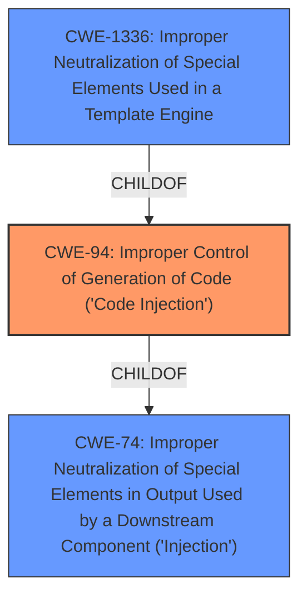

# Analysis for CVE-2022-23503

# Summary

| CWE ID | CWE Name | Confidence | CWE Abstraction Level | CWE Vulnerability Mapping Label | CWE-Vulnerability Mapping Notes |
|---|---|---|---|---|---|
| CWE-94 | Improper Control of Generation of Code ('Code Injection') | 0.9 | Base | Allowed-with-Review | Primary CWE |
| CWE-1336 | Improper Neutralization of Special Elements Used in a Template Engine | 0.7 | Base | Allowed | Secondary Candidate |
| CWE-74 | Improper Neutralization of Special Elements in Output Used by a Downstream Component ('Injection') | 0.4 | Class | Discouraged | Secondary Candidate |

## Evidence and Confidence

*   **Confidence Score:** 0.8
*   **Evidence Strength:** HIGH

## Relationship Analysis
The primary CWE is CWE-94, which is a Base level CWE and a child of CWE-74. CWE-1336 is also a child of CWE-94 making them related.
CWE-94 is a base CWE, which is preferred, but the guidance suggests reviewing the mapping due to frequent misuse.

## Vulnerability Chain
The vulnerability chain starts with the **lack of separation of user-submitted data** from internal configuration, leading to a **code injection** vulnerability that allows an attacker to execute PHP code via TypoScript.

## Summary of Analysis
The initial assessment strongly points to CWE-94 as the primary weakness, given the direct evidence of **code injection** via user-submitted data. The analysis considered the relationships between CWE-94, CWE-1336, and CWE-74. CWE-94 is the most specific and accurately captures the essence of the vulnerability.

The assessment is heavily based on the provided evidence, particularly the "Vulnerability Description Key Phrases" section, which explicitly mentions "**lack of separation of user-submitted data**" and "**code injection**". Additionally, the "CVE Reference Links Content Summary" confirms the **root cause** as the "lack of separation between user-submitted data and internal configuration...allowing **code injection** via TypoScript."

The relationships between the CWEs helped refine the selection. While CWE-74 is a parent of CWE-94, it is too general. CWE-1336, while related, is more specific to template engines. The selection of CWE-94 is at the optimal level of specificity, as it directly addresses the improper control of code generation.

Relevant CWE Information:

# Enhanced Context (25 CWEs)

## CWE-184: Incomplete List of Disallowed Inputs
**Abstraction Level**: Base
**Similarity Score**: 0.79
**Source**: dense

**Description**:
The product implements a protection mechanism that relies on a list of inputs (or properties of inputs) that are not allowed by policy or otherwise require other action to neutralize before additional processing takes place, but the list is incomplete.

**Mapping Guidance**:
- Usage: Allowed
- Rationale: This CWE entry is at the Base level of abstraction, which is a preferred level of abstraction for mapping to the root causes of vulnerabilities.

## CWE-23: Relative Path Traversal
**Abstraction Level**: Base
**Similarity Score**: 0.79
**Source**: dense

**Description**:
The product uses external input to construct a pathname that should be within a restricted directory, but it does not properly neutralize sequences such as ".." that can resolve to a location that is outside of that directory.

**Mapping Guidance**:
- Usage: Allowed
- Rationale: This CWE entry is at the Base level of abstraction, which is a preferred level of abstraction for mapping to the root causes of vulnerabilities.

## CWE-74: Improper Neutralization of Special Elements in Output Used by a Downstream Component ('Injection')
**Abstraction Level**: Class
**Similarity Score**: 0.79
**Source**: dense

**Description**:
The product constructs all or part of a command, data structure, or record using externally-influenced input from an upstream component, but it does not neutralize or incorrectly neutralizes special elements that could modify how it is parsed or interpreted when it is sent to a downstream component.

**Mapping Guidance**:
- Usage: Discouraged
- Rationale: CWE-74 is high-level and often misused when lower-level weaknesses are more appropriate.

**Technical Explanation for CWE-94:**

*   **How the vulnerability's details match the CWE's characteristics:** The vulnerability involves the **lack of separation of user-submitted data** from internal configuration in the Form Designer backend module. This allows attackers to inject code instructions that are then processed and executed as PHP code via TypoScript. This directly aligns with CWE-94's description of constructing a code segment using externally-influenced input without proper neutralization.
*   **The security implications and potential impact:** The security implication is arbitrary PHP code execution, leading to complete compromise of the application (High Confidentiality, Integrity, and Availability).
*   **Any parent-child relationships or chain patterns that influenced your mapping:** CWE-94 is a child of CWE-74, which represents a broader class of injection vulnerabilities. However, CWE-94 is more specific, focusing on the construction and execution of code.
*   **Whether the weakness is primary or secondary in the vulnerability:** This is the primary weakness.
*   **How the official MITRE mapping guidance influenced your decision:** The MITRE mapping guidance for CWE-94 advises caution due to frequent misuse but acknowledges its applicability when the product's functionality intentionally constructs a code segment. In this case, the TypoScript processing in the Form Designer backend module fits this criterion.

**Technical Explanation for CWE-1336:**

*   **How the vulnerability's details match the CWE's characteristics:** The vulnerability involves injecting code instructions into TypoScript, which can be considered a template engine. The **lack of separation of user-submitted data** from the internal configuration allows attackers to inject template expressions that are then processed and executed as PHP code.
*   **The security implications and potential impact:** The security implication is arbitrary PHP code execution, leading to complete compromise of the application (High Confidentiality, Integrity, and Availability).
*   **Any parent-child relationships or chain patterns that influenced your mapping:** CWE-1336 is a child of CWE-94, which represents a broader class of code injection vulnerabilities.
*   **Whether the weakness is primary or secondary in the vulnerability:** This is a secondary candidate.
*   **How the official MITRE mapping guidance influenced your decision:** The MITRE mapping guidance for CWE-1336 advises to carefully read both the name and description to ensure that this mapping is an appropriate fit.

**Technical Explanation for CWE-74:**

*   **How the vulnerability's details match the CWE's characteristics:** The vulnerability involves the Form Designer backend module using user-submitted data to construct code instructions.
*   **The security implications and potential impact:** The security implication is arbitrary PHP code execution, leading to complete compromise of the application (High Confidentiality, Integrity, and Availability).
*   **Any parent-child relationships or chain patterns that influenced your mapping:** CWE-74 is a parent of CWE-94.
*   **Whether the weakness is primary or secondary in the vulnerability:** This is a secondary candidate.
*   **How the official MITRE mapping guidance influenced your decision:** The MITRE mapping guidance for CWE-74 discourages its use when lower-level weaknesses are more appropriate.

**CWEs Considered But Not Used:**

*   CWE-20: Improper Input Validation - While input validation is generally important, the core issue here is the **code injection** itself, making CWE-94 a more direct fit.
*   CWE-79: Improper Neutralization of Input During Web Page Generation ('Cross-site Scripting') - This CWE is specific to XSS, which is not the primary issue in this case.
*   CWE-89: Improper Neutralization of Special Elements used in an SQL Command ('SQL Injection') - This CWE is specific to SQL injection, which is not the primary issue in this case.
*   CWE-138: Improper Neutralization of Special Elements - This is too high level and doesn't capture the specifics of the **code injection**.
*   CWE-22: Improper Limitation of a Pathname to a Restricted Directory ('Path Traversal') - Path traversal is not relevant to the vulnerability description.