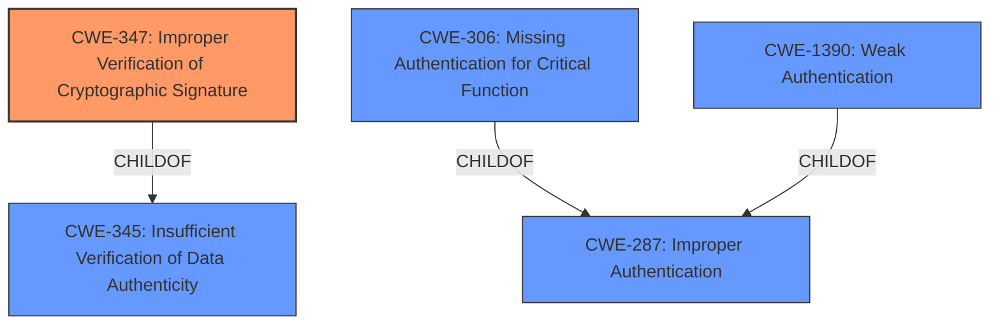

# Analysis for CVE-2022-23505

# Summary
| CWE ID | CWE Name | Confidence | CWE Abstraction Level | CWE Vulnerability Mapping Label | CWE-Vulnerability Mapping Notes |
|---|---|---|---|---|---|
| CWE-347 | Improper Verification of Cryptographic Signature | 1.0 | Base | Allowed | Primary CWE |
| CWE-287 | Improper Authentication | 0.7 | Class | Discouraged | Secondary Candidate |

## Evidence and Confidence

*   **Confidence Score:** 0.9
*   **Evidence Strength:** HIGH

## Relationship Analysis
The primary CWE is CWE-347, which is a base-level CWE related to cryptographic signature verification. CWE-347 is a child of CWE-345, Insufficient Verification of Data Authenticity. CWE-287 is a class-level CWE that is a parent of CWE-306 and CWE-1390. Since CWE-347 is a base-level CWE and directly relates to the **improper** signature validation, it is the more appropriate choice. The relationship of CWE-347 as a child of CWE-345 further supports its relevance.

## Vulnerability Chain
The vulnerability chain starts with the **improper verification** of the cryptographic signature (CWE-347). This leads to a bypass of authentication, ultimately allowing an attacker to gain unauthorized access.

## Summary of Analysis
The initial analysis pointed towards authentication bypass due to signature validation issues. The retriever results highlighted CWE-347 (Improper Verification of Cryptographic Signature) and CWE-287 (Improper Authentication).

The vulnerability description explicitly states that the `passport-wsfed-saml2` library **fails to properly validate signatures** on WS-Federation assertions. The CVE Reference Links Content Summary further emphasizes this point, stating that the vulnerability lies in the **insufficient signature verification** of WSFed tokens, allowing an attacker to bypass authentication by presenting a crafted, signed WSFed assertion.

Based on this evidence, CWE-347 is the most appropriate choice because it directly addresses the root cause of the vulnerability. The issue is not simply an **improper authentication** (CWE-287) but specifically a **failure to properly verify the cryptographic signature** of the WSFed assertion.

The selection of CWE-347 is further supported by its base-level abstraction, which aligns with the goal of identifying the root cause of the vulnerability. The MITRE mapping guidance for CWE-347 also recommends its use when the product does not verify, or incorrectly verifies, the cryptographic signature for data, making it a perfect fit for this scenario.

CWE-287 was considered, but the **improper authentication** is a consequence of the **improper signature verification**, making CWE-347 the more direct and accurate representation of the weakness. The MITRE mapping guidance for CWE-287 also discourages its use when lower-level CWE entries are likely to be applicable, further supporting the choice of CWE-347.

Relevant CWE Information:

# Enhanced Context (25 CWEs)
The following CWEs were identified as potentially relevant to this vulnerability:

## CWE-303: Incorrect Implementation of Authentication Algorithm
**Abstraction Level**: Base
**Similarity Score**: 0.81

## CWE-345: Insufficient Verification of Data Authenticity
**Abstraction Level**: Class
**Similarity Score**: 0.80

## CWE-1391: Use of Weak Credentials
**Abstraction Level**: Class
**Similarity Score**: 0.80

## CWE-1240: Use of a Cryptographic Primitive with a Risky Implementation
**Abstraction Level**: Base
**Similarity Score**: 0.79

## CWE-807: Reliance on Untrusted Inputs in a Security Decision
**Abstraction Level**: Base
**Similarity Score**: 0.79

## CWE-330: Use of Insufficiently Random Values
**Abstraction Level**: Class
**Similarity Score**: 0.79

## CWE-328: Use of Weak Hash
**Abstraction Level**: Base
**Similarity Score**: 0.79

## CWE-347: Improper Verification of Cryptographic Signature
**Abstraction Level**: Base
**Similarity Score**: 0.79

## CWE-1390: Weak Authentication
**Abstraction Level**: Class
**Similarity Score**: 0.78

## CWE-703: Improper Check or Handling of Exceptional Conditions
**Abstraction Level**: Pillar
**Similarity Score**: 0.78

## CWE-1390: Weak Authentication
**Abstraction Level**: Class
**Similarity Score**: 5031.16

## CWE-295: Improper Certificate Validation
**Abstraction Level**: Base
**Similarity Score**: 4966.96

## CWE-347: Improper Verification of Cryptographic Signature
**Abstraction Level**: Base
**Similarity Score**: 4951.42

## CWE-488: Exposure of Data Element to Wrong Session
**Abstraction Level**: Base
**Similarity Score**: 4859.29

## CWE-287: Improper Authentication
**Abstraction Level**: Class
**Similarity Score**: 4833.99

## CWE-613: Insufficient Session Expiration
**Abstraction Level**: base
**Similarity Score**: 4.33

## CWE-178: Improper Handling of Case Sensitivity
**Abstraction Level**: base
**Similarity Score**: 3.76

## CWE-322: Key Exchange without Entity Authentication
**Abstraction Level**: base
**Similarity Score**: 3.76

## CWE-289: Authentication Bypass by Alternate Name
**Abstraction Level**: base
**Similarity Score**: 2.87

## CWE-942: Permissive Cross-domain Policy with Untrusted Domains
**Abstraction Level**: variant
**Similarity Score**: 2.68

## CWE-481: Assigning instead of Comparing
**Abstraction Level**: variant
**Similarity Score**: 2.68

## CWE-287: Improper Authentication
**Abstraction Level**: class
**Similarity Score**: 2.55

## CWE-295: Improper Certificate Validation
**Abstraction Level**: Base
**Similarity Score**: 2.50

## CWE-1289: Improper Validation of Unsafe Equivalence in Input
**Abstraction Level**: Base
**Similarity Score**: 2.49

## CWE-488: Exposure of Data Element to Wrong Session
**Abstraction Level**: base
**Similarity Score**: 2.47