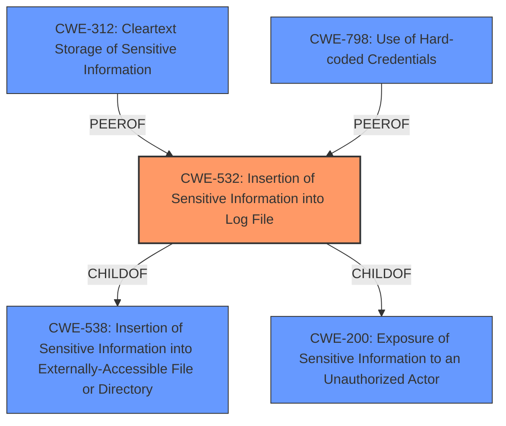

# Analysis for CVE-2022-23506

# Summary
| CWE ID | CWE Name | Confidence | CWE Abstraction Level | CWE Vulnerability Mapping Label | CWE-Vulnerability Mapping Notes |
|---|---|---|---|---|---|
| CWE-532 | Insertion of Sensitive Information into Log File | 1.0 | Base | Allowed | Primary CWE |
| CWE-312 | Cleartext Storage of Sensitive Information | 0.7 | Base | Allowed | Secondary Candidate |
| CWE-798 | Use of Hard-coded Credentials | 0.6 | Base | Allowed | Secondary Candidate |

## Evidence and Confidence

*   **Confidence Score:** 0.9
*   **Evidence Strength:** HIGH

## Relationship Analysis
The primary CWE selected is CWE-532 (**Insertion of Sensitive Information into Log File**), which is a Base level CWE. It has a parent relationship with CWE-538 (**Insertion of Sensitive Information into Externally-Accessible File or Directory**) and CWE-200 (**Exposure of Sensitive Information to an Unauthorized Actor**). The selection was influenced by the direct match to the vulnerability description and the base level abstraction.

## Vulnerability Chain
The vulnerability chain starts with **improper secret masking**, leading to the exposure of sensitive AWS credentials in packer log files.
  - **Root Cause:** **Improper secret masking** during packer builds.
  - **Weakness:** Insertion of sensitive information into log files.
  - **Impact:** Exposure of AWS access keys and secret keys, potentially allowing an attacker to gain unauthorized access to the AWS account.

## Summary of Analysis
The initial analysis identified CWE-532 (**Insertion of Sensitive Information into Log File**) as the primary candidate, which aligns with the description of the vulnerability. The vulnerability involves the **improper masking** of secrets, specifically AWS credentials, which leads to their inclusion in log files. This matches the CWE-532 description: "The product writes sensitive information to a log file."

The supporting evidence for this decision is present in the "CVE Reference Links Content Summary" section: "The vulnerability stems from **improper masking** of AWS credentials within log files during Packer builds performed by Rosco. Specifically, the `aws_access_key` and `aws_secret_key` were not being masked by default." The "Vulnerability Description Key Phrases" also highlights the **improper secret masking** as the root cause.

CWE-312 (**Cleartext Storage of Sensitive Information**) and CWE-798 (**Use of Hard-coded Credentials**) were also considered, as the credentials were not encrypted/masked and potentially hardcoded. However, the core issue is the presence of the credentials in the logs due to the **improper masking**, making CWE-532 the more direct and accurate classification.

The graph relationships influenced the selection by confirming that CWE-532 is a base level CWE and is related to the exposure of sensitive information.

The selected CWEs are at the optimal level of specificity because they directly address the root cause and mechanism of the vulnerability, avoiding more generic classifications.

Relevant CWE Information:

# Enhanced Context (25 CWEs)

## CWE-538: Insertion of Sensitive Information into Externally-Accessible File or Directory
**Abstraction Level**: Base
**Similarity Score**: 0.78
**Source**: dense

**Description**:
The product places sensitive information into files or directories that are accessible to actors who are allowed to have access to the files, but not to the sensitive information.

**Mapping Guidance**:
- Usage: Allowed
- Rationale: This CWE entry is at the Base level of abstraction, which is a preferred level of abstraction for mapping to the root causes of vulnerabilities.

## CWE-312: Cleartext Storage of Sensitive Information
**Abstraction Level**: Base
**Similarity Score**: 0.78
**Source**: dense

**Description**:
The product stores sensitive information in cleartext within a resource that might be accessible to another control sphere.

**Mapping Guidance**:
- Usage: Allowed
- Rationale: This CWE entry is at the Base level of abstraction, which is a preferred level of abstraction for mapping to the root causes of vulnerabilities.

**Technical Explanation:** While the primary issue is the insertion into logs, the stored credentials being in cleartext increases the risk. This is a secondary contributing factor.
**Justification:** The credentials weren't necessarily stored for long term, but the fact they were not masked implies that they were stored in cleartext at some point during the build process before being logged.
**Confidence:** 0.7

## CWE-1391: Use of Weak Credentials
**Abstraction Level**: Class
**Similarity Score**: 0.78
**Source**: dense

**Description**:
The product uses weak credentials (such as a default key or hard-coded password) that can be calculated, derived, reused, or guessed by an attacker.

**Mapping Guidance**:
- Usage: Allowed-with-Review
- Rationale: This CWE entry is a Class and might have Base-level children that would be more appropriate

**Justification:** While the credentials being exposed may be considered a weak credential in itself, it is a result of the root cause and not directly related.
**Confidence:** 0.3

## CWE-226: Sensitive Information in Resource Not Removed Before Reuse
**Abstraction Level**: Base
**Similarity Score**: 0.77
**Source**: dense

**Description**:
The product releases a resource such as memory or a file so that it can be made available for reuse, but it does not clear or "zeroize" the information contained in the resource before the product performs a critical state transition or makes the resource available for reuse by other entities.

**Mapping Guidance**:
- Usage: Allowed
- Rationale: This CWE entry is at the Base level of abstraction, which is a preferred level of abstraction for mapping to the root causes of vulnerabilities.

**Justification:** Although the credentials should be removed from memory after use, it is not related to the fact that they are written to the logs.
**Confidence:** 0.3

## CWE-319: Cleartext Transmission of Sensitive Information
**Abstraction Level**: Base
**Similarity Score**: 0.77
**Source**: dense

**Description**:
The product transmits sensitive or security-critical data in cleartext in a communication channel that can be sniffed by unauthorized actors.

**Mapping Guidance**:
- Usage: Allowed
- Rationale: This CWE entry is at the Base level of abstraction, which is a preferred level of abstraction for mapping to the root causes of vulnerabilities.

**Justification:** Although the credentials may be transmitted in cleartext, it is not related to the fact that they are written to the logs.
**Confidence:** 0.3

## CWE-798: Use of Hard-coded Credentials
**Abstraction Level**: Base
**Similarity Score**: 0.77
**Source**: dense

**Description**:
The product contains hard-coded credentials, such as a password or cryptographic key.

**Mapping Guidance**:
- Usage: Allowed
- Rationale: This CWE entry is at the Base level of abstraction, which is a preferred level of abstraction for mapping to the root causes of vulnerabilities.

**Technical Explanation:** If the credentials were hardcoded, this CWE would be applicable in addition to CWE-532.
**Justification:** Hardcoding credentials would result in the potential exposure of those credentials, especially if logging is enabled.
**Confidence:** 0.6

## CWE-212: Improper Removal of Sensitive Information Before Storage or Transfer
**Abstraction Level**: Base
**Similarity Score**: 0.77
**Source**: dense

**Description**:
The product stores, transfers, or shares a resource that contains sensitive information, but it does not properly remove that information before the product makes the resource available to unauthorized actors.

**Mapping Guidance**:
- Usage: Allowed
- Rationale: This CWE entry is at the Base level of abstraction, which is a preferred level of abstraction for mapping to the root causes of vulnerabilities.

**Justification:** Although the credentials should be removed before storage or transfer, it is not directly related to the logs.
**Confidence:** 0.3

## CWE-321: Use of Hard-coded Cryptographic Key
**Abstraction Level**: Variant
**Similarity Score**: 0