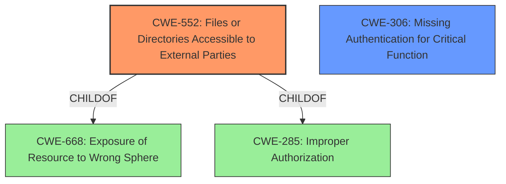

# Analysis for CVE-2022-23508

# Summary
| CWE ID | CWE Name | Confidence | CWE Abstraction Level | CWE Vulnerability Mapping Label | CWE-Vulnerability Mapping Notes |
|---|---|---|---|---|---|
| CWE-552 | Files or Directories Accessible to External Parties | 0.9 | Base | Allowed | Primary CWE. The local S3 bucket was accessible to unauthorized local users. |
| CWE-306 | Missing Authentication for Critical Function | 0.7 | Base | Allowed | Secondary CWE. The endpoint had no security controls to block unauthorized access. |

## Evidence and Confidence

*   **Confidence Score:** 0.8
*   **Evidence Strength:** HIGH

## Relationship Analysis
The primary relationship that influenced the decision was the ChildOf relationship between CWE-552 and CWE-668 (Exposure of Resource to Wrong Sphere) and CWE-285 (Improper Authorization). While CWE-668 is more general, CWE-552 provides a more specific classification. Also, the parent CWE-285 does not fit the vulnerability description as well as CWE-552.

## Vulnerability Chain
The vulnerability chain starts with the **lack of security controls on the endpoint** (CWE-306), which allowed unauthorized local users to access the local S3 bucket (CWE-552), leading to the ability to alter Kubernetes cluster resources.

## Summary of Analysis
The analysis is primarily based on the provided evidence, including the vulnerability description and the CVE Reference Links Content Summary. The key piece of evidence is that the "GitOps run has a local S3 bucket which it uses for synchronizing files that are later applied against a Kubernetes cluster. Its endpoint had **no security controls to block unauthorized access**, therefore allowing local users (and processes) on the same machine to see and alter the bucket content."

This directly aligns with CWE-552 (Files or Directories Accessible to External Parties), as the S3 bucket was made accessible to unauthorized local users due to the **lack of security controls**.

CWE-306 (Missing Authentication for Critical Function) is included as a secondary CWE because the root cause was the **lack of security controls on the endpoint**.

The retriever results also support this decision, with CWE-552 being the top match. Other CWEs, such as CWE-319 (Cleartext Transmission of Sensitive Information), are not applicable as there is no mention of sensitive information being transmitted in cleartext. CWE-532 (Insertion of Sensitive Information into Log File) is also not applicable as the vulnerability is not related to sensitive information being written to a log file.

The selected CWEs are at the optimal level of specificity. CWE-552 is a Base-level CWE, which is preferred for mapping to the root causes of vulnerabilities, as stated in the mapping guidance.