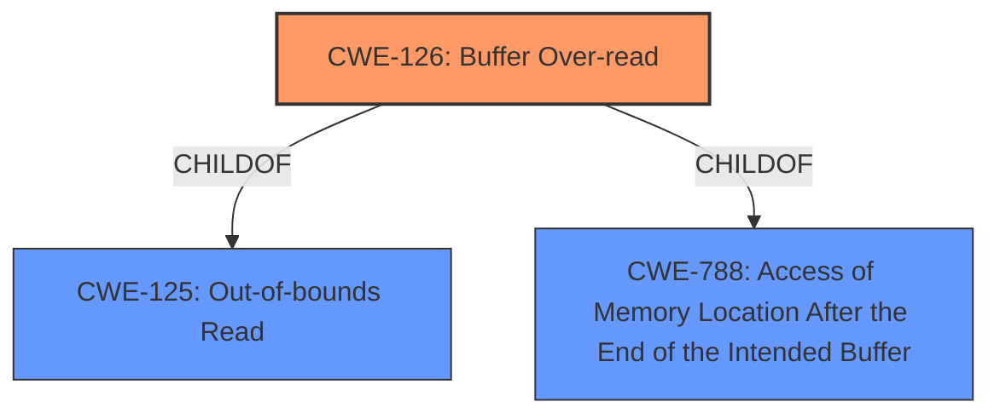

# Analysis Report for CVE-2022-23537

# Vulnerability Analysis Report: CVE-2022-23537

## Description


## Analysis (with Relationship Data)

# Summary
| CWE ID | CWE Name | Confidence | CWE Abstraction Level | CWE Vulnerability Mapping Label | CWE-Vulnerability Mapping Notes |
|---|---|---|---|---|---|
| CWE-126 | Buffer Over-read | 1.0 | Variant | Allowed | Primary CWE |

## Evidence and Confidence

*   **Confidence Score:** 1.0
*   **Evidence Strength:** HIGH

## Relationship Analysis
The primary relationship impacting the decision is the ChildOf relationship between CWE-126 and CWE-125 (Out-of-bounds Read) and CWE-788 (Access of Memory Location After the End of the Intended Buffer). CWE-126 is a Variant of CWE-125, providing a more specific classification for the vulnerability. There are no complex chain relationships here.



## Vulnerability Chain
The vulnerability chain consists of:
1.  **Root Cause:** **Buffer overread** due to **improper** validation of STUN message attribute length.
2.  **Weakness:** Reading beyond the buffer boundary.
3.  **Impact:** Potential information disclosure, application crash, or memory corruption.

## Summary of Analysis
The analysis is based on the vulnerability description and CVE reference content summary. The primary **weakness** identified is a **buffer overread** in PJSIP when parsing a specially crafted STUN message with an unknown attribute.

The CVE reference link content summary explicitly states: "The root cause is a buffer over-read in the STUN message decoder. This occurs when parsing a STUN message that contains an unknown attribute. Specifically, the code was not correctly validating the length of the attribute value, leading to a read beyond the allocated buffer."

The **Vulnerability Description Key Phrases** also identifies **Buffer overread** as a weakness.

The Retriever Results list CWE-126 (Buffer Over-read) as the top candidate, which aligns perfectly with the vulnerability description and root cause analysis. CWE-126 is a Variant, which is a preferred level of abstraction.

Therefore, CWE-126 is the most appropriate and specific classification.

Relevant CWE Information:

# Enhanced Context (25 CWEs)
The following CWEs were identified as potentially relevant to this vulnerability:

## CWE-126: Buffer Over-read
**Abstraction Level**: Variant
**Similarity Score**: 0.77
**Source**: dense

**Description**:
The product reads from a buffer using buffer access mechanisms such as indexes or pointers that reference memory locations after the targeted buffer.

**Mapping Guidance**:
- Usage: Allowed
- Rationale: This CWE entry is at the Variant level of abstraction, which is a preferred level of abstraction for mapping to the root causes of vulnerabilities.
# Enhanced Context (25 CWEs)
The following CWEs were identified as potentially relevant to this vulnerability:

## CWE-126: Buffer Over-read
**Abstraction Level**: Variant
**Similarity Score**: 0.77
**Source**: dense

**Description**:
The product reads from a buffer using buffer access mechanisms such as indexes or pointers that reference memory locations after the targeted buffer.

**Mapping Guidance**:
- Usage: Allowed
- Rationale: This CWE entry is at the Variant level of abstraction, which is a preferred level of abstraction for mapping to the root causes of vulnerabilities.

**Technical Explanation for CWE-126:**

*   **How the vulnerability's details match the CWE's characteristics:** The vulnerability involves reading beyond the intended buffer when parsing a STUN message. The `CVE Reference Links Content Summary` explicitly mentions that the code was not correctly validating the length of the attribute value, leading to a read beyond the allocated buffer. This directly aligns with the description of CWE-126, which describes reading from a buffer using access mechanisms that reference memory locations after the targeted buffer.
*   **The security implications and potential impact:** The security implications include potential information disclosure (reading sensitive data from memory), application crash (denial of service), and possible memory corruption.
*   **Any parent-child relationships or chain patterns that influenced your mapping:** CWE-126 is a variant of CWE-125 (Out-of-bounds Read) and CWE-788. This hierarchical relationship confirms that CWE-126 provides a more specific classification of the general out-of-bounds read issue.
*   **Whether the weakness is primary or secondary in the vulnerability:** The **buffer overread** is the primary weakness.
*   **How the official MITRE mapping guidance influenced your decision:** The MITRE mapping guidance for CWE-126 states that its Usage is "Allowed" and the Rationale is "This CWE entry is at the Variant level of abstraction, which is a preferred level of abstraction for mapping to the root causes of vulnerabilities." This supports the choice of CWE-126 as the primary CWE.

**CWEs Considered but Not Used:**

*   **CWE-125 (Out-of-bounds Read):** While related, CWE-126 is a more specific variant that accurately describes the **buffer overread**.
*   **CWE-1284 (Improper Validation of Specified Quantity in Input):** While the root cause involves **improper** validation of the attribute length, the direct result is a **buffer overread**, making CWE-126 a more accurate classification.
*   **CWE-754 (Improper Check for Unusual or Exceptional Conditions):** This is a more general class. The vulnerability is more specifically a buffer over-read.
*   **CWE-190 (Integer Overflow or Wraparound):** This is not the direct cause of the vulnerability, although it could potentially be related if the length calculation involved an integer overflow. However, the provided information does not suggest this, so it is not the primary cause.


## CWE Relationship Analysis

Current CWEs represent these abstraction levels: .


### Vulnerability Chain Analysis

**Chain starting from CWE-190:**
- 190 (Integer Overflow or Wraparound) - ROOT


**Chain starting from CWE-1284:**
- 1284 (Improper Validation of Specified Quantity in Input) - ROOT


### CWE Relationship Diagram

```mermaid
graph TD
    classDef primary fill:#f96,stroke:#333,stroke-width:2px
    classDef secondary fill:#69f,stroke:#333
    classDef tertiary fill:#9e9,stroke:#333
```


*Report generated on 2025-03-31 04:38:23*
