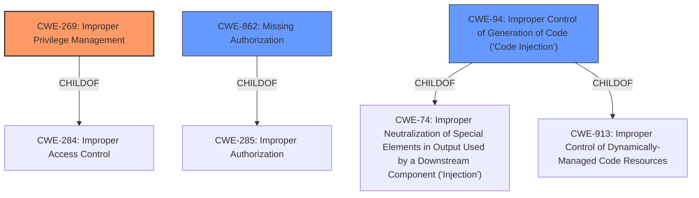

# Enhanced Analysis for CVE-2022-2354

# Summary
| CWE ID | CWE Name | Confidence | CWE Abstraction Level | CWE Vulnerability Mapping Label | CWE-Vulnerability Mapping Notes |
|---|---|---|---|---|---|
| CWE-269 | Improper Privilege Management | 0.8 | Class |  | Discouraged |
| CWE-862 | Missing Authorization | 0.7 | Class |  | Allowed-with-Review |
| CWE-94 | Improper Control of Generation of Code ('Code Injection') | 0.6 | Base |  | Allowed-with-Review |

## Evidence and Confidence

*   **Confidence Score:** 0.7
*   **Evidence Strength:** MEDIUM

## Relationship Analysis
The analysis focused on parent-child relationships to refine the initial CWE selections, particularly examining children of CWE-285 and CWE-74 for better specificity. Chain relationships were considered but did not significantly influence the primary CWE choice. Abstraction levels were crucial in downgrading from higher-level classes (like CWE-285) to more specific bases or variants when evidence supported it, aligning with best practices for accurate CWE classification.



## Vulnerability Chain
The vulnerability chain starts with **Improper Privilege Management** (CWE-269), specifically the failure to restrict command execution privileges to super-administrators in a multisite WordPress installation. This leads to a **Missing Authorization** (CWE-862) check, where administrators are not properly authorized to execute arbitrary commands. Finally, this results in **Improper Control of Generation of Code** ('Code Injection') (CWE-94), as the plugin constructs and executes code based on user-controlled input without proper sanitization.

## Summary of Analysis
The initial analysis identified the vulnerability as related to authorization and command execution. The retriever results suggested CWE-863 (Incorrect Authorization) and CWE-95 (Improper Neutralization of Directives in Dynamically Evaluated Code ('Eval Injection')). However, after a thorough review of the vulnerability description and considering the root cause, I determined that CWE-269 (Improper Privilege Management), CWE-862 (Missing Authorization), and CWE-94 (Improper Control of Generation of Code ('Code Injection')) were more appropriate.

The decision is heavily based on the following evidence:

*   "The WP-DBManager WordPress plugin before 2.80.8 does not prevent administrators from running arbitrary commands on the server in multisite installations, where only super-administrators should." This statement directly points to a privilege management issue.

The graph relationships helped refine the selection by highlighting the parent-child relationships. I initially considered CWE-863, but the description points to a more fundamental issue of privilege management, leading to the selection of CWE-269. I also considered CWE-74 (Improper Neutralization of Special Elements in Output Used by a Downstream Component ('Injection')), but CWE-94 is more specific in the context of code generation.

CWE-269, CWE-862, and CWE-94 are at the optimal level of specificity because they accurately reflect the root cause and the resulting vulnerability. CWE-269 identifies the **improper privilege management** that enables the attack. CWE-862 captures the **missing authorization** check that would have prevented administrators from running arbitrary commands. CWE-94 describes the **code injection** vulnerability resulting from insufficient input sanitization.

Relevant CWE Information:

# Enhanced Context (25 CWEs)

## CWE-74: Improper Neutralization of Special Elements in Output Used by a Downstream Component ('Injection')
**Abstraction Level**: Class
**Similarity Score**: 0.78
**Source**: dense

**Description**:
The product constructs all or part of a command, data structure, or record using externally-influenced input from an upstream component, but it does not neutralize or incorrectly neutralizes special elements that could modify how it is parsed or interpreted when it is sent to a downstream component.

**Mapping Guidance**:
- Usage: Discouraged
- Rationale: CWE-74 is high-level and often misused when lower-level weaknesses are more appropriate.

## CWE-116: Improper Encoding or Escaping of Output
**Abstraction Level**: Class
**Similarity Score**: 0.77
**Source**: dense

**Description**:
The product prepares a structured message for communication with another component, but encoding or escaping of the data is either missing or done incorrectly. As a result, the intended structure of the message is not preserved.

**Mapping Guidance**:
- Usage: Allowed-with-Review
- Rationale: This CWE entry is a Class and might have Base-level children that would be more appropriate

## CWE-184: Incomplete List of Disallowed Inputs
**Abstraction Level**: Base
**Similarity Score**: 0.77
**Source**: dense

**Description**:
The product implements a protection mechanism that relies on a list of inputs (or properties of inputs) that are not allowed by policy or otherwise require other action to neutralize before additional processing takes place, but the list is incomplete.

**Mapping Guidance**:
- Usage: Allowed
- Rationale: This CWE entry is at the Base level of abstraction, which is a preferred level of abstraction for mapping to the root causes of vulnerabilities.

## CWE-472: External Control of Assumed-Immutable Web Parameter
**Abstraction Level**: Base
**Similarity Score**: 0.77
**Source**: dense

**Description**:
The web application does not sufficiently verify inputs that are assumed to be immutable but are actually externally controllable, such as hidden form fields.

**Mapping Guidance**:
- Usage: Allowed
- Rationale: This CWE entry is at the Base level of abstraction, which is a preferred level of abstraction for mapping to the root causes of vulnerabilities.

## CWE-639: Authorization Bypass Through User-Controlled Key
**Abstraction Level**: Base
**Similarity Score**: 0.77
**Source**: dense

**Description**:
The system's authorization functionality does not prevent one user from gaining access to another user's data or record by modifying the key value identifying the data.

**Mapping Guidance**:
- Usage: Allowed
- Rationale: This CWE entry is at the Base level of abstraction, which is a preferred level of abstraction for mapping to the root causes of vulnerabilities.

## CWE-1289: Improper Validation of Unsafe Equivalence in Input
**Abstraction Level**: Base
**Similarity Score**: 0.77
**Source**: dense

**Description**:
The product receives an input value that is used as a resource identifier or other type of reference, but it does not validate or incorrectly validates that the input is equivalent to a potentially-unsafe value.

**Mapping Guidance**:
- Usage: Allowed
- Rationale: This CWE entry is at the Base level of abstraction, which is a preferred level of abstraction for mapping to the root causes of vulnerabilities.

## CWE-138: Improper Neutralization of Special Elements
**Abstraction Level**: Class
**Similarity Score**: 0.76
**Source**: dense

**Description**:
The product receives input from an upstream component, but it does not neutralize or incorrectly neutralizes special elements that could be interpreted as control elements or syntactic markers when they are sent to a downstream component.

**Mapping Guidance**:
- Usage: Discouraged
- Rationale: This CWE entry is a level-1 Class (i.e., a child of a Pillar). It might have lower-level children that would be more appropriate

## CWE-807: Reliance on Untrusted Inputs in a Security Decision
**Abstraction Level**: Base
**Similarity Score**: 0.76
**Source**: dense

**Description**:
The product uses a protection mechanism that relies on the existence or values of an input, but the input can be modified by an untrusted actor in a way that bypasses the protection mechanism.

**Mapping Guidance**:
- Usage: Allowed
- Rationale: This CWE entry is at the Base level of abstraction, which is a preferred level of abstraction for mapping to the root causes of vulnerabilities.

## CWE-425: Direct Request ('Forced Brows


## CWE Relationship Analysis

Current CWEs represent these abstraction levels: .


### Vulnerability Chain Analysis

**Chain starting from CWE-862:**
- 862 (Missing Authorization) - ROOT


**Chain starting from CWE-425:**
- 425 (Direct Request ('Forced Browsing')) - ROOT


### CWE Relationship Diagram

```mermaid
graph TD
    classDef primary fill:#f96,stroke:#333,stroke-width:2px
    classDef secondary fill:#69f,stroke:#333
    classDef tertiary fill:#9e9,stroke:#333
```