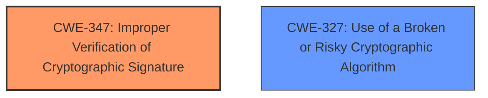

# Raw Analyzer Response for CVE-2022-23540

# Summary
| CWE ID  | CWE Name                                                        | Confidence | CWE Abstraction Level | CWE Vulnerability Mapping Label | CWE-Vulnerability Mapping Notes |
| :-------- | :-------------------------------------------------------------- | :--------- | :---------------------- | :------------------------------ | :------------------------------ |
| CWE-347   | Improper Verification of Cryptographic Signature              | 1.0        | Base                    | Primary                         | Allowed                       |
| CWE-327   | Use of a Broken or Risky Cryptographic Algorithm | 0.75       | Class                   | Secondary                       | Allowed-with-Review         |

## Evidence and Confidence

*   **Confidence Score:** 0.9
*   **Evidence Strength:** HIGH

## Relationship Analysis
The primary CWE is CWE-347, which indicates the core issue of improper signature verification. CWE-327 is a related Class-level CWE representing the use of a broken or risky cryptographic algorithm which can contribute to the improper verification. The hierarchical relationship here is that CWE-347 is often caused by underlying cryptographic issues, but in this case the none algorithm is the issue and is not necessarily broken.

## Vulnerability Chain
The vulnerability chain starts with the **lack of algorithm definition** in the `jwt.verify()` function, leading to **defaulting to the none algorithm for signature verification**, ultimately resulting in a **signature validation bypass**.
  - **Root Cause:** **Lack of algorithm definition**
  - **Weakness:** **Defaulting to the none algorithm**
  - **Impact:** Signature validation bypass

## Summary of Analysis
Initially, the vulnerability description indicates a **lack of algorithm definition** which leads to the `jwt.verify()` function **defaulting to the none algorithm for signature verification**. This directly results in a **signature validation bypass**.

The CVE Reference Links Content Summary reinforces this analysis. It clearly states the root cause as the `jwt.verify()` function defaulting to the "none" algorithm when no algorithm is specified. The weakness is described as both the **insecure default algorithm** and the **lack of explicit algorithm enforcement**.

Based on this evidence, CWE-347 (Improper Verification of Cryptographic Signature) is the most appropriate primary CWE. It accurately reflects the core issue: the product does not verify, or incorrectly verifies, the cryptographic signature for data because it allows the "none" algorithm.

CWE-327 (Use of a Broken or Risky Cryptographic Algorithm) is a secondary consideration. While the "none" algorithm isn't inherently "broken" in the traditional sense, its use in signature verification is certainly "risky" as it effectively disables signature validation.

The retriever results also support CWE-347 as the top match with a score of 1.094. CWE-327 is also listed with a score of 0.770.

I am selecting CWE-347 as the primary CWE because it directly addresses the **improper verification of cryptographic signature**. The evidence explicitly states that the `jwt.verify()` function defaults to the "none" algorithm, which means no signature verification is performed.
I considered CWE-287 (Improper Authentication) and CWE-863 (Incorrect Authorization) but they were less appropriate. The vulnerability isn't about failing to authenticate or authorize correctly, but specifically about bypassing the signature verification process.

Relevant CWE Information:

# Enhanced Context (25 CWEs)
The following CWEs were identified as potentially relevant to this vulnerability:

## CWE-203: Observable Discrepancy
**Abstraction Level**: Base
**Similarity Score**: 0.77
**Source**: dense

**Description**:
The product behaves differently or sends different responses under different circumstances in a way that is observable to an unauthorized actor, which exposes security-relevant information about the state of the product, such as whether a particular operation was successful or not.

**Mapping Guidance**:
- Usage: Allowed
- Rationale: This CWE entry is at the Base level of abstraction, which is a preferred level of abstraction for mapping to the root causes of vulnerabilities.

## CWE-345: Insufficient Verification of Data Authenticity
**Abstraction Level**: Class
**Similarity Score**: 0.77
**Source**: dense

**Description**:
The product does not sufficiently verify the origin or authenticity of data, in a way that causes it to accept invalid data.

**Mapping Guidance**:
- Usage: Discouraged
- Rationale: This CWE entry is a level-1 Class (i.e., a child of a Pillar). It might have lower-level children that would be more appropriate

## CWE-204: Observable Response Discrepancy
**Abstraction Level**: Base
**Similarity Score**: 0.77
**Source**: dense

**Description**:
The product provides different responses to incoming requests in a way that reveals internal state information to an unauthorized actor outside of the intended control sphere.

**Mapping Guidance**:
- Usage: Allowed
- Rationale: This CWE entry is at the Base level of abstraction, which is a preferred level of abstraction for mapping to the root causes of vulnerabilities.

## CWE-208: Observable Timing Discrepancy
**Abstraction Level**: Base
**Similarity Score**: 0.76
**Source**: dense

**Description**:
Two separate operations in a product require different amounts of time to complete, in a way that is observable to an actor and reveals security-relevant information about the state of the product, such as whether a particular operation was successful or not.

**Mapping Guidance**:
- Usage: Allowed
- Rationale: This CWE entry is at the Base level of abstraction, which is a preferred level of abstraction for mapping to the root causes of vulnerabilities.

## CWE-303: Incorrect Implementation of Authentication Algorithm
**Abstraction Level**: Base
**Similarity Score**: 0.76
**Source**: dense

**Description**:
The requirements for the product dictate the use of an established authentication algorithm, but the implementation of the algorithm is incorrect.

**Mapping Guidance**:
- Usage: Allowed
- Rationale: This CWE entry is at the Base level of abstraction, which is a preferred level of abstraction for mapping to the root causes of vulnerabilities.

## CWE-347: Improper Verification of Cryptographic Signature
**Abstraction Level**: Base
**Similarity Score**: 0.76
**Source**: dense

**Description**:
The product does not verify, or incorrectly verifies, the cryptographic signature for data.

**Mapping Guidance**:
- Usage: Allowed
- Rationale: This CWE entry is at the Base level of abstraction, which is a preferred level of abstraction for mapping to the root causes of vulnerabilities.

## CWE-1391: Use of Weak Credentials
**Abstraction Level**: Class
**Similarity Score**: 0.75
**Source**: dense

**Description**:
The product uses weak credentials (such as a default key or hard-coded password) that can be calculated, derived, reused, or guessed by an attacker.

**Mapping Guidance**:
- Usage: Allowed-with-Review
- Rationale: This CWE entry is a Class and might have Base-level children that would be more appropriate

## CWE-668: Exposure of Resource to Wrong Sphere
**Abstraction Level**: Class
**Similarity Score**: 0.75
**Source**: dense

**Description**:
The product exposes a resource to the wrong control sphere, providing unintended actors with inappropriate access to the resource.

**Mapping Guidance**:
- Usage: Discouraged
- Rationale: CWE-668 is high-level and is often misused as a catch-all when lower-level CWE IDs might be applicable. It is sometimes used for low-information vulnerability reports [REF-1287]. It is a level-1 Class (i.e., a child of a Pillar). It is not useful for trend analysis.

## CWE-319: Cleartext Transmission of Sensitive Information
**Abstraction Level**: Base
**Similarity Score**: 0.75
**Source**: dense

**Description**:
The product transmits sensitive or security-critical data in cleartext in a communication channel that can be sniffed by unauthorized actors.

**Mapping Guidance**:
- Usage: Allowed
- Rationale: This CWE entry is at the Base level of abstraction, which is a preferred level of abstraction for mapping to the root causes of vulnerabilities.

## CWE-807: Reliance on Untrusted Inputs in a Security Decision
**Abstraction Level**: Base
**Similarity Score**: 0.75
**Source**: dense

**Description**:
The product uses a protection mechanism that relies on the existence or values of an input, but the input can be modified by an untrusted actor in a way that bypasses the protection mechanism.

**Mapping Guidance**:
- Usage: Allowed
- Rationale: This CWE entry is at the Base level of abstraction, which is a preferred level of abstraction for mapping to the root