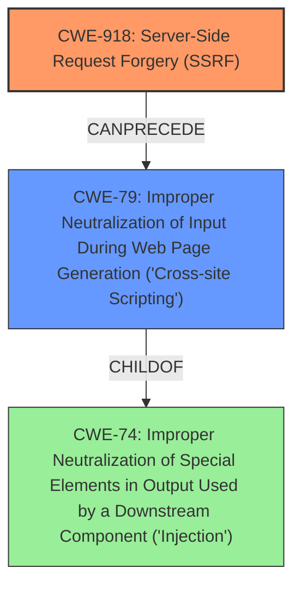

# Analysis for CVE-2022-23544

# Summary
| CWE ID | CWE Name | Confidence | CWE Abstraction Level | CWE Vulnerability Mapping Label | CWE-Vulnerability Mapping Notes |
|---|---|---|---|---|---|
| CWE-918 | Server-Side Request Forgery (SSRF) | 1.0 | Base | Allowed | Primary CWE. The vulnerability description clearly states a Server-Side Request Forgery vulnerability, which aligns directly with CWE-918. |
| CWE-79 | Improper Neutralization of Input During Web Page Generation ('Cross-site Scripting') | 0.8 | Base | Allowed | Secondary CWE. The vulnerability description mentions that the SSRF can be leveraged to execute JavaScript code, indicating a reflected XSS vulnerability due to improper sanitization of the response. |

## Evidence and Confidence

*   **Confidence Score:** 0.9
*   **Evidence Strength:** HIGH

## Relationship Analysis
The primary relationship influencing the assessment is the potential chain where an SSRF (CWE-918) can lead to XSS (CWE-79). While SSRF itself doesn't inherently cause XSS, the description indicates that the server's response to the forged request is not properly sanitized, allowing for JavaScript injection.

## Vulnerability Chain
The vulnerability chain starts with the **Server-Side Request Forgery** (**CWE-918**) due to **improper validation** of the URL parameter. This allows an attacker to make the server send requests to arbitrary URLs. The server's response is then not properly sanitized, leading to a Reflected Cross-Site Scripting (**CWE-79**) vulnerability.

## Summary of Analysis
The initial analysis identified **Server-Side Request Forgery** as the root cause, leading to **CWE-918**. The evidence for this is found in the "**Vulnerability Description Key Phrases**" section: "rootcause: **Server-Side request forgery**" and in the "**CVE Reference Links Content Summary**" section: "The vulnerability stems from a **Server-Side Request Forgery** (SSRF) vulnerability in the `IssueProxyResourceService::getMdImageByUrl` method."

Additionally, the possibility of Cross-Site Scripting (**CWE-79**) was identified. The evidence is found in the "**Vulnerability Description**" section: "A **Server-Side request forgery** in `IssueProxyResourceServicegetMdImageByUrl` allows an attacker to access internal resources, as well as executing JavaScript code in the context of Meterspheres origin by a victim of a reflected XSS". Also, in the "**CVE Reference Links Content Summary**" section: "This indicates a reflected XSS vulnerability, likely due to the response of the SSRF not being properly sanitized."

The graph relationships influenced the final selection by highlighting the chain of events: the SSRF makes a request and the response is not sanitized, leading to XSS.

The selected CWEs are at the optimal level of specificity because **CWE-918** is a Base level CWE that accurately describes the **Server-Side Request Forgery**, and **CWE-79** is a Base level CWE that accurately describes the **Cross-Site Scripting** vulnerability.

Relevant CWE Information:

# Enhanced Context (25 CWEs)

## CWE-918: Server-Side Request Forgery (SSRF)
**Abstraction:** Base
**Status:** Incomplete

### Description
The web server receives a URL or similar request from an upstream component and retrieves the contents of this URL, but it does not sufficiently ensure that the request is being sent to the expected destination.

### Extended Description
Not provided

### Alternative Terms
XSPA: Cross Site Port Attack
SSRF: Server-Side Request Forgery

### Relationships
ChildOf -> CWE-441
ChildOf -> CWE-610

### Mapping Guidance
**Usage:** Allowed
**Rationale:** This CWE entry is at the Base level of abstraction, which is a preferred level of abstraction for mapping to the root causes of vulnerabilities.
**Comments:** Carefully read both the name and description to ensure that this mapping is an appropriate fit. Do not try to 'force' a mapping to a lower-level Base/Variant simply to comply with this preferred level of abstraction.
**Reasons:**
- Acceptable-Use

### Additional Notes
**[Relationship]** CWE-918 (SSRF) and CWE-611 (XXE) are closely related, because they both involve web-related technologies and can launch outbound requests to unexpected destinations. However, XXE can be performed client-side, or in other contexts in which the software is not acting directly as a server, so the "Server" portion of the SSRF acronym does not necessarily apply.

### Observed Examples
- **CVE-2023-32786:** Chain: LLM integration framework has prompt injection (CWE-1427) that allows an attacker to force the service to retrieve data from an arbitrary URL, essentially providing SSRF (CWE-918) and potentially injecting content into downstream tasks.
- **CVE-2021-26855:** Server Side Request Forgery (SSRF) in mail server, as exploited in the wild per CISA KEV.
- **CVE-2021-21973:** Server Side Request Forgery in cloud platform, as exploited in the wild per CISA KEV.

## CWE-79: Improper Neutralization of Input During Web Page Generation ('Cross-site Scripting')
**Abstraction:** Base
**Status:** Stable

### Description
The product does not neutralize or incorrectly neutralizes user-controllable input before it is placed in output that is used as a web page that is served to other users.

### Extended Description
Cross-site scripting (XSS) vulnerabilities occur when:
  1. Untrusted data enters a web application, typically from a web request.
  2. The web application dynamically generates a web page that contains this untrusted data.
  3. During page generation, the application does not prevent the data from containing content that is executable by a web browser, such as JavaScript, HTML tags, HTML attributes, mouse events, Flash, ActiveX, etc.
  4. A victim visits the generated web page through a web browser, which contains malicious script that was injected using the untrusted data.
  5. Since the script comes from a web page that was sent by the web server, the victim's web browser executes the malicious script in the context of the web server's domain.
  6. This effectively violates the intention of the web browser's same-origin policy, which states that scripts in one domain should not be able to access resources or run code in a different domain.

There are three main kinds of XSS:
  -  **Type 1: Reflected XSS (or Non-Persistent)**  - The server reads data directly from the HTTP request and reflects it back in the HTTP response. Reflected XSS exploits occur when an attacker causes a victim to supply dangerous content to a vulnerable web application, which is then reflected back to the victim and executed by the web browser. The most common mechanism for delivering malicious content is to include it as a parameter in a URL that is posted publicly or e-mailed directly to the victim. URLs constructed in this manner constitute the core of many phishing schemes, whereby an attacker convinces a victim to visit a URL that refers to a vulnerable site. After the site reflects the attacker's content back to the victim, the content is executed by the victim's browser.
  -  **Type 2: Stored XSS (or Persistent)**  - The application stores dangerous data in a database, message forum, visitor log, or other trusted data store. At a later time, the dangerous data is subsequently read back into the application and included in dynamic content. From an attacker's perspective, the optimal place to inject malicious content is in an area that is displayed to either many users or particularly interesting users. Interesting users typically have elevated privileges in the application or interact with sensitive data that is valuable to the attacker. If one of these users executes malicious content, the attacker may be able to perform privileged operations on behalf of the user or gain access to sensitive data belonging to the user. For example, the attacker might inject XSS into a log message, which might not be handled properly when an administrator views the logs.
  -  **Type 0: DOM-Based XSS**  - In DOM-based XSS, the client performs the injection of XSS into the page; in the other types, the server performs the injection. DOM-based XSS generally involves server